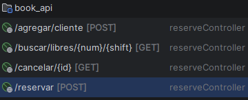

# ABP Vinos — La Canal

> **Proyecto ABP** | Ciclo Formativo de Grado Superior — Desarrollo de Aplicaciones Web  
> Curso 2024–2025

---

## Descripción del Proyecto

**La Canal** es un sistema de gestión integral para un restaurante, desarrollado como proyecto ABP (Aprendizaje Basado en Proyectos) por un equipo de 5 estudiantes.

El sistema permite a los clientes consultar la carta de vinos y menús del restaurante a través de una interfaz web moderna, y realizar reservas de mesa online. Internamente, gestiona la disponibilidad de mesas, los turnos y el registro de clientes mediante una base de datos centralizada.

El proyecto está compuesto por cuatro módulos integrados: una base de datos MariaDB en contenedor Docker, dos APIs REST independientes (una en Python/Flask para el catálogo y otra en Java/Spring Boot para las reservas) y dos frontends en React que consumen cada una de esas APIs.

---

## Integrantes del Equipo

| Nombre | Rol principal |
|--------|--------------|
| _(Nombre 1)_ | _(Backend / Frontend / BD…)_ |
| _(Nombre 2)_ | |
| _(Nombre 3)_ | |
| _(Nombre 4)_ | |
| _(Nombre 5)_ | |

---

## Arquitectura del Proyecto

```
┌─────────────────────────┐   ┌─────────────────────────┐
│   front-end-vinos       │   │   reservas-mesas         │
│   (React 19 + Vite 8)   │   │   (React 19 + Vite 8)   │
│   Puerto: 5173          │   │   Puerto: 5174 (dev)     │
└───────────┬─────────────┘   └───────────┬─────────────┘
            │ HTTP/JSON                   │ HTTP/JSON
            ▼                             ▼
┌─────────────────────────┐   ┌─────────────────────────┐
│   api-vinos             │   │   book_api               │
│   (Python 3 + Flask)    │   │   (Java + Spring Boot)   │
│   Puerto: 5000          │   │   Puerto: 8081           │
└───────────┬─────────────┘   └───────────┬─────────────┘
            │ pymysql                      │ mariadb-java-client
            └──────────────┬──────────────┘
                           ▼
            ┌─────────────────────────┐
            │   bbdd (MariaDB)        │
            │   Contenedor Docker     │
            │   Puerto: 3306          │
            │                         │
            │  ┌───────────────────┐  │
            │  │  cataleg-vins     │  │
            │  │  (8 tablas)       │  │
            │  └───────────────────┘  │
            │  ┌───────────────────┐  │
            │  │  reservas_lacanal │  │
            │  │  (4 tablas)       │  │
            │  └───────────────────┘  │
            │  ┌───────────────────┐  │
            │  │  usuarios-lacanal │  │
            │  │  (1 tabla)        │  │
            │  └───────────────────┘  │
            │  ┌───────────────────┐  │
            │  │  menus-lacanal    │  │
            │  │  (3 tablas)       │  │
            │  └───────────────────┘  │
            └─────────────────────────┘
```

---

## Componentes y Tecnologías

| Componente | Tecnología | Puerto | Descripción |
|------------|-----------|--------|-------------|
| **bbdd** | MariaDB (Docker) | 3306 | Base de datos unificada con cuatro esquemas |
| **api-vinos** | Python 3 + Flask + PyMySQL | 5000 | API REST para el catálogo de vinos y menús |
| **book_api** | Java 21 + Spring Boot + JDBC | 8081 | API REST para la gestión de reservas de mesa |
| **front-end-vinos** | React 19 + Vite 8 + Tailwind CSS | 5173 | Interfaz pública: carta de vinos y menús |
| **reservas-mesas** | React 19 + Vite 8 + Flatpickr | — | Formulario de reserva de mesas en 3 pasos |

---

## Endpoints de las APIs

### `api-vinos` — Flask (Puerto 5000)

| Método | Endpoint | Descripción |
|--------|----------|-------------|
| `GET` | `/vinos` | Devuelve el listado completo de vinos con datos relacionados (tipo, bodega, cosecha, formato y copa) |

---

### `book_api` — Spring Boot (Puerto 8081)

| Método | Endpoint | Descripción |
|--------|----------|-------------|
| `GET` | `/buscar/libres` | Consulta las mesas disponibles para un número de comensales y turno dado |
| `POST` | `/agregar/cliente` | Registra un nuevo cliente en el sistema |
| `POST` | `/reservar` | Crea una reserva asociando un cliente, una mesa y un turno |
| `GET` | `/cancelar/{id}` | Cancela una reserva existente por su ID y libera la mesa |

> **Captura de IntelliJ — Vista de endpoints (HTTP Client / Spring Endpoints):**
>
> _(Añadir aquí una captura de pantalla de IntelliJ mostrando los endpoints del proyecto)_
>
> 

---

## Inicio Rápido

> [!IMPORTANT]
> Los servicios deben arrancarse en este orden: primero la base de datos, luego las APIs y finalmente los frontends.

### 1. Levantar la base de datos

```bash
cd bbdd
docker compose up -d
```

Verifica que el contenedor `db-la-canal` está activo:

```bash
docker ps
```

### 2. Arrancar la API de vinos (Flask)

```bash
cd api-vinos

# Solo la primera vez: crear entorno virtual e instalar dependencias
python3 -m venv .venv
source .venv/bin/activate      # macOS / Linux
pip install flask pymysql flask-cors

# Arrancar el servidor
python app.py
```

La API quedará disponible en `http://127.0.0.1:5000`

### 3. Arrancar la API de reservas (Spring Boot)

```bash
cd book_api
./mvnw spring-boot:run
```

La API quedará disponible en `http://localhost:8081`

### 4. Arrancar el frontend del catálogo

```bash
cd front-end-vinos
npm install
npm run dev
```

La aplicación estará disponible en `http://localhost:5173`

### 5. Arrancar el frontend de reservas

```bash
cd reservas-mesas
npm install
npm run dev
```

---

## Credenciales de Base de Datos

| Usuario | Contraseña | Acceso |
|---------|------------|--------|
| `root` | `la-canal-admin` | Superusuario — acceso total |
| `vinosadmin` | `1234` | Solo `cataleg-vins` |
| `reservasadmin` | `1234` | Solo `reservas_lacanal` |
| `usersadmin` | `1234` | Solo `usuarios-lacanal` |
| `menusadmin` | `1234` | Solo `menus-lacanal` |

---

## Estructura del Repositorio

```text
test_repository/
├── README.md                          ← Este archivo
├── bbdd/                              # Base de datos unificada
│   ├── docker-compose.yaml
│   ├── instrucciones.md
│   └── init-scripts/
│       ├── 01-databases-y-usuarios.sql   # Crea las 4 BD y usuarios
│       ├── 02-schema-vinos.sql           # Esquema de la BD de vinos
│       ├── 03-data-vinos.sql             # Datos del catálogo de vinos
│       ├── 04-schema-reservas.sql        # Esquema y datos de reservas
│       ├── 05-schema-users.sql           # Esquema y admin inicial de accesos
│       └── 06-schema-menus.sql           # Esquema y datos de menús
├── api-vinos/                         # API REST del catálogo (Flask)
│   ├── README.md
│   ├── app.py
│   ├── controller/
│   └── database/
├── book_api/                          # API REST de reservas (Spring Boot)
│   ├── pom.xml
│   └── src/
├── front-end-vinos/                   # Frontend catálogo (React + Vite)
│   ├── README.md
│   ├── instrucciones.md
│   └── src/
├── reservas-mesas/                    # Frontend reservas (React + Vite)
│   └── src/
└── docs/                              # Documentación global
    ├── documentacion-bbdd-vinos.md
    ├── documentacion-bbdd-reservas.md
    ├── documentacion-bbdd-usuarios.md
    ├── documentacion-bbdd-menus.md
    ├── frontend-architecture.md
    └── git-ignore-explanations.md
```

---

## Índice de Documentación

| Archivo | Descripción |
|---------|-------------|
| [bbdd/instrucciones.md](bbdd/instrucciones.md) | Guía de levantamiento de la BD unificada |
| [api-vinos/README.md](api-vinos/README.md) | Documentación técnica completa de la API de vinos |
| [front-end-vinos/README.md](front-end-vinos/README.md) | Documentación del frontend del catálogo |
| [front-end-vinos/instrucciones.md](front-end-vinos/instrucciones.md) | Guía de inicio del frontend |
| [front-end-vinos/docs/react-router.md](front-end-vinos/docs/react-router.md) | Guía de uso de React Router |
| [docs/frontend-architecture.md](docs/frontend-architecture.md) | Arquitectura y estructura detallada del frontend |
| [docs/documentacion-bbdd-vinos.md](docs/documentacion-bbdd-vinos.md) | Esquema detallado de `cataleg-vins` |
| [docs/documentacion-bbdd-reservas.md](docs/documentacion-bbdd-reservas.md) | Esquema detallado de `reservas_lacanal` |
| [docs/documentacion-bbdd-usuarios.md](docs/documentacion-bbdd-usuarios.md) | Esquema detallado de `usuarios-lacanal` |
| [docs/documentacion-bbdd-menus.md](docs/documentacion-bbdd-menus.md) | Esquema detallado de `menus-lacanal` |
| [docs/git-ignore-explanations.md](docs/git-ignore-explanations.md) | Explicación de reglas del `.gitignore` |

---

## Convenciones del Equipo

### Ramas (Branches)

- **`main`** — Rama principal protegida. No subir cambios directamente.
- Crear una rama descriptiva para cada tarea:
  ```bash
  git checkout -b feature/nombre-tarea
  ```

### Pull Requests

- Todo cambio debe pasar por un **Pull Request** revisado por al menos un compañero.
- Actualizar la documentación relevante en cada PR.

### Variables de Entorno

- Los archivos `.env` están en `.gitignore` y **nunca deben subirse** al repositorio.
- Cada miembro crea su propio `.env` localmente.
- Consultar con el equipo los valores necesarios.

### Dependencias

- **Python** (api-vinos): Documentar en el README o crear un `requirements.txt`.
- **Node.js** (front-end-vinos, reservas-mesas): Se gestionan con `package.json` + `npm install`.
- **Java** (book_api): Gestionadas con Maven (`pom.xml`).
- **Docker** (bbdd): No requiere instalación adicional de dependencias.

> [!WARNING]
> No subir al repositorio: `.venv/`, `node_modules/`, `__pycache__/`, archivos `.pyc`, `.env`, ni `dist/`. Revisa el [.gitignore](docs/git-ignore-explanations.md) para más detalles.
