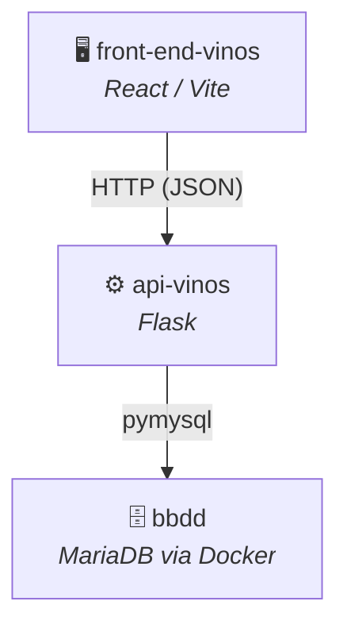
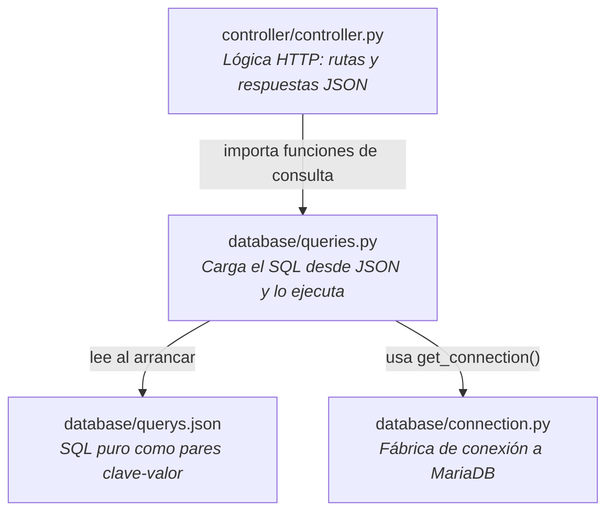
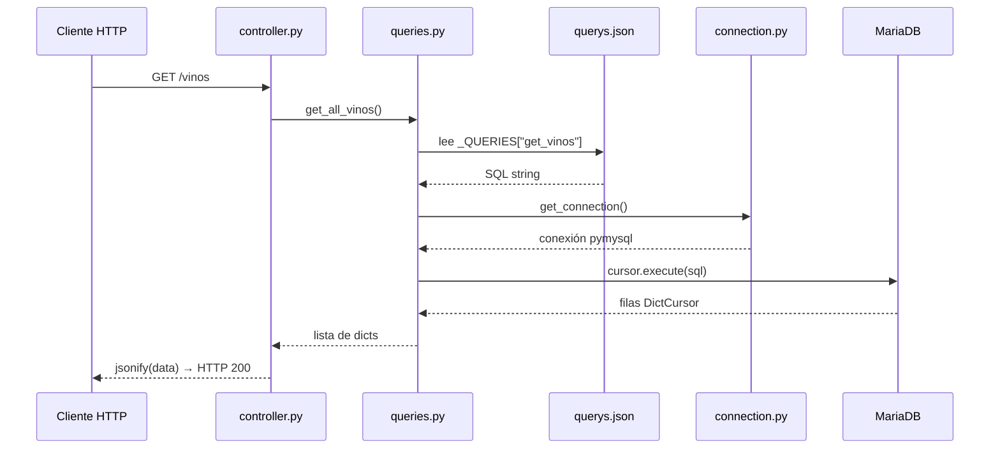

# api-vinos — Documentación Técnica

API REST construida con **Python + Flask** que actúa como capa de acceso a datos entre la base de datos MariaDB (`bbdd`) y el frontend (`front-end-vinos`).

---

## Índice

1. [Arquitectura del proyecto](#1-arquitectura-del-proyecto)
2. [Requisitos previos](#2-requisitos-previos)
3. [Instalación y puesta en marcha](#3-instalación-y-puesta-en-marcha)
4. [Estructura de archivos](#4-estructura-de-archivos)
5. [Endpoints disponibles](#5-endpoints-disponibles)
6. [Base de datos](#6-base-de-datos)
7. [Variables de entorno](#7-variables-de-entorno)
8. [Convenciones del equipo](#8-convenciones-del-equipo)

---

## 1. Arquitectura del proyecto



La API sigue el patrón **Blueprint** de Flask con una separación de responsabilidades en tres capas:



- `app.py` — Punto de entrada. Crea la app Flask y registra el Blueprint.
- `controller/controller.py` — Define las rutas. **No contiene SQL**; delega en `queries.py`.
- `database/queries.py` — Lee `querys.json` al importarse y expone funciones Python por cada consulta.
- `database/querys.json` — Almacena el SQL puro como pares `"nombre": "SELECT ..."`. Es el único lugar donde se escribe SQL.
- `database/connection.py` — Fábrica de conexiones. Su única responsabilidad es crear y devolver el objeto `connection` de pymysql.

---

## 2. Requisitos previos

| Herramienta | Versión mínima | Uso |
|---|---|---|
| Python | 3.12 | Entorno de ejecución |
| pip | — | Gestor de paquetes |
| Docker Desktop | — | Para levantar MariaDB (`bbdd`) |

Dependencias Python (instalar dentro del entorno virtual):

```
flask
pymysql
flask-cors
```

---

## 3. Instalación y puesta en marcha

> [!IMPORTANT]
> Antes de arrancar la API asegúrate de que el contenedor de MariaDB de `bbdd` está corriendo.

### 3.1 Levantar la base de datos

```bash
cd bbdd
docker compose up -d
```

### 3.2 Crear el entorno virtual e instalar dependencias

Desde la raíz de `api-vinos`:

```bash
# Crear el entorno virtual (solo la primera vez)
python3 -m venv .venv

# Activar el entorno virtual
source .venv/bin/activate        # macOS / Linux
.venv\Scripts\activate           # Windows

# Instalar dependencias
pip install flask pymysql flask-cors
```

> [!NOTE]
> El directorio `.venv/` está excluido del repositorio mediante `.gitignore`. Cada miembro del equipo debe crearlo localmente.

### 3.3 Arrancar el servidor de desarrollo

```bash
python app.py
```

La API quedará disponible en: **`http://127.0.0.1:5000`**

---

## 4. Estructura de archivos y Documentación del Código

```
api-vinos/
├── .venv/                  # Entorno virtual Python (ignorado por Git)
├── app.py                  # Punto de entrada de Flask
├── controller/
│   └── controller.py       # Rutas del Blueprint "main" (solo HTTP)
└── database/
    ├── connection.py       # Fábrica de conexión: get_connection()
    ├── queries.py          # Funciones Python que ejecutan el SQL
    └── querys.json         # SQL puro: { "nombre_query": "SELECT ..." }
```

### Documentación Detallada de Módulos y Código Fuente

#### 1. `app.py` (Punto de Entrada)
* **Propósito:** Inicializar el servidor HTTP Flask, configurar políticas de red y mapear la modularidad de rutas.
* **Componentes y Configuración Clave:**
  - **`CORS(app)`:** Habilita el middleware Cross-Origin Resource Sharing (CORS). Es crítico ya que el frontend (React) corre en `http://localhost:5173` y necesita realizar peticiones asíncronas hacia el puerto de la API `http://127.0.0.1:5000` de forma segura.
  - **`register_blueprint(main_blueprint)`:** Registra el agrupador de controladores y rutas modularizadas definido en `controller.py`.
  - **Bloque Principal (`__main__`):** Lanza el servidor en modo desarrollo (`debug=True`) en el puerto por defecto `5000` al ejecutar directamente `python app.py`.

#### 2. `controller/controller.py` (Capa de Controladores)
* **Propósito:** Actuar como la interfaz HTTP pura del backend, recibiendo peticiones y devolviendo respuestas JSON estructuradas sin interactuar directamente con código SQL.
* **Flujos y Endpoints:**
  - **`main_blueprint = Blueprint("main", __name__)`:** Instancia el Blueprint que aisla el direccionamiento de vinos.
  - **Ruta `GET /vinos` (`def vinos()`):**
    - **Entrada:** Petición GET web estándar sin parámetros requeridos de query.
    - **Lógica:** Llama a la función `get_all_vinos()` de la capa de datos.
    - **Salida:** Serializa la lista a formato JSON (`jsonify(data)`) devolviendo código HTTP **`200 OK`** si la consulta es exitosa. En caso de fallo imprevisto de base de datos o sintaxis, Flask interceptará la excepción retornando un error **`500 Internal Server Error`**.

#### 3. `database/connection.py` (Capa de Acceso y Conexiones)
* **Propósito:** Proveer conexiones limpias a la base de datos MariaDB abstrayendo la obtención de credenciales.
* **Fábrica de Conexión (`get_connection()`):**
  - **Variables de Entorno:** Lee mediante `os.environ.get()` las variables dinámicas de base de datos (`DB_HOST`, `DB_PORT`, `DB_USER`, `DB_PASSWORD`, `DB_NAME`) configuradas en Docker, con valores seguros por defecto para entornos de pruebas locales (`localhost`, puerto `3306`, usuario `vinosadmin`).
  - **`cursorclass=pymysql.cursors.DictCursor`:** Es una de las configuraciones más importantes de la API. En lugar de devolver las filas en crudo de la consulta como tuplas de Python (ej. `('Muga Crianza', 'Tinto')`), devuelve cada registro como un diccionario de Python indexado por el nombre de la columna (`{'vino_nombre': 'Muga Crianza', 'tipo_nombre': 'Tinto'}`). Esto permite su serialización directa a JSON sin procesamiento adicional en el backend.

#### 4. `database/queries.py` (Capa de Consultas en Memoria)
* **Propósito:** Ejecutar y aislar la lógica de base de datos de la aplicación.
* **Características Técnicas:**
  - **Carga en Memoria al Importar:** Utiliza `pathlib.Path` para localizar y cargar a memoria de forma instantánea el archivo `querys.json` al momento en que la API se inicia, evitando lecturas reiterativas de disco en cada petición web.
  - **Función `get_all_vinos()`:**
    - Abre la conexión mediante `get_connection()`.
    - Instancia un cursor con soporte para diccionarios.
    - Ejecuta la sentencia SQL pre-cargada desde el JSON mediante la clave `"get_vinos"`.
    - Recupera todos los datos mediante `cursor.fetchall()`, cerrando debidamente el cursor y liberando la conexión al pool antes de retornar los diccionarios.

---

### Por qué no hay `__init__.py`

Flask localiza los módulos `controller` y `database` como paquetes Python porque el servidor se lanza **desde la raíz de `api-vinos/`**, añadiendo ese directorio al `sys.path` automáticamente. Los archivos `__init__.py` son opcionales en Python 3 (namespace packages).

> [!WARNING]
> Si se abre la carpeta `api-vinos/` directamente en VSCode sin configurar el intérprete de Python del `.venv`, el editor no encontrará los módulos locales (`database`, `controller`) ni las librerías instaladas (`flask`, `pymysql`). Ver la sección de [Convenciones del equipo](#8-convenciones-del-equipo) para la solución.


---

## 5. Endpoints disponibles

### `GET /vinos`

Devuelve los vinos con todos sus datos relacionados: tipo, bodega, cosecha, formato y copa.

**Cadena de llamadas:**



**Request**
```
GET http://127.0.0.1:5000/vinos
```

**Response** — `200 OK`
```json
[
  {
    "vino_nombre": "Can Sumoi La Fou",
    "tipo_nombre": "Rosat",
    "bodega_nombre": "Can Sumoi",
    "zona_origen": "Penedès",
    "anio": 2022,
    "CONCAT(form.formato_capacidad, ' ml')": "750 ml",
    "copa_nombre": "Copa de vino rosado"
  }
]
```

> [!NOTE]
> Para añadir un nuevo endpoint: primero añade la query en `querys.json`, luego crea la función en `queries.py` y finalmente la ruta en `controller.py`. Nunca escribas SQL directamente en el controlador.

---

### Gestión de queries — `database/querys.json`

Todo el SQL del proyecto vive en este fichero JSON. `queries.py` lo carga **una sola vez al arrancar** el módulo:

```python
_QUERIES_FILE = Path(__file__).parent / "querys.json"
_QUERIES = json.loads(_QUERIES_FILE.read_text(encoding="utf-8"))
```

Cada función de consulta accede a su query por nombre de clave:

```python
cursor.execute(_QUERIES["get_vinos"])  # lee la clave del JSON
```

**Formato del JSON:**
```json
{
  "get_vinos": "SELECT v.vino_nombre, t.tipo_nombre ... FROM vinos_venta vv JOIN ...",
  "otra_query": "SELECT ..."
}
```

**Ventajas de este patrón:**
- El SQL está en un único lugar → fácil de leer y modificar sin tocar código Python.
- Añadir una nueva consulta no requiere cambiar `queries.py`, solo el JSON y crear la función que lo llame.

---

## 6. Base de datos

La conexión se configura directamente en `database/connection.py` utilizando variables de entorno o valores por defecto seguros:

| Parámetro | Valor por defecto | Variable de entorno |
|---|---|---|
| `host` | `localhost` | `DB_HOST` |
| `port` | `3306` | `DB_PORT` |
| `user` | `vinosadmin` | `DB_USER` |
| `password` | `1234` | `DB_PASSWORD` |
| `database` | `cataleg-vins` | `DB_NAME` |
| `cursorclass` | `DictCursor` (resultados como diccionarios) | — |

El uso de `DictCursor` hace que cada fila retornada sea un `dict` Python con los nombres de columna como claves, lo que permite serializarla directamente a JSON.

> [!CAUTION]
> Las credenciales están escritas directamente en el código. Como próximo paso se deben mover a un archivo `.env` (ver sección siguiente) que **no se suba al repositorio**.

---

## 7. Variables de entorno

Actualmente no existe un archivo `.env`. El objetivo es moverlo aquí para no tener credenciales en el código fuente.

Crear un archivo `.env` en la raíz de `api-vinos/` (este archivo está en `.gitignore`):

```env
DB_HOST=localhost
DB_PORT=3306
DB_USER=vinosadmin
DB_PASSWORD=1234
DB_NAME=cataleg-vins
```

Compartir con el equipo un archivo `.env.example` con los nombres de las variables pero **sin valores reales**:

```env
DB_HOST=
DB_USER=
DB_PASSWORD=
DB_NAME=
```

---

## 8. Convenciones del equipo

### Seleccionar el intérprete de Python en VSCode

VSCode necesita saber qué intérprete usar para resolver los imports correctamente. Si ves errores de tipo `Import "flask" could not be resolved`:

1. Abre la paleta de comandos: `Cmd+Shift+P`
2. Escribe y selecciona: **Python: Select Interpreter**
3. Elige la opción que apunte a `.venv`:
   ```
   ./api-vinos/.venv/bin/python  (o similar)
   ```

Alternativamente, crea un archivo `.vscode/settings.json` en la raíz del repositorio:

```json
{
  "python.defaultInterpreterPath": "${workspaceFolder}/api-vinos/.venv/bin/python"
}
```

### Flujo de trabajo Git

- **No subir** `.venv/`, `__pycache__/`, archivos `.pyc` ni `.env`.
- Hacer commit de cualquier nueva dependencia documentándola en este README o en un `requirements.txt`.
- Abrir Pull Request para cualquier nuevo endpoint y actualizar la sección [Endpoints](#5-endpoints-disponibles).
