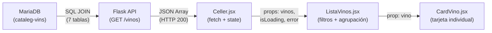
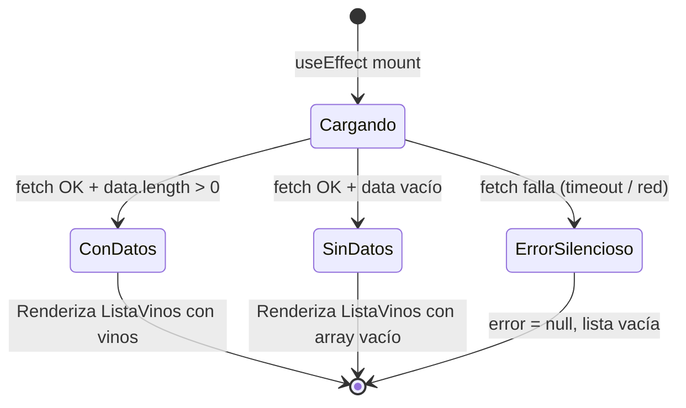
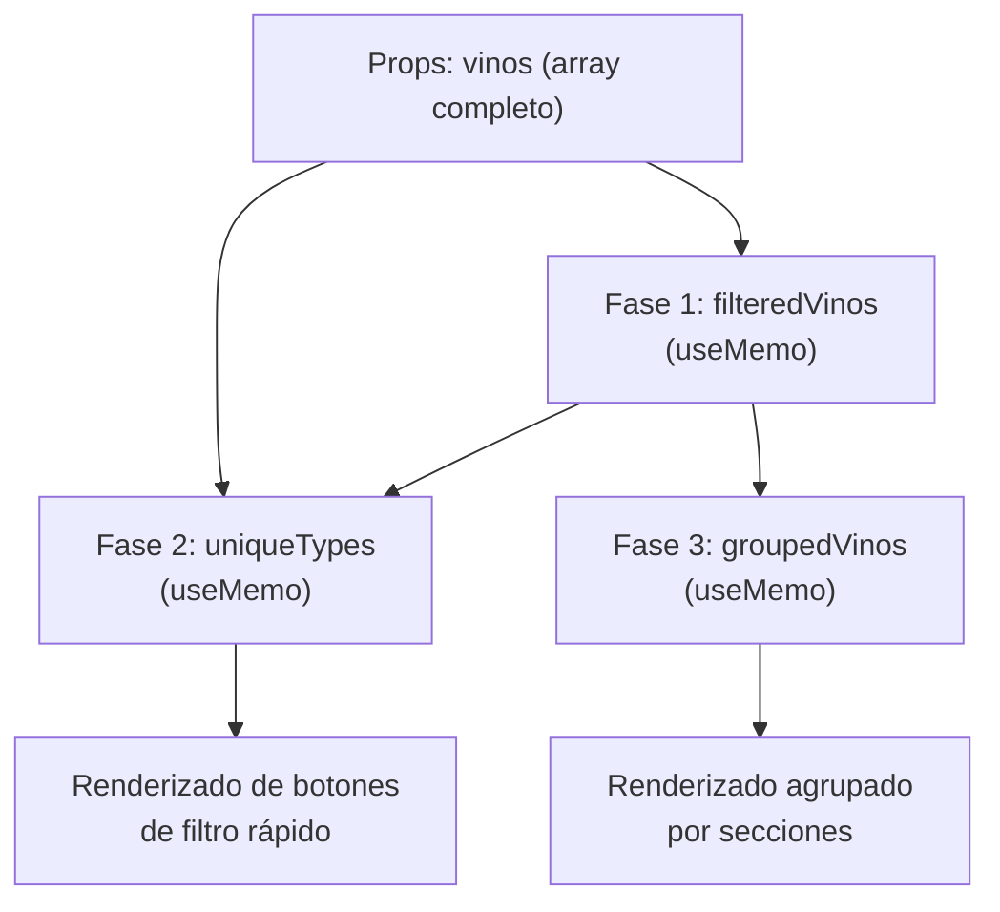
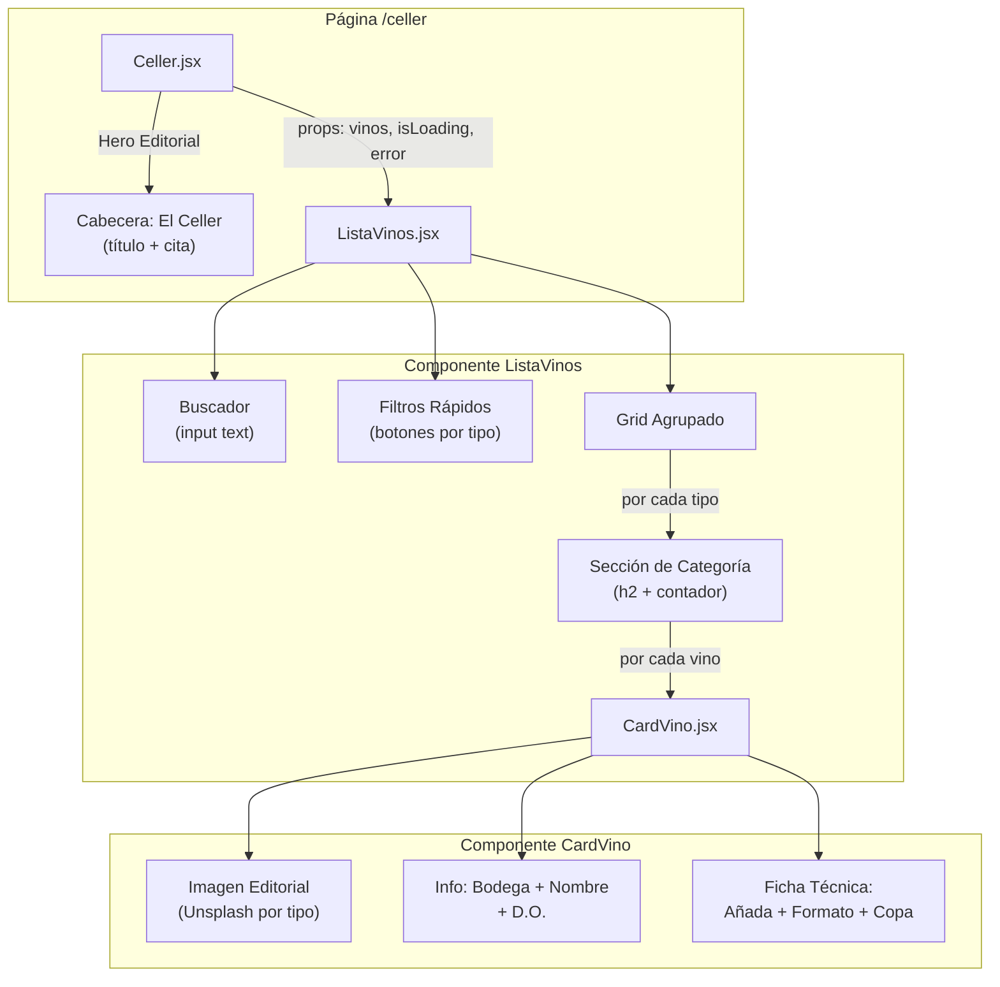

# Documentación: Funcionalidad de la Lista de Vinos (El Celler)

Documentación técnica del flujo completo de la **Lista de Vinos** del restaurante La Canal. Esta funcionalidad permite a los usuarios explorar, filtrar y buscar el catálogo de vinos disponibles en la bodega del restaurante, accediendo a ella desde la página principal a través de la ruta `/celler`.

---

## 1. Visión General del Flujo de Datos

La Lista de Vinos sigue una arquitectura de tres capas: **Base de datos → API → Frontend**.



### Resumen del flujo:
1. **Base de datos** (`cataleg-vins`): Una consulta SQL con 7 JOINs extrae los datos de vinos a la venta con toda su información asociada.
2. **API Flask** (`GET /vinos`): Sirve los datos como un array JSON al frontend.
3. **Página Celler** (`Celler.jsx`): Consume la API, gestiona el estado de carga/error y pasa los datos al componente de lista.
4. **Lista de Vinos** (`ListaVinos.jsx`): Implementa búsqueda, filtrado por tipo y agrupación visual.
5. **Tarjeta de Vino** (`CardVino.jsx`): Renderiza cada vino individual con un diseño editorial premium.

---

## 2. Capa de Base de Datos

### Consulta SQL Principal

La consulta que alimenta toda la Lista de Vinos está definida en [`querys.json`](file:///Users/heernaa/Desktop/ABP/api-vinos/database/querys.json) bajo la clave `"get_vinos"`:

```sql
SELECT
    v.vino_nombre,
    t.tipo_nombre,
    b.bodega_nombre,
    v.zona_origen,
    c.anio,
    CONCAT(form.formato_capacidad, ' ml') AS Capacidad,
    cop.copa_nombre
FROM vinos_venta vv
    JOIN cosechas c    ON c.cosecha_id = vv.cosecha_id
    JOIN formatos form ON vv.formato_id = form.formato_id
    JOIN vinos v       ON c.vino_id = v.vino_id
    JOIN tipos t       ON t.tipo_id = v.vino_tipo
    JOIN copas cop     ON cop.copa_id = v.copa_id
    JOIN bodegas b     ON b.bodega_id = v.bodega;
```

### Tablas involucradas y su rol

| Tabla | Rol en la consulta | Dato que aporta |
|-------|-------------------|-----------------|
| `vinos_venta` | Tabla raíz — productos a la venta | Enlaza cosecha con formato |
| `cosechas` | Añada del vino | `anio` (año de cosecha) |
| `formatos` | Formato de botella | `formato_capacidad` → `Capacidad` (ej. "750 ml") |
| `vinos` | Catálogo principal | `vino_nombre`, `zona_origen` |
| `tipos` | Clasificación del vino | `tipo_nombre` (Tinto, Blanco, Espumoso…) |
| `copas` | Copa recomendada de servicio | `copa_nombre` |
| `bodegas` | Bodega productora | `bodega_nombre` |

### Estructura del objeto JSON devuelto por registro

```json
{
  "vino_nombre": "Muga Crianza",
  "tipo_nombre": "Tinto",
  "bodega_nombre": "Bodegas Muga",
  "zona_origen": "D.O.Ca. Rioja",
  "anio": 2019,
  "Capacidad": "750 ml",
  "copa_nombre": "Copa Burdeos (Tinto)"
}
```

> [!NOTE]
> El campo `Capacidad` se genera con `CONCAT(formato_capacidad, ' ml')` en la propia SQL. El frontend también contempla el nombre crudo del alias `CONCAT(form.formato_capacidad, ' ml')` como clave alternativa por si el driver de la base de datos lo devuelve literalmente.

---

## 3. Capa de API (Flask)

### Archivos implicados

| Archivo | Responsabilidad |
|---------|----------------|
| [`app.py`](file:///Users/heernaa/Desktop/ABP/api-vinos/app.py) | Punto de entrada Flask. Registra el Blueprint del controlador y habilita CORS. |
| [`controller.py`](file:///Users/heernaa/Desktop/ABP/api-vinos/controller/controller.py) | Define la ruta `GET /vinos`. Llama a `get_all_vinos()` y devuelve `jsonify(data)`. |
| [`queries.py`](file:///Users/heernaa/Desktop/ABP/api-vinos/database/queries.py) | Ejecuta la consulta SQL. Carga la query desde `querys.json` al importarse el módulo. |
| [`connection.py`](file:///Users/heernaa/Desktop/ABP/api-vinos/database/connection.py) | Establece conexión con MariaDB usando `pymysql`. Configurable por variables de entorno. |
| [`querys.json`](file:///Users/heernaa/Desktop/ABP/api-vinos/database/querys.json) | Almacén centralizado de consultas SQL en formato JSON. |

### Endpoint

| Método | Ruta | Respuesta | Content-Type |
|--------|------|-----------|--------------|
| `GET` | `/vinos` | Array JSON con todos los vinos a la venta | `application/json` |

### Configuración de conexión a la base de datos

| Variable de entorno | Valor por defecto | Descripción |
|---------------------|-------------------|-------------|
| `DB_HOST` | `localhost` | Host del servidor MariaDB |
| `DB_PORT` | `3306` | Puerto de MariaDB |
| `DB_USER` | `vinosadmin` | Usuario de la base de datos |
| `DB_PASSWORD` | `1234` | Contraseña del usuario |
| `DB_NAME` | `cataleg-vins` | Nombre de la base de datos |

> [!IMPORTANT]
> La conexión usa `DictCursor` de `pymysql`, lo que hace que cada fila se devuelva como un diccionario Python (clave = nombre de columna), que Flask serializa directamente a JSON.

---

## 4. Capa de Frontend (React)

### 4.1. Página `Celler.jsx` — Orquestador de la vista

**Ruta:** `/celler`
**Archivo:** [`Celler.jsx`](file:///Users/heernaa/Desktop/ABP/front-end-vinos/src/pages/Celler.jsx)

#### Responsabilidades:
1. **Consumo de la API** — Hace `fetch` a `http://127.0.0.1:5000/vinos` al montarse.
2. **Gestión de estado** — Maneja tres estados con `useState`:
   - `vinos` (`Array`): Lista de vinos obtenidos de la API.
   - `isLoading` (`boolean`): Indica si la petición está en curso.
   - `error` (`null | Error`): Almacena errores de conexión.
3. **Renderizado del Hero editorial** — Muestra la cabecera visual con el título "El Celler" y una cita editorial.
4. **Delegación al componente `ListaVinos`** — Pasa `vinos`, `isLoading` y `error` como props.

#### Diagrama de estado del componente:



#### Mecanismos de resiliencia:

| Mecanismo | Implementación | Por qué |
|-----------|---------------|---------|
| **Timeout de 3s** | `AbortController` + `setTimeout` | Evita que la UI quede bloqueada indefinidamente si la API no responde. |
| **Cleanup en desmontaje** | Variable `active` + return en `useEffect` | Previene actualizaciones de estado en un componente ya desmontado (evita memory leaks). |
| **Error silencioso** | En el `catch`, se establece `error = null` | La experiencia del usuario permanece fluida; no se muestra un error visual agresivo. |
| **Scroll al inicio** | `window.scrollTo({ top: 0, behavior: "instant" })` | Garantiza que la página comience en la parte superior al navegar desde otra ruta. |

---

### 4.2. Componente `ListaVinos.jsx` — Motor de filtrado y agrupación

**Archivo:** [`ListaVinos.jsx`](file:///Users/heernaa/Desktop/ABP/front-end-vinos/src/components/ListaVinos.jsx)

#### Props recibidas:

| Prop | Tipo | Descripción |
|------|------|-------------|
| `vinos` | `Array<Object>` | Array de objetos de vino procedentes de la API |
| `isLoading` | `boolean` | Si `true`, muestra el skeleton loader |
| `error` | `Object \| null` | Si tiene valor, muestra el estado de error |

#### Estado local:

| Estado | Tipo | Valor inicial | Uso |
|--------|------|---------------|-----|
| `searchQuery` | `string` | `""` | Texto introducido en el buscador |
| `selectedType` | `string` | `"all"` | Tipo de vino seleccionado en los filtros rápidos |

#### Lógica de procesamiento de datos (3 etapas memorizadas)

Los datos se transforman en tres fases consecutivas, cada una optimizada con `useMemo` para evitar recálculos innecesarios:



##### Fase 1 — `filteredVinos`: Filtrado combinado

Filtra el array `vinos` combinando dos criterios con operador AND:

| Criterio | Campo(s) buscados | Lógica |
|----------|-------------------|--------|
| **Búsqueda de texto** (`matchSearch`) | `vino_nombre`, `bodega_nombre`, `zona_origen` | Coincidencia parcial case-insensitive (`includes`) |
| **Filtro por tipo** (`matchType`) | `tipo_nombre` | Coincidencia exacta (normalizada) o `"all"` para mostrar todos |

##### Fase 2 — `uniqueTypes`: Extracción de tipos únicos

- Recorre el array `vinos` original (no el filtrado) para extraer todos los valores únicos de `tipo_nombre`.
- Usa un `Set` para eliminar duplicados y ordena alfabéticamente.
- Se usa para renderizar los botones de filtro rápido dinámicamente.

##### Fase 3 — `groupedVinos`: Agrupación por tipo

- Agrupa los `filteredVinos` en un objeto `{ [tipo_nombre]: Array<vino> }`.
- Dentro de cada grupo, los vinos se ordenan alfabéticamente por `vino_nombre` con `localeCompare`.
- Los vinos sin tipo se agrupan bajo `"Altres / Otros"`.

#### Función auxiliar: `formatTypeHeader`

Traduce los nombres de tipo de la base de datos a cabeceras bilingües elegantes (catalán / castellano):

| Valor en BBDD | Cabecera renderizada |
|----------------|----------------------|
| `tinto` | Vins Tints / Vinos Tintos |
| `blanco` | Vins Blancs / Vinos Blancos |
| `espumoso` | Vins Escumosos / Espumosos |
| `rosado` / `rosat` | Vins Rosats / Rosados |
| Otro valor | Se muestra en MAYÚSCULAS |

#### Estados de UI renderizados:

| Estado | Condición | Qué se muestra |
|--------|-----------|----------------|
| **Cargando** | `isLoading === true` | Skeleton loader animado con `animate-pulse` (3 tarjetas fantasma) |
| **Error** | `error !== null` | Panel con doble borde, mensaje "Error de connexió" e instrucciones |
| **Sin resultados** | `filteredVinos.length === 0` | Panel "Sense resultats" con botón "Netejar filtres" para resetear búsqueda y filtro |
| **Con resultados** | `filteredVinos.length > 0` | Grid agrupado por secciones con encabezados de categoría y contador de vinos |

---

### 4.3. Componente `CardVino.jsx` — Tarjeta individual de vino

**Archivo:** [`CardVino.jsx`](file:///Users/heernaa/Desktop/ABP/front-end-vinos/src/components/CardVino.jsx)

#### Prop recibida:

| Prop | Tipo | Descripción |
|------|------|-------------|
| `vino` | `Object` | Un objeto de vino con todos los campos de la API |

#### Campos del objeto `vino` utilizados:

| Campo | Uso en la tarjeta |
|-------|-------------------|
| `vino_nombre` | Nombre principal (h3, tipografía Serif Romana) |
| `tipo_nombre` | Tag superpuesto en la imagen + selección de imagen editorial |
| `bodega_nombre` | Subtítulo superior (tipografía Sans Humanista) |
| `zona_origen` | D.O. en cursiva serif debajo del nombre |
| `anio` | Ficha técnica: "Any / Añada" |
| `Capacidad` | Ficha técnica: "Format / Formato" |
| `copa_nombre` | Ficha técnica: "Copa de Servei" (condicional) |

> [!NOTE]
> El campo `copa_nombre` solo se muestra si tiene un valor definido (`{copa_nombre && (...)}`).

#### Sistema de imágenes editoriales (`WINE_IMAGES`)

En lugar de imágenes de la base de datos, el componente usa un mapa estático de fotos editoriales de Unsplash, seleccionadas por tipo de vino:

| Tipo | Imagen asignada |
|------|----------------|
| `tinto` | Foto de vino tinto en copa |
| `blanco` | Foto de vino blanco |
| `espumoso` | Foto de espumoso/champán |
| `rosado` / `rosat` | Foto de vino rosado |
| Cualquier otro / sin tipo | Imagen por defecto genérica de vino |

La selección se hace normalizando `tipo_nombre` a minúsculas y buscando en el mapa `WINE_IMAGES`.

#### Estructura visual de la tarjeta:

```
┌─────────────────────────────┐  ← double-border-frame (borde exterior)
│ ┌─────────────────────────┐ │  ← double-border-frame-inner (borde interior)
│ │ ┌─────────────────────┐ │ │
│ │ │                     │ │ │  ← Imagen editorial (aspect-ratio 3:4)
│ │ │   [TAG: Tipo]       │ │ │     con tag superpuesto
│ │ │                     │ │ │     hover: scale 1.05 en 1.5s
│ │ └─────────────────────┘ │ │
│ │                         │ │
│ │     BODEGA_NOMBRE       │ │  ← Sans Humanista, 10px, tracking 0.25em
│ │     VINO_NOMBRE         │ │  ← Serif Romana, 18px, uppercase
│ │     ───────             │ │  ← Separador visual
│ │     zona_origen         │ │  ← Serif Cursiva, itálica, lowercase
│ │                         │ │
│ │  ┄┄┄┄┄┄┄┄┄┄┄┄┄┄┄┄┄┄┄  │ │  ← Ficha técnica con separadores
│ │  Any / Añada     2019   │ │
│ │  Format         750 ml  │ │
│ │  Copa      Copa Burdeos │ │  ← Solo si copa_nombre existe
│ │                         │ │
│ └─────────────────────────┘ │
└─────────────────────────────┘
```

#### Interacciones y micro-animaciones:

| Interacción | Efecto | Duración |
|-------------|--------|----------|
| Hover sobre la tarjeta | `shadow-2xl`, `translateY(-4px)`, borde más visible | 700ms (cubic-bezier) |
| Hover sobre la imagen | `scale(1.05)` con `ease-out` | 1500ms |

---

## 5. Integración en el Enrutamiento

La Lista de Vinos se integra en la navegación SPA de la siguiente manera:

| Archivo | Definición |
|---------|-----------|
| [`App.jsx`](file:///Users/heernaa/Desktop/ABP/front-end-vinos/src/App.jsx) | `<Route path="/celler" element={<Celler />} />` |
| [`NavBar.jsx`](file:///Users/heernaa/Desktop/ABP/front-end-vinos/src/components/NavBar.jsx) | Enlace de navegación `<Link to="/celler">` en la barra |

El usuario accede a la lista a través de:
- El enlace **"El Celler"** en la barra de navegación persistente.
- Navegación directa a la URL `/celler`.

Dentro de la página Celler existe un enlace de retorno `← Tornar a l'inici / Volver al inicio` que lleva a `/`.

---

## 6. Estilos CSS Utilizados

Los componentes de la Lista de Vinos utilizan las clases de diseño definidas en [`index.css`](file:///Users/heernaa/Desktop/ABP/front-end-vinos/src/index.css):

| Clase CSS | Uso en la Lista de Vinos |
|-----------|--------------------------|
| `.double-border-frame` | Envoltorio de cada `CardVino`, paneles de error y sin resultados |
| `.double-border-frame-inner` | Borde interior del doble marco perimetral |
| `.marble-subtle-bg` | Fondo de la sección Hero de la página Celler |
| `animate-pulse` | Skeleton loader durante la carga |

### Variables de tema (Tailwind CSS v4) utilizadas:

| Variable | Uso |
|----------|-----|
| `canal-bg` | Fondo de la página y las tarjetas |
| `canal-alt` | Fondo alternativo de las imágenes |
| `canal-text` | Color del texto principal y botones activos |
| `canal-secondary` | Texto secundario, etiquetas y placeholders |
| `canal-border` | Bordes de tarjetas, separadores y filtros |
| `font-serif-romana` | Nombres de vino y cabeceras de categoría |
| `font-sans-humanist` | Bodegas, filtros, buscador y ficha técnica |
| `font-serif-italic` | Zona de origen y contador de vinos |

---

## 7. Diagrama de Componentes Completo



---

## 8. Posibles Mejoras Futuras

| Mejora | Descripción |
|--------|-------------|
| **Imágenes propias de la BBDD** | Sustituir las imágenes de Unsplash por fotos reales de cada vino almacenadas en la base de datos. |
| **Paginación o scroll infinito** | Si el catálogo crece significativamente, implementar carga lazy de vinos. |
| **Activación del fallback** | Descomentar y activar `FALLBACK_VINOS` en `Celler.jsx` para que la UI muestre datos estáticos si la API falla. |
| **Filtro por D.O. / bodega** | Añadir filtros adicionales por denominación de origen o por bodega productora. |
| **Detalles expandidos** | Implementar una vista detallada de cada vino con composición de uvas (`vinos_uvas`), descripción completa y maridajes. |
| **Caché de API** | Implementar `React Query` o `SWR` para cachear las respuestas y reducir las llamadas a la API. |
