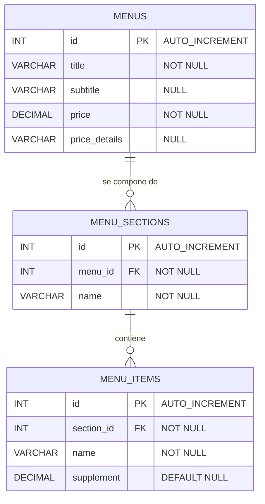

# Documentación del Esquema: Base de Datos `menus-lacanal`

Este documento describe en detalle el esquema de la base de datos `menus-lacanal`, encargada de gestionar los menús gastronómicos ofrecidos en el restaurante **La Canal**. El diseño está estructurado de manera jerárquica para permitir menús flexibles compuestos por múltiples secciones y platos/ítems por sección.

> [!NOTE]
> El script SQL de inicialización y carga de datos iniciales se encuentra en [`bbdd/init-scripts/06-schema-menus.sql`](file:///Users/heernaa/Desktop/ABP%20(LACANAL)/test_repository/bbdd/init-scripts/06-schema-menus.sql). Este script se ejecuta automáticamente al levantar el contenedor Docker.

---

## Índice

1. [Resumen del Esquema](#1-resumen-del-esquema)
2. [Detalle de Tablas](#2-detalle-de-tablas)
   - [2.1 Tabla `menus`](#21-tabla-menus)
   - [2.2 Tabla `menu_sections`](#22-tabla-menu_sections)
   - [2.3 Tabla `menu_items`](#23-tabla-menu_items)
3. [Relaciones entre Tablas](#3-relaciones-entre-tablas)
4. [Diagrama Entidad-Relación](#4-diagrama-entidad-relación)
5. [Consultas de Ejemplo](#5-consultas-de-ejemplo)
6. [Decisiones de Diseño](#6-decisiones-de-diseño)

---

## 1. Resumen del Esquema

La base de datos `menus-lacanal` permite administrar la oferta de menús estructurados del restaurante (como el menú diario, el menú especial de fin de semana o menús degustación especiales como el *Interludi*). 

Se organiza en tres niveles relacionales jerárquicos:
1. **Menú** (`menus`): La cabecera del menú (título, precio, validez y detalles).
2. **Secciones** (`menu_sections`): Las divisiones de un menú (ej. "Snacks", "Primers", "Segons", "Postres").
3. **Platos** (`menu_items`): La lista de platos disponibles dentro de cada sección, con la posibilidad de registrar un coste suplementario para platos premium.

---

## 2. Detalle de Tablas

### 2.1 Tabla `menus`

Almacena la cabecera principal y metadatos de cada menú del restaurante.

| Columna | Tipo de Datos | Nulo | Default | Restricciones | Descripción |
| :--- | :--- | :---: | :---: | :---: | :--- |
| `id` | `INT` | NO | AUTO_INCREMENT | **PRIMARY KEY** | Identificador único del menú. |
| `title` | `VARCHAR(100)` | NO | — | `NOT NULL` | Nombre principal del menú (ej: "Menú del Dia"). |
| `subtitle` | `VARCHAR(255)` | SÍ | `NULL` | — | Descripción o período de validez (ej: "De dimarts a divendres al migdia"). |
| `price` | `DECIMAL(5, 2)`| NO | — | `NOT NULL` | Precio base del menú. |
| `price_details` | `VARCHAR(255)` | SÍ | `NULL` | — | Detalles del precio o suplementos incluidos (ej: "IVA inclòs • amb pa, aigua i copa de vi"). |

```sql
CREATE TABLE if not exists menus (
    id INT AUTO_INCREMENT PRIMARY KEY,
    title VARCHAR(100) NOT NULL,
    subtitle VARCHAR(255),
    price DECIMAL(5, 2) NOT NULL,
    price_details VARCHAR(255)
);
```

#### Datos precargados

El script de inicialización inserta **3 menús** básicos:

| id | title | subtitle | price | price_details |
| :---: | :--- | :--- | :---: | :--- |
| 1 | Menú del Dia | De dimarts a divendres al migdia | 19.50 | IVA inclòs • amb pa, aigua i copa de vi |
| 2 | Menú Interludi | Cocktail benvinguda | 45.00 | IVA inclòs • amb pa i aigua |
| 3 | Menú Cap de Setmana | Cocktail benvinguda | 35.00 | IVA inclòs • amb pa i aigua |

---

### 2.2 Tabla `menu_sections`

Representa las diferentes fases o secciones en las que se divide un menú estructurado.

| Columna | Tipo de Datos | Nulo | Default | Restricciones | Descripción |
| :--- | :--- | :---: | :---: | :---: | :--- |
| `id` | `INT` | NO | AUTO_INCREMENT | **PRIMARY KEY** | Identificador único de la sección. |
| `menu_id` | `INT` | NO | — | `NOT NULL`, **FK → menus** | Referencia al menú al que pertenece la sección. |
| `name` | `VARCHAR(100)` | NO | — | `NOT NULL` | Nombre de la sección (ej: "Primers", "Segons a escollir", "Snacks"). |

```sql
CREATE TABLE if not exists menu_sections (
    id INT AUTO_INCREMENT PRIMARY KEY,
    menu_id INT NOT NULL,
    name VARCHAR(100) NOT NULL,
    CONSTRAINT fk_sections_menus FOREIGN KEY (menu_id) REFERENCES menus (id) ON DELETE CASCADE
);
```

---

### 2.3 Tabla `menu_items`

Almacena los platos individuales o artículos que forman parte de cada sección de un menú.

| Columna | Tipo de Datos | Nulo | Default | Restricciones | Descripción |
| :--- | :--- | :---: | :---: | :---: | :--- |
| `id` | `INT` | NO | AUTO_INCREMENT | **PRIMARY KEY** | Identificador único del plato. |
| `section_id` | `INT` | NO | — | `NOT NULL`, **FK → menu_sections** | Referencia a la sección del menú a la que pertenece. |
| `name` | `VARCHAR(255)` | NO | — | `NOT NULL` | Nombre descriptivo del plato y sus ingredientes. |
| `supplement` | `DECIMAL(5, 2)`| SÍ | `NULL` | — | Cargo extra opcional si se selecciona este plato (ej: 14.00 para Filet de vedella). |

```sql
CREATE TABLE if not exists menu_items (
    id INT AUTO_INCREMENT PRIMARY KEY,
    section_id INT NOT NULL,
    name VARCHAR(255) NOT NULL,
    supplement DECIMAL(5, 2) DEFAULT NULL,
    CONSTRAINT fk_items_sections FOREIGN KEY (section_id) REFERENCES menu_sections (id) ON DELETE CASCADE
);
```

---

## 3. Relaciones entre Tablas

El esquema define dos relaciones clave de tipo jerárquico-dependiente:

| Relación                          | Tipo    | Columna FK     | Referencia               | Regla ON DELETE | Motivo |
|-----------------------------------|---------|----------------|---------------------------|-----------------|-------------------------------------------------------------------------------------------------|
| `menu_sections` → `menus`         | N:1     | `menu_id`      | `menus(id)`               | **CASCADE**     | Si se elimina un menú, todas sus secciones asociadas pierden el sentido y deben borrarse.       |
| `menu_items` → `menu_sections`    | N:1     | `section_id`   | `menu_sections(id)`       | **CASCADE**     | Si se elimina una sección, todos los platos que contiene se borran automáticamente.             |

### Descripción textual

- **Un menú contiene múltiples secciones** (1:N). La eliminación física de un menú borra recursivamente todas sus secciones para evitar registros huérfanos.
- **Una sección agrupa múltiples platos o ítems** (1:N). Del mismo modo, la eliminación de una sección propaga la limpieza en cascada a todos sus platos dependientes.
- **La relación es lineal y unidereccional** en sentido descendente (`menus` → `menu_sections` → `menu_items`).

---

## 4. Diagrama Entidad-Relación



---

## 5. Consultas de Ejemplo

### 5.1 Obtener la estructura completa de un menú (con secciones y platos)

Esta consulta recopila la información estructurada necesaria para pintar la carta interactiva en la interfaz de React:

```sql
SELECT 
    m.title AS menu_nombre,
    m.price AS menu_precio,
    ms.name AS seccion_nombre,
    mi.name AS plato_nombre,
    mi.supplement AS plato_suplemento
FROM menus m
INNER JOIN menu_sections ms ON m.id = ms.menu_id
INNER JOIN menu_items mi    ON ms.id = mi.section_id
WHERE m.id = 1
ORDER BY ms.id, mi.id;
```

### 5.2 Consultar qué platos tienen un coste extra o suplemento en todos los menús

```sql
SELECT 
    m.title AS menu_nombre,
    ms.name AS seccion_nombre,
    mi.name AS plato_nombre,
    CONCAT('+', mi.supplement, ' €') AS suplemento
FROM menu_items mi
INNER JOIN menu_sections ms ON mi.section_id = ms.id
INNER JOIN menus m          ON ms.menu_id = m.id
WHERE mi.supplement IS NOT NULL AND mi.supplement > 0
ORDER BY m.id, mi.supplement DESC;
```

### 5.3 Insertar una nueva sección y sus platos correspondientes dentro de un menú existente

```sql
-- 1. Insertamos una nueva sección en el menú con ID = 1 (Menú del Día)
INSERT INTO menu_sections (menu_id, name)
VALUES (1, 'Bebidas y Sugerencias');

-- 2. Insertamos platos en esa sección usando LAST_INSERT_ID()
INSERT INTO menu_items (section_id, name, supplement)
VALUES 
    (LAST_INSERT_ID(), 'Copa de Vino Tinto Selección especial', 3.00),
    (LAST_INSERT_ID(), 'Cerveza artesanal local', NULL);
```

---

## 6. Decisiones de Diseño

### 6.1 Estructura altamente normalizada de 3 niveles

Se prefirió diseñar tres tablas independientes en lugar de un esquema plano o desnormalizado (por ejemplo, guardar secciones e ítems en formato JSON en una sola tabla) por las siguientes razones:
* **Facilidad de consultas**: Permite al motor relacional filtrar, buscar y ordenar platos directamente mediante sentencias SQL estándar sin necesidad de parsear strings en la base de datos.
* **Integridad referencial absoluta**: Las claves foráneas garantizan que no existan platos apuntando a secciones fantasma, ni secciones en menús inexistentes.
* **Flexibilidad para el frontend**: Permite a la API estructurar y devolver de manera nativa árboles JSON bien anidados a la interfaz de usuario de React de forma óptima.

### 6.2 Uso de `ON DELETE CASCADE` recursivo

A diferencia de las bases de datos operativas de ventas o reservas, donde los registros deben blindarse mediante `RESTRICT` para evitar la pérdida accidental de históricos, la estructura de la carta de menús es puramente de contenidos de exhibición. 

Si el administrador borra un menú o una sección de forma voluntaria, lo esperado es que toda su descendencia desaparezca del catálogo. El borrado en cascada automatiza y simplifica este mantenimiento sin requerir complejas transacciones multi-paso en el backend.

### 6.3 Campo `supplement` como decimal anulable (`DEFAULT NULL`)

El campo `supplement` en la tabla `menu_items` usa `NULL` por defecto para denotar platos cuyo precio está completamente cubierto por el precio base del menú. Esto permite al frontend diferenciar con total claridad un plato "sin cargo extra" (`NULL` o `0`) de un plato gourmet que requiere un suplemento explícito (ej: carne de alta gama o marisco premium).

---

*Última actualización: mayo 2026 — Proyecto ABP Vinos · La Canal*
