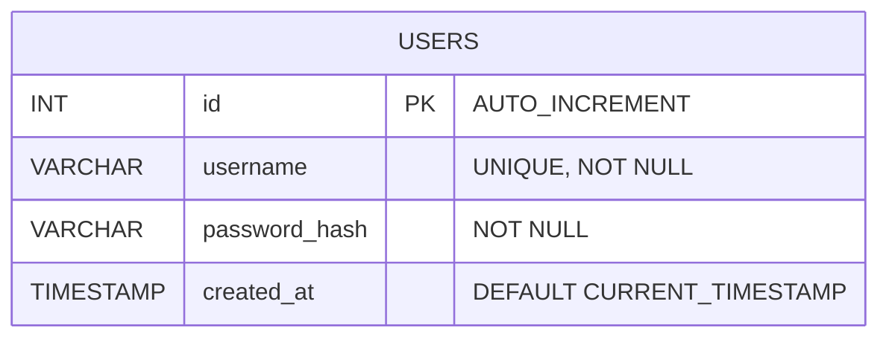
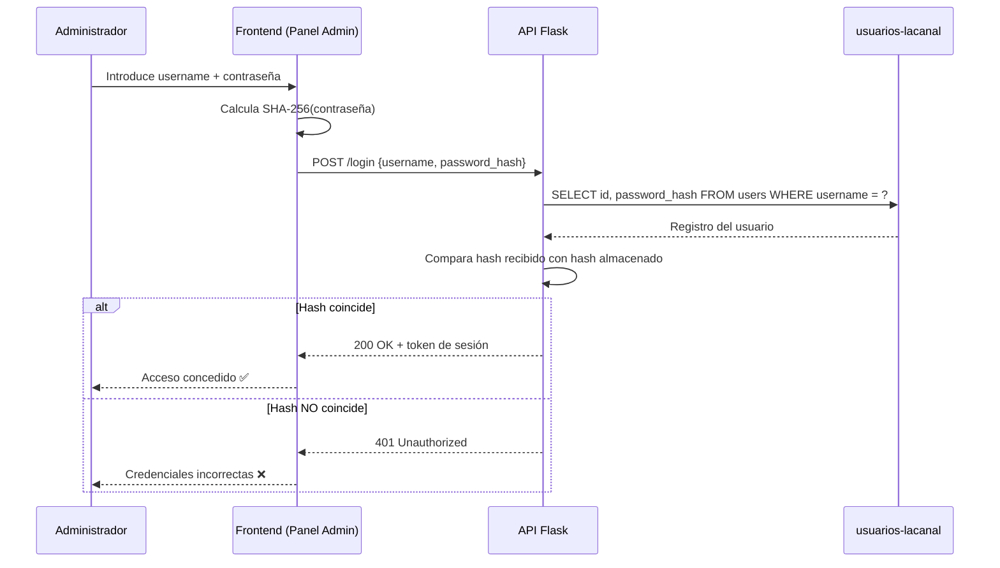

# Documentación del Esquema: Base de Datos `usuarios-lacanal`

Este documento describe en detalle el esquema de la base de datos `usuarios-lacanal`, encargada de gestionar el control de acceso de usuarios y las credenciales de administración del panel de control del restaurante **La Canal**.

> [!NOTE]
> El script SQL de inicialización y carga de datos iniciales se encuentra en [`bbdd/init-scripts/05-schema-users.sql`](file:///Users/heernaa/Desktop/ABP%20(LACANAL)/test_repository/bbdd/init-scripts/05-schema-users.sql). Este script se ejecuta automáticamente al levantar el contenedor de Docker.

---

## Índice

1. [Resumen del Esquema](#1-resumen-del-esquema)
2. [Estructura de la Tabla `users`](#2-estructura-de-la-tabla-users)
3. [Seguridad y Cifrado](#3-seguridad-y-cifrado)
4. [Datos Iniciales y Carga](#4-datos-iniciales-y-carga)
5. [Consultas de Administración Frecuentes](#5-consultas-de-administración-frecuentes)

---

## 1. Resumen del Esquema

La base de datos `usuarios-lacanal` está aislada de los catálogos operativos (vinos y reservas) por razones de seguridad e integridad de datos. Su único propósito es autenticar a los miembros del equipo autorizados para acceder al panel de administración del restaurante.

### Diagrama Entidad-Relación



### Flujo de Autenticación



---

## 2. Estructura de la Tabla `users`

La tabla principal de almacenamiento es `users`. Su diseño está optimizado para consultas rápidas de autenticación.

| Columna | Tipo de Datos | Nulo | Default | Restricciones | Descripción |
| :--- | :--- | :---: | :---: | :---: | :--- |
| `id` | `INT` | NO | AUTO_INCREMENT | **PRIMARY KEY** | Identificador numérico único de usuario. |
| `username` | `VARCHAR(50)` | NO | — | `UNIQUE`, `NOT NULL` | Nombre de usuario único para login. |
| `password_hash` | `VARCHAR(255)` | NO | — | `NOT NULL` | Hash seguro de la contraseña cifrada. |
| `created_at` | `TIMESTAMP` | SÍ | `CURRENT_TIMESTAMP` | — | Fecha y hora de creación automática. |

```sql
CREATE TABLE IF NOT EXISTS users (
    id INT AUTO_INCREMENT PRIMARY KEY,
    username VARCHAR(50) UNIQUE NOT NULL,
    password_hash VARCHAR(255) NOT NULL,
    created_at TIMESTAMP DEFAULT CURRENT_TIMESTAMP
);
```

---

## 3. Seguridad y Cifrado

El campo `password_hash` está diseñado para almacenar las contraseñas procesadas bajo técnicas de hashing criptográfico unidireccional. 

### Algoritmo Utilizado: SHA-256
* **Longitud del Hash:** 64 caracteres en representación hexadecimal (256 bits).
* **Justificación de Diseño:** 
  - SHA-256 es una función criptográfica de hash de alta velocidad y robustez, ideal para aplicaciones internas y paneles de administración de restaurantes.
  - Almacenar hashes en lugar de texto plano garantiza que, en el caso improbable de una brecha física o volcado de la base de datos, las contraseñas reales de los administradores permanezcan indescifrables.

---

## 4. Datos Iniciales y Carga

El script de inicialización realiza una inserción segura del usuario administrador inicial de la plataforma utilizando una sentencia de inserción idempotente con protección ante duplicados (`ON DUPLICATE KEY UPDATE`):

```sql
INSERT INTO
    users (username, password_hash)
VALUES (
        'admin',
        '03ac674216f3e15c761ee1a5e255f067953623c8b388b4459e13f978d7c846f4'
    )
ON DUPLICATE KEY UPDATE
    password_hash = VALUES(password_hash);
```

### Credenciales por Defecto:
* **Usuario:** `admin`
* **Contraseña:** `1234`
* **Hash Generado (Hexadecimal):** `03ac674216f3e15c761ee1a5e255f067953623c8b388b4459e13f978d7c846f4`

---

## 5. Consultas de Administración Frecuentes

### 5.1 Verificar Login de un Usuario (Autenticación)

El backend de Flask ejecuta esta consulta enviando el nombre de usuario y comparando el hash calculado de la contraseña ingresada en el formulario:

```sql
SELECT id, username, password_hash 
FROM users 
WHERE username = 'admin';
```

### 5.2 Insertar o Registrar un Nuevo Usuario Administrador

Para añadir un nuevo miembro al equipo con contraseña `mi_clave_segura` (debe calcularse previamente su hash SHA-256 en el backend):

```sql
INSERT INTO users (username, password_hash) 
VALUES ('nuevo_admin', 'HASH_HEXADECIMAL_SHA256_AQUÍ');
```

### 5.3 Actualizar Contraseña de un Administrador existente

Para cambiar de forma segura la contraseña del usuario `admin` a una nueva (cuyo hash es `NUEVO_HASH_SHA256`):

```sql
UPDATE users 
SET password_hash = 'NUEVO_HASH_SHA256' 
WHERE username = 'admin';
```

### 5.4 Eliminar el Acceso a un Administrador

```sql
DELETE FROM users 
WHERE username = 'antiguo_empleado';
```

---

*Última actualización: mayo 2026 — Proyecto ABP Vinos · La Canal*
