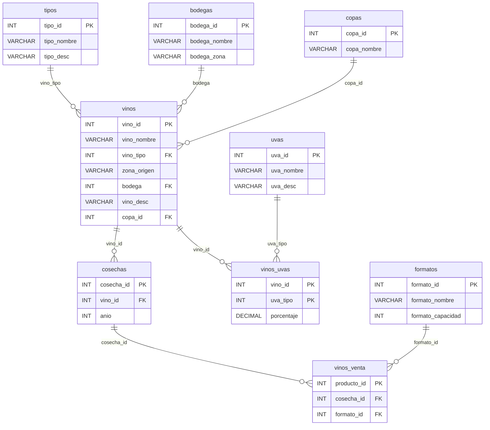

# Documentación del Esquema: `cataleg-vins`

Base de datos del catálogo de vinos del restaurante La Canal. Almacena toda la información sobre vinos, uvas, bodegas, tipos, formatos, copas, cosechas y productos a la venta.

> [!NOTE]
> Tras la unificación de la infraestructura, los scripts SQL de inicialización correspondientes se ubican en:
> - Esquema de Tablas: [`bbdd/init-scripts/02-schema-vinos.sql`](file:///Users/heernaa/Desktop/ABP%20(LACANAL)/test_repository/bbdd/init-scripts/02-schema-vinos.sql)
> - Carga de Datos: [`bbdd/init-scripts/03-data-vinos.sql`](file:///Users/heernaa/Desktop/ABP%20(LACANAL)/test_repository/bbdd/init-scripts/03-data-vinos.sql)
> Estos archivos se ejecutan en secuencia al inicializar el contenedor Docker.

---


## Tablas del Esquema

### 1. `uvas` — Catálogo de variedades de uva

| Columna | Tipo | Restricciones | Descripción |
|---------|------|---------------|-------------|
| `uva_id` | INT | PRIMARY KEY, AUTO_INCREMENT | Identificador único |
| `uva_nombre` | VARCHAR(50) | NOT NULL | Nombre de la variedad de uva |
| `uva_desc` | VARCHAR(255) | — | Descripción de las características de la uva |

---

### 2. `tipos` — Tipos de vino

| Columna | Tipo | Restricciones | Descripción |
|---------|------|---------------|-------------|
| `tipo_id` | INT | PRIMARY KEY, AUTO_INCREMENT | Identificador único |
| `tipo_nombre` | VARCHAR(50) | NOT NULL | Nombre del tipo (Tinto, Blanco, Espumoso…) |
| `tipo_desc` | VARCHAR(255) | — | Descripción del tipo de vino |

---

### 3. `bodegas` — Bodegas productoras

| Columna | Tipo | Restricciones | Descripción |
|---------|------|---------------|-------------|
| `bodega_id` | INT | PRIMARY KEY, AUTO_INCREMENT | Identificador único |
| `bodega_nombre` | VARCHAR(100) | NOT NULL | Nombre de la bodega |
| `bodega_zona` | VARCHAR(100) | — | Zona geográfica principal de la bodega |

---

### 4. `formatos` — Formatos de botella

| Columna | Tipo | Restricciones | Descripción |
|---------|------|---------------|-------------|
| `formato_id` | INT | PRIMARY KEY, AUTO_INCREMENT | Identificador único |
| `formato_nombre` | VARCHAR(50) | NOT NULL | Nombre del formato (Estándar, Magnum…) |
| `formato_capacidad` | INT | CHECK (> 0) | Capacidad en mililitros (ml) |

---

### 5. `copas` — Tipos de copa recomendada

| Columna | Tipo | Restricciones | Descripción |
|---------|------|---------------|-------------|
| `copa_id` | INT | PRIMARY KEY, AUTO_INCREMENT | Identificador único |
| `copa_nombre` | VARCHAR(50) | NOT NULL | Nombre del tipo de copa |

---

### 6. `vinos` — Catálogo principal de vinos

| Columna | Tipo | Restricciones | Descripción |
|---------|------|---------------|-------------|
| `vino_id` | INT | PRIMARY KEY, AUTO_INCREMENT | Identificador único |
| `vino_nombre` | VARCHAR(150) | NOT NULL | Nombre del vino |
| `vino_tipo` | INT | FK → `tipos(tipo_id)` ON DELETE SET NULL | Tipo de vino |
| `zona_origen` | VARCHAR(100) | — | Denominación de origen |
| `bodega` | INT | FK → `bodegas(bodega_id)` ON DELETE SET NULL | Bodega productora |
| `vino_desc` | VARCHAR(255) | — | Descripción del vino |
| `copa_id` | INT | FK → `copas(copa_id)` ON DELETE SET NULL | Copa recomendada |

> [!NOTE]
> Posee una restricción de unicidad compuesta `uq_vinos_nombre_bodega` sobre `(vino_nombre, bodega)` para evitar repetir el mismo vino de la misma bodega, permitiendo que bodegas diferentes tengan vinos con el mismo nombre.

> [!NOTE]
> Las claves foráneas usan `ON DELETE SET NULL` para que, si se elimina un tipo, bodega o copa, el vino no se pierda — solo se desvincula del registro eliminado.

---

### 7. `vinos_uvas` — Composición de uvas por vino

| Columna | Tipo | Restricciones | Descripción |
|---------|------|---------------|-------------|
| `vino_id` | INT | PK (compuesta), FK → `vinos(vino_id)` ON DELETE CASCADE | Vino |
| `uva_tipo` | INT | PK (compuesta), FK → `uvas(uva_id)` ON DELETE CASCADE | Variedad de uva |
| `porcentaje` | DECIMAL(5,2) | CHECK (> 0 AND <= 100) | Porcentaje de esta uva en el vino |

> [!IMPORTANT]
> Esta es una tabla intermedia (relación N:M). Un vino puede tener varias uvas y una uva puede estar en varios vinos. El `porcentaje` indica la proporción de cada variedad en la mezcla.

---

### 8. `cosechas` — Añadas / cosechas

| Columna | Tipo | Restricciones | Descripción |
|---------|------|---------------|-------------|
| `cosecha_id` | INT | PRIMARY KEY, AUTO_INCREMENT | Identificador único |
| `vino_id` | INT | FK → `vinos(vino_id)` ON DELETE CASCADE | Vino al que pertenece la cosecha |
| `anio` | INT | — | Año de la cosecha |

---

### 9. `vinos_venta` — Productos a la venta (cosecha + formato)

| Columna | Tipo | Restricciones | Descripción |
|---------|------|---------------|-------------|
| `producto_id` | INT | PRIMARY KEY, AUTO_INCREMENT | Identificador único del producto |
| `cosecha_id` | INT | FK → `cosechas(cosecha_id)` ON DELETE CASCADE | Cosecha asociada |
| `formato_id` | INT | FK → `formatos(formato_id)` ON DELETE RESTRICT | Formato de botella |

> [!NOTE]
> `ON DELETE RESTRICT` en `formato_id` impide eliminar un formato si hay productos que lo usan, protegiendo la integridad del catálogo a la venta.

---

## Diagrama Entidad-Relación



---

## Consultas de Ejemplo

### Obtener el catálogo completo de vinos a la venta

```sql
SELECT
    v.vino_nombre,
    t.tipo_nombre,
    b.bodega_nombre,
    v.zona_origen,
    c.anio,
    CONCAT(f.formato_capacidad, ' ml') AS capacidad,
    cop.copa_nombre
FROM vinos_venta vv
    JOIN cosechas c ON c.cosecha_id = vv.cosecha_id
    JOIN formatos f ON vv.formato_id = f.formato_id
    JOIN vinos v ON c.vino_id = v.vino_id
    JOIN tipos t ON t.tipo_id = v.vino_tipo
    JOIN copas cop ON cop.copa_id = v.copa_id
    JOIN bodegas b ON b.bodega_id = v.bodega;
```

### Obtener la composición de uvas de un vino

```sql
SELECT
    v.vino_nombre,
    u.uva_nombre,
    vu.porcentaje
FROM vinos_uvas vu
    JOIN vinos v ON v.vino_id = vu.vino_id
    JOIN uvas u ON u.uva_id = vu.uva_tipo
WHERE v.vino_nombre = 'Muga Crianza';
```

### Insertar un nuevo vino con su cosecha y formato

```sql
-- 1. Insertar el vino
INSERT INTO vinos (vino_nombre, vino_tipo, zona_origen, bodega, vino_desc, copa_id)
VALUES ('Protos Crianza', 1, 'D.O. Ribera del Duero', 1, 'Tinto con 14 meses en barrica.', 1);

-- 2. Registrar la composición de uvas (100% Tempranillo)
INSERT INTO vinos_uvas (vino_id, uva_tipo, porcentaje)
VALUES (LAST_INSERT_ID(), 1, 100.00);

-- 3. Añadir una cosecha
INSERT INTO cosechas (vino_id, anio)
VALUES (LAST_INSERT_ID(), 2021);

-- 4. Poner el producto a la venta en formato estándar (750ml)
INSERT INTO vinos_venta (cosecha_id, formato_id)
VALUES (LAST_INSERT_ID(), 1);
```

---

## Decisiones de Diseño

| Decisión | Justificación |
|----------|---------------|
| `ON DELETE SET NULL` en las FK de `vinos` | Si se elimina un tipo, bodega o copa, el vino se conserva pero pierde la referencia. Evita borrados en cascada no deseados en el catálogo principal. |
| `ON DELETE CASCADE` en `vinos_uvas`, `cosechas` | Si se elimina un vino, sus composiciones y cosechas se eliminan automáticamente (datos dependientes sin sentido sin el vino). |
| `ON DELETE RESTRICT` en `vinos_venta.formato_id` | Protege los formatos de ser eliminados si hay productos que los usan, evitando datos huérfanos en el catálogo. |
| Tabla intermedia `vinos_uvas` | Relación muchos-a-muchos entre vinos y uvas, con porcentaje como atributo propio de la relación. |
| Separar `cosechas` y `vinos_venta` | Permite tener varias añadas del mismo vino, y cada añada puede venderse en distintos formatos. El producto final es la combinación cosecha + formato. |
