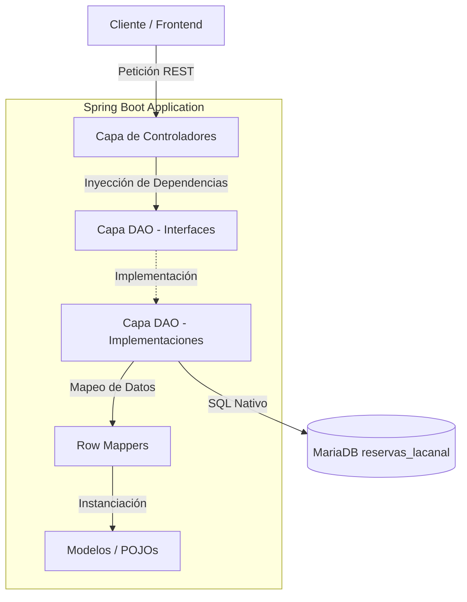

# Documentación Técnica Exhaustiva: `book_api` (La Canal)

Esta documentación describe con detalle absoluto el diseño de arquitectura, lógica de negocio y estructura del código fuente de la aplicación **`book_api`** (ubicada en [book_api/src/main/java](../book_api/src/main/java)). 

El servicio está implementado en **Spring Boot 3 / Java 21** empleando persistencia relacional ligera a través de **Spring JDBC Template**, siguiendo un diseño en tres capas completamente desacopladas.

---

## 1. Arquitectura de Tres Capas

La aplicación está diseñada para ser altamente modular y evitar la sobrecarga de un ORM pesado como Hibernate/JPA, prefiriendo el control directo de SQL nativo mediante **JDBC Template**:



* **Capa de Control (`controller`)**: Expone endpoints HTTP, maneja códigos de estado HTTP, valida peticiones básicas y coordina flujos de negocio sencillos orquestando múltiples DAOs.
* **Capa de Acceso a Datos (`dao`)**: Define interfaces estrictas (`DAO`) y sus respectivas implementaciones concretas (`DAOImpl`) usando SQL nativo e inyectando `JdbcTemplate`.
* **Capa de Mapeo (`RowMapper`)**: Clases especializadas encargadas de transformar de forma segura registros relacionales (`ResultSet`) en instancias de objetos Java (`POJOs`).
* **Capa de Dominio (`model`)**: Clases planas que representan los datos del negocio (`classes`), tipos de datos consistentes (`enums`) y excepciones del sistema (`exceptions`).

---

## 2. Estructura de Paquetes y Clases en `src/main/java`

El código fuente dentro de `com.book_api` se organiza de la siguiente manera:

```
com.book_api/
│
├── BookApiApplication.java         # Punto de entrada y gestión de arranque
│
├── config/
│   └── corsConfig.java             # Configuración de políticas CORS
│
├── controller/
│   └── reserveController.java      # Endpoints de la API REST
│
├── model/
│   ├── classes/                    # POJOs y Entidades del Negocio (books, clients, shifts, tables)
│   ├── enums/                      # Enumerados consistentes del dominio
│   └── exceptions/                 # Clases de Excepciones del Dominio
│
└── dao/                            # Capa de Persistencia estructurada por entidad
    ├── booksDAO/                   # Interfaces, Impls y RowMappers de Reservas
    ├── clientsDAO/                 # Interfaces, Impls y RowMappers de Clientes
    ├── shiftsDAO/                  # Interfaces, Impls y RowMappers de Turnos
    └── tablesDAO/                  # Interfaces, Impls y RowMappers de Mesas
```

---

## 3. Desglose Detallado de Capas

### A. Capa de Configuración e Inicio

#### [BookApiApplication.java](../book_api/src/main/java/com/book_api/BookApiApplication.java)
Es la clase de arranque estándar de Spring Boot. Incorpora un bloque `try-catch` para capturar específicamente excepciones en la instanciación de Beans (`BeanCreationException`):
* **Comportamiento:** Si Spring Boot falla al configurar la conexión JDBC (por ejemplo, si el contenedor de base de datos no está disponible en la IP o host configurado), captura el error de forma controlada y muestra un mensaje limpio en consola en vez de lanzar un volcado completo de la pila de llamadas (Stacktrace).

#### [config/corsConfig.java](../book_api/src/main/java/com/book_api/config/corsConfig.java)
Configura el acceso cruzado (CORS) para permitir la comunicación segura entre el Frontend y el API Backend.
* **Orígenes permitidos:** Habilita peticiones específicamente desde `http://localhost:3000` (despliegue local estándar de frontend) y `http://localhost:5173` (puerto por defecto de Vite).
* **Métodos HTTP:** `GET`, `POST`, `PUT`, `DELETE` y `OPTIONS` (petición de pre-vuelo).
* **Credenciales:** Habilita el paso de cookies/cabeceras de autenticación (`allowCredentials(true)`).

---

### B. Capa de Controladores (Controller)

#### [controller/reserveController.java](../book_api/src/main/java/com/book_api/controller/reserveController.java)
Esta clase actúa como el único controlador de la aplicación, exponiendo 5 endpoints estratégicos:

| Método HTTP | Endpoint | Descripción | Respuesta Exitosa | Respuesta Error |
| :--- | :--- | :--- | :--- | :--- |
| **POST** | `/agregar/cliente` | Registra un nuevo comensal en la base de datos. | `201 Created` - "Successfully created" | `400 Bad Request` |
| **POST** | `/reservar` | Registra una mesa para un cliente y un turno. Cambia la mesa a inactiva. | `201 Created` - "Successfully reserved" | `400 Bad Request` / `404 Not Found` |
| **GET** | `/cancelar/{id}` | Elimina una reserva de forma física y reactiva la mesa asociada. | `202 Accepted` - "Successfully Cancelled" | `400 Bad Request` |
| **GET** | `/buscar/libres` | Lista todas las mesas disponibles para el turno de la mañana por defecto. | `200 OK` - Listado de Mesas | `404 Not Found` |
| **GET** | `/buscar/libres/{b}` | Busca mesas libres según la capacidad de comensales. | `200 OK` - Listado de Mesas | `404 Not Found` |

#### Análisis de Lógica de Negocio en Endpoints:
1. **Flujo de Reservas (`/reservar`):**
   * Primero verifica si el cliente especificado en la reserva existe en la base de datos llamando a `clientDAO.getClient()`.
   * Si no existe, detiene la operación y retorna un `404 Not Found`.
   * Si existe, establece el estado de la reserva por defecto a `bookStates.Pendiente`.
   * Inserta físicamente la reserva mediante `bookDAO.addReserve()`.
   * Inhabilita la mesa correspondiente de inmediato llamando a `tableDAO.setDeactive()`, cambiando su estado a `BOOKED` para impedir reservas duplicadas en el mismo turno.
2. **Flujo de Cancelaciones (`/cancelar/{id}`):**
   * Busca los datos de la reserva por ID para identificar qué mesa estaba asignada.
   * Borra físicamente la reserva de la base de datos a través de `bookDAO.cancelReserve()`.
   * Reactiva la mesa asignada a través de `tableDAO.setActive()`, poniéndola en estado `FREE` de inmediato.

---

### C. Capa de Acceso a Datos (DAO)

Cada carpeta en el paquete `dao` sigue una estructura estricta compuesta por:
* **Interface `X_DAO`**: Declara las firmas de los métodos que consumirá el controlador.
* **Implementación `X_DAOImpl`**: Implementa las consultas usando SQL nativo a través de `JdbcTemplate`.
* **RowMapper `X_RowMapper`**: Mapea campos relacionales a POJOs.

#### 1. Módulo Clientes (`clientsDAO`)
* **[clientDAOImpl.java](../book_api/src/main/java/com/book_api/dao/clientsDAO/clientDAOImpl.java):**
  * `getClient(id)`: Controla de forma segura la excepción `EmptyResultDataAccessException`. Si no se encuentra el cliente en lugar de romper el hilo o propagar el error de Spring JDBC, captura la excepción y retorna un valor controlado `null`, permitiendo que el controlador responda con un código HTTP `404 Not Found` limpio.
* **[clientRowMapper.java](../book_api/src/main/java/com/book_api/dao/clientsDAO/clientRowMapper.java):** Mapea la columna `fecha_registro` de la BBDD al campo `bookDate` de la clase Java.

#### 2. Módulo Mesas (`tablesDAO`)
Este módulo es sumamente interesante porque encapsula una regla algorítmica de optimización espacial para el restaurante.
* **[tableDAOImpl.java](../book_api/src/main/java/com/book_api/dao/tablesDAO/tableDAOImpl.java):**
  * `getAvaliableTables(guests, tss)`: Ejecuta una consulta `JOIN` que vincula turnos de mesas (`mesas_turnos`) con el inventario físico (`mesas`).
  * **Regla de Negocio de Ocupación:** La consulta SQL incluye la siguiente cláusula lógica:
    ```sql
    WHERE (m.capacidad >= ? AND m.capacidad - 2 <= ?) AND m.activa = 1 AND mt.id_turno = ?
    ```
    * **Propósito:** Optimiza el aforo del local. Asegura que un grupo pequeño no acapare una mesa excesivamente grande. Por ejemplo, un grupo de 2 comensales puede sentarse en una mesa de capacidad 2, 3 o 4, pero **nunca** se le ofrecerá una mesa de 5 o más (ya que `capacidad - 2` sería superior a la cantidad de comensales).
    * Ordena el resultado por `capacidad ASC` para proponer siempre las mesas que mejor se ajustan al número de personas primero.

* **[tableRowMapper.java](../book_api/src/main/java/com/book_api/dao/tablesDAO/tableRowMapper.java):** Traduce la propiedad binaria `activa` de la base de datos (0 o 1) al enumerado conceptual `tableStates` (`BOOKED` o `FREE`).

#### 3. Módulo Turnos (`shiftsDAO`)
* **[shiftDAOImpl.java](../book_api/src/main/java/com/book_api/dao/shiftsDAO/shiftDAOImpl.java):** Lee la tabla `turnos` por ID u obtiene la lista completa de horarios del restaurante.
* **[shiftRowMapper.java](../book_api/src/main/java/com/book_api/dao/shiftsDAO/shiftRowMapper.java):**
  * Realiza una conversión exhaustiva (utilizando operadores ternarios encadenados) para traducir cadenas de texto en español e inglés provenientes de la base de datos (como "Monday" o "maniana") a tipos enum fuertemente tipados de Java (`dayShiftStates` y `timeShiftStates`).

#### 4. Módulo Reservas (`booksDAO`)
* **[bookDAOImpl.java](../book_api/src/main/java/com/book_api/dao/booksDAO/bookDAOImpl.java):**
  * `addReserve(b)`: Realiza una sentencia `INSERT` parametrizada pasando todas las IDs de las relaciones necesarias (`id_cliente`, `id_mesa`, `id_turno`) además de las marcas temporales de la reserva y creación.
  * `cancelReserve(id)`: Ejecuta una eliminación física (`DELETE`) del registro correspondiente de la tabla de reservas.
* **[bookRowMapper.java](../book_api/src/main/java/com/book_api/dao/booksDAO/bookRowMapper.java):**
  * Para evitar múltiples llamadas pesadas a la base de datos en bucle (`N+1 SELECT problem`), el mapeador de reservas instancia POJOs parciales planos (`clients`, `shifts`, `tables`) y les asigna únicamente su campo identificador (`ID`) recuperado del registro de la reserva. Esto permite mantener la agilidad del JDBC sin penalizaciones de rendimiento, dejando la carga completa de datos relacionados a demanda.

---

## 4. Estructura de Datos y Modelo de Dominio (`model`)

### POJOs / Clases de Dominio

#### [books.java](../book_api/src/main/java/com/book_api/model/classes/books.java)
Representa la entidad central `reservas`.
* Usa anotaciones `@Entity` y `@Table("reservas")` con fines ilustrativos o documentales, así como `@Getter` y `@Setter` de Lombok para agilizar y mantener el archivo limpio.
* Contiene referencias de composición de objetos `@ManyToOne` hacia `clients`, `tables` y `shifts`.

#### [clients.java](../book_api/src/main/java/com/book_api/model/classes/clients.java)
Representa los datos del cliente (`clientes`).
* Cuenta con propiedades clave: `clientID` (ID), `name` (Nombre completo), `email`, `phone` (Teléfono) y `bookDate` (Fecha de registro de usuario en BBDD, curiosamente nombrado pero mapea a `fecha_registro`).

#### [tables.java](../book_api/src/main/java/com/book_api/model/classes/tables.java)
Representa una mesa física del restaurante (`mesas`).
* Contiene dos métodos utilitarios críticos de lógica pura:
  * `isAvaliable()`: Determina si el estado de la mesa es `FREE`.
  * `canSeat(guests)`: Comprobación simple para saber si la capacidad de la mesa soporta al grupo.

#### [shifts.java](../book_api/src/main/java/com/book_api/model/classes/shifts.java)
Representa un turno de atención (`turnos`).
* Relaciona las variables temporales como `startHour` (Hora comienzo), `endHour` (Hora cierre), `maxBooks` (Capacidad máxima de reservas permitidas en ese turno) y mapea los enums del día de la semana e intervalos de jornada.

---

### Enumeraciones del Dominio (`model/enums`)

Para asegurar la integridad de datos en el backend, el dominio cuenta con 4 enums específicos:

1. **`bookStates`**: Representa la etapa en la que se encuentra la reserva:
   * `Pendiente`, `Confirmada`, `Cancelada`, `Completada`.
2. **`tableStates`**: Estado de ocupación física de la mesa:
   * `FREE`, `BOOKED`.
3. **`dayShiftStates`**: Días de la semana permitidos:
   * `MONDAY`, `TUESDAY`, `WEDNESDAY`, `THURSDAY`, `FRIDAY`, `SATURDAY`, `SUNDAY`.
4. **`timeShiftStates`**: Bloque de horario de servicio:
   * `maniana`, `comida`, `noche`.

---

## 5. Áreas Técnicas de Oportunidad (Refactorizaciones Recomendadas)

Al analizar en profundidad el código fuente de `src/main/java`, se han detectado ciertos puntos que el equipo de desarrollo podría mejorar para asegurar mayor estabilidad en producción:

1. **Gestión de Resultados Vacíos en DAOs (`getFirst()`)**
   * En [bookDAOImpl.java](../book_api/src/main/java/com/book_api/dao/booksDAO/bookDAOImpl.java) y [tableDAOImpl.java](../book_api/src/main/java/com/book_api/dao/tablesDAO/tableDAOImpl.java), se ejecuta la instrucción `.getFirst()` directamente sobre la lista que devuelve `jdbcTemplate.query(...)`.
   * **El Riesgo:** Si se consulta una ID que no existe, la base de datos devolverá un conjunto vacío. Al llamar a `.getFirst()` en una lista vacía, se lanzará inmediatamente una excepción `NoSuchElementException`, lo que provocará un error HTTP 500 descontrolado en lugar de un HTTP 404 limpio.
   * **Recomendación:** Implementar un try-catch controlado (tal como se hace en `clientDAOImpl`) o retornar un `Optional<T>` y gestionar la ausencia del registro en el controlador.

2. **Resolución de Variables en Endpoints de Búsqueda**
   * En [reserveController.java](../book_api/src/main/java/com/book_api/controller/reserveController.java), el endpoint para buscar mesas según comensales está definido de la siguiente forma:
     `@GetMapping("/buscar/libres/{b}") public ResponseEntity<?> checkReserve(@PathVariable books b)`
   * **El Riesgo:** Pasar un objeto complejo como `@PathVariable` requiere configuraciones adicionales de convertidores/formateadores customizados en Spring MVC. En su lugar, es mucho más simple y estándar recibir simplemente el número de comensales (`guests`) como una variable de ruta directa:
     ```java
     @GetMapping("/buscar/libres/personas/{guests}")
     public ResponseEntity<?> checkReserve(@PathVariable int guests) { ... }
     ```

3. **Coherencia en Nombres de Atributos y Mapeos**
   * En la clase [clients.java](../book_api/src/main/java/com/book_api/model/classes/clients.java), la fecha de registro del cliente se mapea al atributo `bookDate`, lo cual puede inducir a errores conceptuales (pues hace pensar que se refiere a la fecha de la reserva). Sería más preciso renombrarlo a `registrationDate`.
