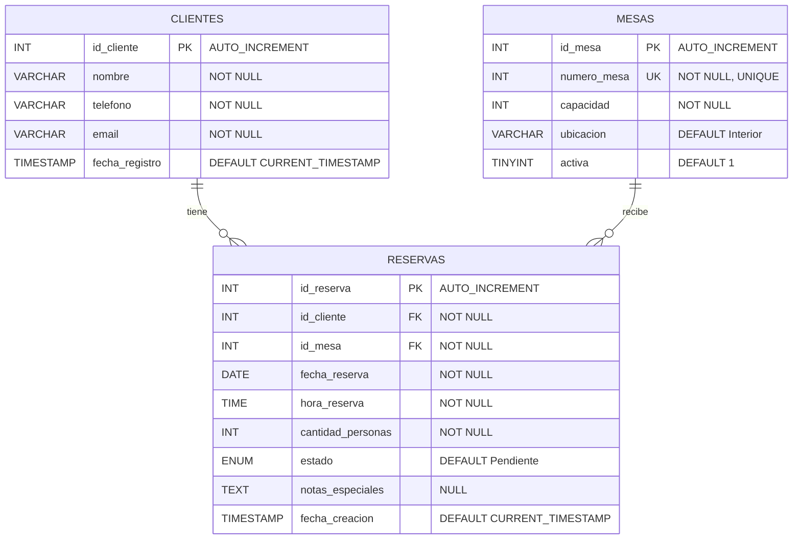

# Documentación del Esquema: Base de Datos `reservas_lacanal`

Este documento describe en detalle el esquema de la base de datos `reservas_lacanal`, que gestiona el sistema de reservas del restaurante **La Canal**. El esquema permite registrar clientes, administrar las mesas del establecimiento y gestionar las reservas asociándolas a un cliente y una mesa concretos.

> [!NOTE]
> El script SQL de inicialización se encuentra en [`bbdd/init-scripts/04-schema-reservas.sql`](file:///Users/heernaa/Desktop/ABP/bbdd/init-scripts/04-schema-reservas.sql). Este script se ejecuta automáticamente al levantar el contenedor Docker.

---

## Índice

1. [Resumen de Tablas](#1-resumen-de-tablas)
2. [Detalle de Tablas](#2-detalle-de-tablas)
   - [2.1 Tabla `clientes`](#21-tabla-clientes)
   - [2.2 Tabla `mesas`](#22-tabla-mesas)
   - [2.3 Tabla `reservas`](#23-tabla-reservas)
3. [Relaciones entre Tablas](#3-relaciones-entre-tablas)
4. [Diagrama Entidad-Relación](#4-diagrama-entidad-relación)
5. [Consultas de Ejemplo](#5-consultas-de-ejemplo)
6. [Decisiones de Diseño](#6-decisiones-de-diseño)

---

## 1. Resumen de Tablas

| Tabla       | Propósito                                              | Nº Columnas | Datos precargados |
|-------------|--------------------------------------------------------|:-----------:|:-----------------:|
| `clientes`  | Registro de clientes que realizan reservas             | 5           | No                |
| `mesas`     | Catálogo de mesas físicas del restaurante              | 5           | Sí (12 mesas)     |
| `reservas`  | Registro de reservas vinculadas a un cliente y una mesa| 9           | No                |

---

## 2. Detalle de Tablas

### 2.1 Tabla `clientes`

Almacena la información de contacto de cada cliente que realiza una reserva en el restaurante.

| Columna          | Tipo             | Nulo   | Default             | Restricciones     | Descripción                          |
|------------------|------------------|--------|----------------------|-------------------|--------------------------------------|
| `id_cliente`     | `INT`            | NO     | AUTO_INCREMENT       | **PRIMARY KEY**   | Identificador único del cliente      |
| `nombre`         | `VARCHAR(100)`   | NO     | —                    | `NOT NULL`        | Nombre completo del cliente          |
| `telefono`       | `VARCHAR(20)`    | NO     | —                    | `NOT NULL`        | Teléfono de contacto                 |
| `email`          | `VARCHAR(100)`   | NO     | —                    | `NOT NULL`        | Correo electrónico                   |
| `fecha_registro` | `TIMESTAMP`      | SÍ     | `CURRENT_TIMESTAMP`  | —                 | Fecha y hora de registro automático  |

```sql
CREATE TABLE `clientes` (
  `id_cliente` int NOT NULL AUTO_INCREMENT,
  `nombre` varchar(100) NOT NULL,
  `telefono` varchar(20) NOT NULL,
  `email` varchar(100) NOT NULL,
  `fecha_registro` timestamp NULL DEFAULT CURRENT_TIMESTAMP,
  PRIMARY KEY (`id_cliente`)
) ENGINE=InnoDB DEFAULT CHARSET=utf8mb4 COLLATE=utf8mb4_general_ci;
```

---

### 2.2 Tabla `mesas`

Representa las mesas físicas del restaurante. Cada mesa tiene un número identificativo único, una capacidad máxima de comensales y una ubicación dentro del local.

| Columna       | Tipo          | Nulo   | Default       | Restricciones              | Descripción                              |
|---------------|---------------|--------|---------------|----------------------------|------------------------------------------|
| `id_mesa`     | `INT`         | NO     | AUTO_INCREMENT| **PRIMARY KEY**            | Identificador interno de la mesa         |
| `numero_mesa` | `INT`         | NO     | —             | `NOT NULL`, **UNIQUE**     | Número visible de la mesa (ej: 1, 101)   |
| `capacidad`   | `INT`         | NO     | —             | `NOT NULL`                 | Número máximo de comensales              |
| `ubicacion`   | `VARCHAR(50)` | SÍ     | `'Interior'`  | —                          | Zona del restaurante (ej: Comedor)       |
| `activa`      | `TINYINT(1)`  | SÍ     | `1`           | —                          | Si la mesa está activa (`1`) o no (`0`)  |

```sql
CREATE TABLE `mesas` (
  `id_mesa` int NOT NULL AUTO_INCREMENT,
  `numero_mesa` int NOT NULL,
  `capacidad` int NOT NULL,
  `ubicacion` varchar(50) DEFAULT 'Interior',
  `activa` tinyint(1) DEFAULT 1,
  PRIMARY KEY (`id_mesa`),
  UNIQUE KEY `numero_mesa` (`numero_mesa`)
) ENGINE=InnoDB AUTO_INCREMENT=13 DEFAULT CHARSET=utf8mb4 COLLATE=utf8mb4_general_ci;
```

#### Datos precargados

El script de inicialización inserta **12 mesas** en el comedor:

| id_mesa | numero_mesa | capacidad | ubicacion | activa |
|:-------:|:-----------:|:---------:|-----------|:------:|
| 1       | 1           | 4         | Comedor   | 1      |
| 2       | 2           | 4         | Comedor   | 1      |
| 3       | 3           | 4         | Comedor   | 1      |
| 4       | 4           | 4         | Comedor   | 1      |
| 5       | 5           | 4         | Comedor   | 1      |
| 6       | 6           | 4         | Comedor   | 1      |
| 7       | 7           | 4         | Comedor   | 1      |
| 8       | 8           | 4         | Comedor   | 1      |
| 9       | 9           | 2         | Comedor   | 1      |
| 10      | 101         | 2         | Comedor   | 1      |
| 11      | 102         | 2         | Comedor   | 1      |
| 12      | 103         | 2         | Comedor   | 1      |

> [!IMPORTANT]
> Las mesas 1–8 tienen capacidad para **4 personas**, mientras que la mesa 9 y las mesas 101–103 tienen capacidad para **2 personas**. Esto es relevante a la hora de validar el campo `cantidad_personas` en las reservas.

---

### 2.3 Tabla `reservas`

Tabla central del sistema. Cada registro vincula un **cliente** con una **mesa** en una fecha y hora determinadas, registrando el estado de la reserva y posibles notas especiales.

| Columna             | Tipo                                                      | Nulo   | Default             | Restricciones                 | Descripción                              |
|---------------------|-----------------------------------------------------------|--------|----------------------|-------------------------------|------------------------------------------|
| `id_reserva`        | `INT`                                                     | NO     | AUTO_INCREMENT       | **PRIMARY KEY**               | Identificador único de la reserva        |
| `id_cliente`        | `INT`                                                     | NO     | —                    | `NOT NULL`, **FK → clientes** | Cliente que realiza la reserva           |
| `id_mesa`           | `INT`                                                     | NO     | —                    | `NOT NULL`, **FK → mesas**    | Mesa asignada a la reserva               |
| `fecha_reserva`     | `DATE`                                                    | NO     | —                    | `NOT NULL`                    | Fecha de la reserva                      |
| `hora_reserva`      | `TIME`                                                    | NO     | —                    | `NOT NULL`                    | Hora de la reserva                       |
| `cantidad_personas` | `INT`                                                     | NO     | —                    | `NOT NULL`                    | Número de comensales                     |
| `estado`            | `ENUM('Pendiente','Confirmada','Cancelada','Completada')` | SÍ     | `'Pendiente'`        | —                             | Estado actual de la reserva              |
| `notas_especiales`  | `TEXT`                                                     | SÍ     | `NULL`               | —                             | Comentarios o peticiones del cliente     |
| `fecha_creacion`    | `TIMESTAMP`                                               | SÍ     | `CURRENT_TIMESTAMP`  | —                             | Fecha y hora de creación del registro    |

```sql
CREATE TABLE `reservas` (
  `id_reserva` int NOT NULL AUTO_INCREMENT,
  `id_cliente` int NOT NULL,
  `id_mesa` int NOT NULL,
  `fecha_reserva` date NOT NULL,
  `hora_reserva` time NOT NULL,
  `cantidad_personas` int NOT NULL,
  `estado` enum('Pendiente','Confirmada','Cancelada','Completada') DEFAULT 'Pendiente',
  `notas_especiales` text,
  `fecha_creacion` timestamp NULL DEFAULT CURRENT_TIMESTAMP,
  PRIMARY KEY (`id_reserva`),
  KEY `id_cliente` (`id_cliente`),
  KEY `id_mesa` (`id_mesa`),
  CONSTRAINT `reservas_ibfk_1` FOREIGN KEY (`id_cliente`) REFERENCES `clientes` (`id_cliente`) ON DELETE CASCADE,
  CONSTRAINT `reservas_ibfk_2` FOREIGN KEY (`id_mesa`) REFERENCES `mesas` (`id_mesa`) ON DELETE RESTRICT
) ENGINE=InnoDB DEFAULT CHARSET=utf8mb4 COLLATE=utf8mb4_general_ci;
```

---

## 3. Relaciones entre Tablas

El esquema define dos relaciones de clave foránea, ambas partiendo de la tabla `reservas`:

| Relación                          | Tipo    | Columna FK     | Referencia               | Regla ON DELETE | Motivo                                                                                          |
|-----------------------------------|---------|----------------|---------------------------|-----------------|-------------------------------------------------------------------------------------------------|
| `reservas` → `clientes`          | N:1     | `id_cliente`   | `clientes(id_cliente)`    | **CASCADE**     | Si se elimina un cliente, sus reservas dejan de tener sentido y se borran automáticamente.       |
| `reservas` → `mesas`             | N:1     | `id_mesa`      | `mesas(id_mesa)`          | **RESTRICT**    | No se puede eliminar una mesa si tiene reservas asociadas, para proteger la integridad de datos. |

### Descripción textual

- **Un cliente puede tener muchas reservas** (relación 1:N). Si el cliente se elimina de la base de datos, todas sus reservas asociadas se eliminan en cascada.
- **Una mesa puede estar asociada a muchas reservas** (relación 1:N). Sin embargo, no se permite eliminar una mesa que tenga reservas vinculadas; primero deben cancelarse o eliminarse las reservas.
- **Cada reserva pertenece exactamente a un cliente y a una mesa**.

---

## 4. Diagrama Entidad-Relación



---

## 5. Consultas de Ejemplo

### 5.1 Consultar todas las reservas con datos del cliente y la mesa

```sql
SELECT
    r.id_reserva,
    c.nombre       AS cliente,
    c.telefono,
    m.numero_mesa,
    m.ubicacion,
    r.fecha_reserva,
    r.hora_reserva,
    r.cantidad_personas,
    r.estado
FROM reservas r
INNER JOIN clientes c ON r.id_cliente = c.id_cliente
INNER JOIN mesas m    ON r.id_mesa    = m.id_mesa
ORDER BY r.fecha_reserva, r.hora_reserva;
```

### 5.2 Consultar reservas pendientes para una fecha concreta

```sql
SELECT
    r.id_reserva,
    c.nombre       AS cliente,
    m.numero_mesa,
    r.hora_reserva,
    r.cantidad_personas
FROM reservas r
INNER JOIN clientes c ON r.id_cliente = c.id_cliente
INNER JOIN mesas m    ON r.id_mesa    = m.id_mesa
WHERE r.fecha_reserva = '2026-05-21'
  AND r.estado = 'Pendiente'
ORDER BY r.hora_reserva;
```

### 5.3 Consultar mesas disponibles (activas y sin reserva en un horario)

```sql
SELECT m.numero_mesa, m.capacidad, m.ubicacion
FROM mesas m
WHERE m.activa = 1
  AND m.id_mesa NOT IN (
      SELECT r.id_mesa
      FROM reservas r
      WHERE r.fecha_reserva = '2026-05-21'
        AND r.hora_reserva = '21:00:00'
        AND r.estado IN ('Pendiente', 'Confirmada')
  )
ORDER BY m.capacidad DESC;
```

### 5.4 Crear una reserva completa (INSERT de cliente + reserva)

```sql
-- Paso 1: Registrar al cliente (si es nuevo)
INSERT INTO clientes (nombre, telefono, email)
VALUES ('María García López', '612345678', 'maria.garcia@email.com');

-- Paso 2: Crear la reserva usando el id del cliente recién insertado
INSERT INTO reservas (id_cliente, id_mesa, fecha_reserva, hora_reserva, cantidad_personas, notas_especiales)
VALUES (
    LAST_INSERT_ID(),  -- id_cliente del paso anterior
    3,                 -- mesa número 3 (id_mesa = 3)
    '2026-05-25',      -- fecha de la reserva
    '20:30:00',        -- hora de la reserva
    4,                 -- número de comensales
    'Celebración de cumpleaños, necesitan velas'
);
```

> [!TIP]
> La función `LAST_INSERT_ID()` de MySQL/MariaDB devuelve el último valor `AUTO_INCREMENT` generado en la conexión actual, lo que permite encadenar inserts sin consultas intermedias.

### 5.5 Actualizar el estado de una reserva

```sql
-- Confirmar una reserva pendiente
UPDATE reservas
SET estado = 'Confirmada'
WHERE id_reserva = 1;

-- Cancelar una reserva
UPDATE reservas
SET estado = 'Cancelada'
WHERE id_reserva = 1;
```

### 5.6 Consultar el historial de reservas de un cliente

```sql
SELECT
    r.id_reserva,
    r.fecha_reserva,
    r.hora_reserva,
    m.numero_mesa,
    r.cantidad_personas,
    r.estado
FROM reservas r
INNER JOIN mesas m ON r.id_mesa = m.id_mesa
WHERE r.id_cliente = 1
ORDER BY r.fecha_reserva DESC, r.hora_reserva DESC;
```

---

## 6. Decisiones de Diseño

### 6.1 `ON DELETE CASCADE` en la relación `reservas → clientes`

Se eligió **CASCADE** porque si un cliente se elimina del sistema (por ejemplo, por una solicitud de baja o derecho al olvido), sus reservas pierden toda utilidad. Mantener reservas huérfanas sin cliente asociado ensuciaría la base de datos y complicaría las consultas.

> [!WARNING]
> Eliminar un cliente borrará **todas** sus reservas automáticamente e irreversiblemente. Si se necesita conservar un histórico, considerad implementar un borrado lógico (campo `activo` en `clientes`) en lugar de un `DELETE` físico.

### 6.2 `ON DELETE RESTRICT` en la relación `reservas → mesas`

Se eligió **RESTRICT** para proteger la integridad de las reservas existentes. Una mesa es un recurso físico del restaurante; eliminarla accidentalmente mientras tiene reservas activas provocaría pérdida de información operativa crítica.

- Si se necesita retirar una mesa del servicio, el flujo correcto es:
  1. Cancelar o reubicar todas las reservas asociadas a esa mesa.
  2. Opcionalmente, marcar la mesa como inactiva (`activa = 0`) en lugar de eliminarla.
  3. Solo entonces, si es estrictamente necesario, eliminar el registro de la mesa.

### 6.3 Campo `estado` como `ENUM`

Se utiliza un `ENUM('Pendiente','Confirmada','Cancelada','Completada')` en lugar de una tabla de estados separada por las siguientes razones:

| Aspecto            | ENUM                                      | Tabla de estados                          |
|--------------------|-------------------------------------------|-------------------------------------------|
| **Simplicidad**    | ✅ Una sola columna, sin JOINs adicionales | ❌ Requiere tabla extra y JOIN             |
| **Rendimiento**    | ✅ Almacenado como entero internamente     | ⚠️ Requiere JOIN en cada consulta          |
| **Flexibilidad**   | ⚠️ Añadir valores requiere `ALTER TABLE`   | ✅ Añadir valores es solo un INSERT        |
| **Caso de uso**    | ✅ Ideal para un conjunto fijo y pequeño   | ✅ Ideal si los estados cambian a menudo   |

Para este proyecto, los cuatro estados cubren el ciclo de vida completo de una reserva y no se prevé que cambien con frecuencia, por lo que `ENUM` es la opción más práctica.

### 6.4 Separación `fecha_reserva` / `hora_reserva`

Se optó por campos separados `DATE` y `TIME` en lugar de un solo `DATETIME` para facilitar:
- Consultas por fecha (ej: "todas las reservas de hoy") sin funciones de extracción.
- Consultas por franja horaria (ej: "reservas entre las 20:00 y las 22:00").
- Mayor claridad en la interfaz de usuario y la API.

### 6.5 Campo `activa` en `mesas`

Permite desactivar una mesa temporalmente (por mantenimiento, reforma, evento privado) sin eliminarla de la base de datos, preservando el historial de reservas anteriores vinculadas a esa mesa.

---

*Última actualización: mayo 2026 — Proyecto ABP Vinos · La Canal*
