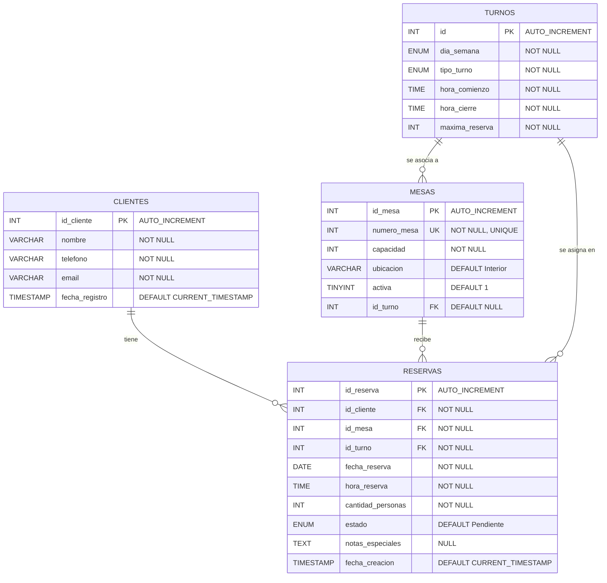

# Documentación del Esquema: Base de Datos `reservas_lacanal`

Este documento describe en detalle el esquema de la base de datos `reservas_lacanal`, que gestiona el sistema de reservas del restaurante **La Canal**. El esquema permite registrar clientes, administrar las mesas del establecimiento, configurar los turnos semanales y gestionar las reservas vinculando todos estos elementos de manera coherente.

> [!NOTE]
> El script SQL de inicialización se encuentra en [`bbdd/init-scripts/04-schema-reservas.sql`](file:///Users/heernaa/Desktop/ABP%20(LACANAL)/test_repository/bbdd/init-scripts/04-schema-reservas.sql). Este script se ejecuta automáticamente al levantar el contenedor Docker.

---

## Índice

1. [Resumen de Tablas](#1-resumen-de-tablas)
2. [Detalle de Tablas](#2-detalle-de-tablas)
   - [2.1 Tabla `clientes`](#21-tabla-clientes)
   - [2.2 Tabla `mesas`](#22-tabla-mesas)
   - [2.3 Tabla `turnos`](#23-tabla-turnos)
   - [2.4 Tabla `reservas`](#24-tabla-reservas)
3. [Relaciones entre Tablas](#3-relaciones-entre-tablas)
4. [Diagrama Entidad-Relación](#4-diagrama-entidad-relaci%C3%B3n)
5. [Consultas de Ejemplo](#5-consultas-de-ejemplo)
6. [Decisiones de Diseño](#6-decisiones-de-dise%C3%B1o)

---

## 1. Resumen de Tablas

| Tabla       | Propósito                                              | Nº Columnas | Datos precargados |
|-------------|--------------------------------------------------------|:-----------:|:-----------------:|
| `clientes`  | Registro de clientes que realizan reservas             | 5           | No                |
| `mesas`     | Catálogo de mesas físicas del restaurante              | 5           | Sí (12 mesas)     |
| `turnos`    | Configuración de turnos por día de la semana y horarios| 6           | Sí (9 turnos)     |
| `reservas`  | Registro de reservas vinculadas a cliente, mesa y turno| 10          | No                |

---

## 2. Detalle de Tablas

### 2.1 Tabla `clientes`

Almacena la información de contacto de cada cliente que realiza una reserva en el restaurante.

| Columna          | Tipo             | Nulo   | Default             | Restricciones     | Descripción                          |
|------------------|------------------|--------|----------------------|-------------------|--------------------------------------|
| `id_cliente`     | `INT`            | NO     | AUTO_INCREMENT       | **PRIMARY KEY**   | Identificador único del cliente      |
| `nombre`         | `VARCHAR(100)`   | NO     | —                    | `NOT NULL`        | Nombre completo del cliente          |
| `telefono`       | `VARCHAR(20)`    | NO     | —                    | `NOT NULL`        | Teléfono de contacto                 |
| `email`          | `VARCHAR(100)`   | NO     | —                    | `NOT NULL`        | Correo electrónico                   |
| `fecha_registro` | `TIMESTAMP`      | SÍ     | `CURRENT_TIMESTAMP`  | —                 | Fecha y hora de registro automático  |

```sql
CREATE TABLE `clientes` (
  `id_cliente` int NOT NULL AUTO_INCREMENT,
  `nombre` varchar(100) NOT NULL,
  `telefono` varchar(20) NOT NULL,
  `email` varchar(100) NOT NULL,
  `fecha_registro` timestamp NULL DEFAULT CURRENT_TIMESTAMP,
  PRIMARY KEY (`id_cliente`)
) ENGINE=InnoDB DEFAULT CHARSET=utf8mb4 COLLATE=utf8mb4_general_ci;
```

---

### 2.2 Tabla `turnos`

Almacena la configuración de turnos y franjas horarias del restaurante según el día de la semana. Define el cupo máximo de reservas permitidas por turno.

| Columna | Tipo | Nulo | Default | Restricciones | Descripción |
| :--- | :--- | :---: | :---: | :---: | :--- |
| `id` | `INT` | NO | AUTO_INCREMENT | **PRIMARY KEY** | Identificador único del turno |
| `dia_semana` | `ENUM('Monday', 'Tuesday', 'Wednesday', 'Thursday', 'Friday', 'Saturday', 'Sunday')` | NO | — | `NOT NULL` | Día de la semana en inglés |
| `tipo_turno` | `ENUM('maniana', 'comida', 'noche')` | NO | — | `NOT NULL` | Bloque horario del turno |
| `hora_comienzo` | `TIME` | NO | — | `NOT NULL` | Hora de apertura del turno |
| `hora_cierre` | `TIME` | NO | — | `NOT NULL` | Hora de cierre del turno |
| `maxima_reserva` | `INT` | NO | — | `NOT NULL` | Cantidad máxima de comensales/reservas por turno |

```sql
CREATE TABLE `turnos` (
    `id` INT AUTO_INCREMENT PRIMARY KEY,
    `dia_semana` ENUM('Monday', 'Tuesday', 'Wednesday', 'Thursday', 'Friday', 'Saturday', 'Sunday') NOT NULL,
    `tipo_turno` ENUM('maniana', 'comida', 'noche') NOT NULL,
    `hora_comienzo` TIME NOT NULL,
    `hora_cierre` TIME NOT NULL,
    `maxima_reserva` INT NOT NULL
) ENGINE = InnoDB DEFAULT CHARSET = utf8mb4 COLLATE = utf8mb4_general_ci;
```

#### Datos precargados

El script de inicialización inserta **9 turnos** en el restaurante:

| id | dia_semana | tipo_turno | hora_comienzo | hora_cierre | maxima_reserva |
| :---: | :--- | :--- | :---: | :---: | :---: |
| 1 | Wednesday | comida | 13:00:00 | 15:30:00 | 30 |
| 2 | Thursday | comida | 13:00:00 | 15:30:00 | 30 |
| 3 | Friday | comida | 13:00:00 | 15:30:00 | 30 |
| 4 | Friday | noche | 20:00:00 | 22:00:00 | 30 |
| 5 | Saturday | maniana | 08:00:00 | 10:30:00 | 30 |
| 6 | Saturday | comida | 13:00:00 | 15:30:00 | 30 |
| 7 | Saturday | noche | 20:00:00 | 22:00:00 | 30 |
| 8 | Sunday | maniana | 08:00:00 | 10:30:00 | 30 |
| 9 | Sunday | comida | 13:00:00 | 15:30:00 | 30 |

---

### 2.3 Tabla `mesas`

Representa las mesas físicas del restaurante. Cada mesa tiene un número identificativo único, una capacidad máxima de comensales, una ubicación dentro del local y, opcionalmente, un turno asignado.

| Columna       | Tipo          | Nulo   | Default       | Restricciones              | Descripción                              |
|---------------|---------------|--------|---------------|----------------------------|------------------------------------------|
| `id_mesa`     | `INT`         | NO     | AUTO_INCREMENT| **PRIMARY KEY**            | Identificador interno de la mesa         |
| `numero_mesa` | `INT`         | NO     | —             | `NOT NULL`, **UNIQUE**     | Número visible de la mesa (ej: 1, 101)   |
| `capacidad`   | `INT`         | NO     | —             | `NOT NULL`                 | Número máximo de comensales              |
| `ubicacion`   | `VARCHAR(50)` | SÍ     | `'Interior'`  | —                          | Zona del restaurante (ej: Comedor)       |
| `activa`      | `TINYINT(1)`  | SÍ     | `1`           | —                          | Si la mesa está activa (`1`) o no (`0`)  |
| `id_turno`    | `INT`         | SÍ     | `NULL`        | **FK → turnos**            | Turno opcional asociado a la mesa         |

```sql
CREATE TABLE `mesas` (
    `id_mesa` int NOT NULL AUTO_INCREMENT,
    `numero_mesa` int NOT NULL,
    `capacidad` int NOT NULL,
    `ubicacion` varchar(50) DEFAULT 'Interior',
    `activa` tinyint(1) DEFAULT 1,
    `id_turno` int DEFAULT NULL, 
    PRIMARY KEY (`id_mesa`),
    UNIQUE KEY `numero_mesa` (`numero_mesa`),
    KEY `id_turno` (`id_turno`),
    CONSTRAINT `mesas_fk_turno` FOREIGN KEY (`id_turno`) REFERENCES `turnos` (`id`) ON DELETE SET NULL
) ENGINE = InnoDB AUTO_INCREMENT = 13 DEFAULT CHARSET = utf8mb4 COLLATE = utf8mb4_general_ci;
```

#### Datos precargados

El script de inicialización inserta **12 mesas** en el comedor, con el campo `id_turno` inicializado en `NULL`:

| id_mesa | numero_mesa | capacidad | ubicacion | activa | id_turno |
|:-------:|:-----------:|:---------:|-----------|:------:|:--------:|
| 1       | 1           | 4         | Comedor   | 1      | NULL     |
| 2       | 2           | 4         | Comedor   | 1      | NULL     |
| 3       | 3           | 4         | Comedor   | 1      | NULL     |
| 4       | 4           | 4         | Comedor   | 1      | NULL     |
| 5       | 5           | 4         | Comedor   | 1      | NULL     |
| 6       | 6           | 4         | Comedor   | 1      | NULL     |
| 7       | 7           | 4         | Comedor   | 1      | NULL     |
| 8       | 8           | 4         | Comedor   | 1      | NULL     |
| 9       | 9           | 2         | Comedor   | 1      | NULL     |
| 10      | 101         | 2         | Comedor   | 1      | NULL     |
| 11      | 102         | 2         | Comedor   | 1      | NULL     |
| 12      | 103         | 2         | Comedor   | 1      | NULL     |

> [!IMPORTANT]
> Las mesas 1–8 tienen capacidad para **4 personas**, mientras que la mesa 9 y las mesas 101–103 tienen capacidad para **2 personas**. Esto es relevante a la hora de validar el campo `cantidad_personas` en las reservas.

---

### 2.4 Tabla `reservas`

Tabla central del sistema. Cada registro vincula un **cliente**, una **mesa** y un **turno** en una fecha determinada, registrando la hora de llegada exacta, el estado y posibles notas especiales.

| Columna             | Tipo                                                      | Nulo   | Default             | Restricciones                 | Descripción                              |
|---------------------|-----------------------------------------------------------|--------|----------------------|-------------------------------|------------------------------------------|
| `id_reserva`        | `INT`                                                     | NO     | AUTO_INCREMENT       | **PRIMARY KEY**               | Identificador único de la reserva        |
| `id_cliente`        | `INT`                                                     | NO     | —                    | `NOT NULL`, **FK → clientes** | Cliente que realiza la reserva           |
| `id_mesa`           | `INT`                                                     | NO     | —                    | `NOT NULL`, **FK → mesas**    | Mesa asignada a la reserva               |
| `id_turno`          | `INT`                                                     | NO     | —                    | `NOT NULL`, **FK → turnos**   | Turno asignado a la reserva              |
| `fecha_reserva`     | `DATE`                                                    | NO     | —                    | `NOT NULL`                    | Fecha de la reserva                      |
| `hora_reserva`      | `TIME`                                                    | NO     | —                    | `NOT NULL`                    | Hora específica de llegada del cliente    |
| `cantidad_personas` | `INT`                                                     | NO     | —                    | `NOT NULL`                    | Número de comensales                     |
| `estado`            | `ENUM('Pendiente','Confirmada','Cancelada','Completada')` | SÍ     | `'Pendiente'`        | —                             | Estado actual de la reserva              |
| `notas_especiales`  | `TEXT`                                                     | SÍ     | `NULL`               | —                             | Comentarios o peticiones del cliente     |
| `fecha_creacion`    | `TIMESTAMP`                                               | SÍ     | `CURRENT_TIMESTAMP`  | —                             | Fecha y hora de creación del registro    |

```sql
CREATE TABLE `reservas` (
    `id_reserva` int NOT NULL AUTO_INCREMENT,
    `id_cliente` int NOT NULL,
    `id_mesa` int NOT NULL,
    `id_turno` int NOT NULL, 
    `fecha_reserva` date NOT NULL,
    `hora_reserva` time NOT NULL, 
    `cantidad_personas` int NOT NULL,
    `estado` enum(
        'Pendiente',
        'Confirmada',
        'Cancelada',
        'Completada'
    ) DEFAULT 'Pendiente',
    `notas_especiales` text,
    `fecha_creacion` timestamp NULL DEFAULT CURRENT_TIMESTAMP,
    PRIMARY KEY (`id_reserva`),
    KEY `id_cliente` (`id_cliente`),
    KEY `id_mesa` (`id_mesa`),
    KEY `id_turno` (`id_turno`), 
    CONSTRAINT `reservas_ibfk_1` FOREIGN KEY (`id_cliente`) REFERENCES `clientes` (`id_cliente`) ON DELETE CASCADE,
    CONSTRAINT `reservas_ibfk_2` FOREIGN KEY (`id_mesa`) REFERENCES `mesas` (`id_mesa`) ON DELETE RESTRICT,
    CONSTRAINT `reservas_ibfk_3` FOREIGN KEY (`id_turno`) REFERENCES `turnos` (`id`) ON DELETE RESTRICT 
) ENGINE = InnoDB DEFAULT CHARSET = utf8mb4 COLLATE = utf8mb4_general_ci;
```

---

## 3. Relaciones entre Tablas

El esquema define cuatro relaciones de clave foránea, estructurando las dependencias de la siguiente forma:

| Relación                          | Tipo    | Columna FK     | Referencia               | Regla ON DELETE | Motivo                                                                                          |
|-----------------------------------|---------|----------------|---------------------------|-----------------|-------------------------------------------------------------------------------------------------|
| `reservas` → `clientes`          | N:1     | `id_cliente`   | `clientes(id_cliente)`    | **CASCADE**     | Si se elimina un cliente, sus reservas dejan de tener sentido y se borran automáticamente.       |
| `reservas` → `mesas`             | N:1     | `id_mesa`      | `mesas(id_mesa)`          | **RESTRICT**    | No se puede eliminar una mesa si tiene reservas asociadas, para proteger la integridad de datos. |
| `reservas` → `turnos`            | N:1     | `id_turno`     | `turnos(id)`              | **RESTRICT**    | No se puede eliminar un turno si hay reservas programadas en él, protegiendo la coherencia de datos. |
| `mesas` → `turnos`               | N:1     | `id_turno`     | `turnos(id)`              | **SET NULL**    | Permite vincular opcionalmente una mesa a un turno específico. Si se borra el turno, la mesa permanece activa. |

### Descripción textual

- **Un cliente puede tener muchas reservas** (relación 1:N). Si el cliente se elimina de la base de datos, todas sus reservas asociadas se eliminan en cascada.
- **Una mesa puede estar asociada a muchas reservas** (relación 1:N). Sin embargo, no se permite eliminar una mesa que tenga reservas vinculadas; primero deben cancelarse o eliminarse las reservas.
- **Un turno puede estar asignado a múltiples reservas** (relación 1:N), permitiendo llevar el control de aforo por franja horaria.
- **Una mesa puede tener un turno asignado de forma opcional** (relación N:1). Si el turno es eliminado, la mesa pierde esa asociación estableciendo el campo a `NULL`.
- **Cada reserva pertenece exactamente a un cliente, a una mesa y a un turno**.

---

## 4. Diagrama Entidad-Relación



---

## 5. Consultas de Ejemplo

### 5.1 Consultar todas las reservas con datos del cliente, la mesa y el turno

```sql
SELECT
    r.id_reserva,
    c.nombre       AS cliente,
    c.telefono,
    m.numero_mesa,
    m.ubicacion,
    t.tipo_turno,
    r.fecha_reserva,
    r.hora_reserva,
    r.cantidad_personas,
    r.estado
FROM reservas r
INNER JOIN clientes c ON r.id_cliente = c.id_cliente
INNER JOIN mesas m    ON r.id_mesa    = m.id_mesa
INNER JOIN turnos t   ON r.id_turno   = t.id
ORDER BY r.fecha_reserva, r.hora_reserva;
```

### 5.2 Consultar reservas pendientes para una fecha concreta

```sql
SELECT
    r.id_reserva,
    c.nombre       AS cliente,
    m.numero_mesa,
    t.tipo_turno,
    r.hora_reserva,
    r.cantidad_personas
FROM reservas r
INNER JOIN clientes c ON r.id_cliente = c.id_cliente
INNER JOIN mesas m    ON r.id_mesa    = m.id_mesa
INNER JOIN turnos t   ON r.id_turno   = t.id
WHERE r.fecha_reserva = '2026-05-21'
  AND r.estado = 'Pendiente'
ORDER BY r.hora_reserva;
```

### 5.3 Consultar mesas disponibles (activas y sin reserva en un turno y horario)

```sql
SELECT m.numero_mesa, m.capacidad, m.ubicacion
FROM mesas m
WHERE m.activa = 1
  AND m.id_mesa NOT IN (
      SELECT r.id_mesa
      FROM reservas r
      WHERE r.fecha_reserva = '2026-05-21'
        AND r.id_turno = 4
        AND r.estado IN ('Pendiente', 'Confirmada')
  )
ORDER BY m.capacidad DESC;
```

### 5.4 Crear una reserva completa (INSERT de cliente + reserva)

```sql
-- Paso 1: Registrar al cliente (si es nuevo)
INSERT INTO clientes (nombre, telefono, email)
VALUES ('María García López', '612345678', 'maria.garcia@email.com');

-- Paso 2: Crear la reserva usando el id del cliente recién insertado, asociando mesa y turno
INSERT INTO reservas (id_cliente, id_mesa, id_turno, fecha_reserva, hora_reserva, cantidad_personas, notas_especiales)
VALUES (
    LAST_INSERT_ID(),  -- id_cliente del paso anterior
    3,                 -- mesa número 3 (id_mesa = 3)
    4,                 -- id_turno = 4 (Viernes noche)
    '2026-05-25',      -- fecha de la reserva
    '20:30:00',        -- hora de la reserva (formato TIME)
    4,                 -- número de comensales
    'Celebración de cumpleaños, necesitan velas'
);
```

> [!TIP]
> La función `LAST_INSERT_ID()` de MySQL/MariaDB devuelve el último valor `AUTO_INCREMENT` generado en la conexión actual, lo que permite encadenar inserts sin consultas intermedias.

### 5.5 Actualizar el estado de una reserva

```sql
-- Confirmar una reserva pendiente
UPDATE reservas
SET estado = 'Confirmada'
WHERE id_reserva = 1;

-- Cancelar una reserva
UPDATE reservas
SET estado = 'Cancelada'
WHERE id_reserva = 1;
```

### 5.6 Consultar el historial de reservas de un cliente

```sql
SELECT
    r.id_reserva,
    r.fecha_reserva,
    r.hora_reserva,
    m.numero_mesa,
    t.tipo_turno,
    r.cantidad_personas,
    r.estado
FROM reservas r
INNER JOIN mesas m ON r.id_mesa = m.id_mesa
INNER JOIN turnos t ON r.id_turno = t.id
WHERE r.id_cliente = 1
ORDER BY r.fecha_reserva DESC, r.hora_reserva DESC;
```

---

## 6. Decisiones de Diseño

### 6.1 `ON DELETE CASCADE` en la relación `reservas → clientes`

Se eligió **CASCADE** porque si un cliente se elimina del sistema (por ejemplo, por una solicitud de baja o derecho al olvido), sus reservas pierden toda utilidad. Mantener reservas huérfanas sin cliente asociado ensuciaría la base de datos y complicaría las consultas.

> [!WARNING]
> Eliminar un cliente borrará **todas** sus reservas automáticamente e irreversiblemente. Si se necesita conservar un histórico, considerad implementar un borrado lógico (campo `activo` en `clientes`) en lugar de un `DELETE` físico.

### 6.2 `ON DELETE RESTRICT` en la relación `reservas → mesas`

Se eligió **RESTRICT** para proteger la integridad de las reservas existentes. Una mesa es un recurso físico del restaurante; eliminarla accidentalmente mientras tiene reservas activas provocaría pérdida de información operativa crítica.

- Si se necesita retirar una mesa del servicio, el flujo correcto es:
  1. Cancelar o reubicar todas las reservas asociadas a esa mesa.
  2. Opcionalmente, marcar la mesa como inactiva (`activa = 0`) en lugar de eliminarla.
  3. Solo entonces, si es estrictamente necesario, eliminar el registro de la mesa.

### 6.3 Campo `estado` como `ENUM`

Se utiliza un `ENUM('Pendiente','Confirmada','Cancelada','Completada')` en lugar de una tabla de estados separada por las siguientes razones:

| Aspecto            | ENUM                                      | Tabla de estados                          |
|--------------------|-------------------------------------------|-------------------------------------------|
| **Simplicidad**    | ✅ Una sola columna, sin JOINs adicionales | ❌ Requiere tabla extra y JOIN             |
| **Rendimiento**    | ✅ Almacenado como entero internamente     | ⚠️ Requiere JOIN en cada consulta          |
| **Flexibilidad**   | ⚠️ Añadir valores requiere `ALTER TABLE`   | ✅ Añadir valores es solo un INSERT        |
| **Caso de uso**    | ✅ Ideal para un conjunto fijo y pequeño   | ✅ Ideal si los estados cambian a menudo   |

Para este proyecto, los cuatro estados cubren el ciclo de vida completo de una reserva y no se prevé que cambien con frecuencia, por lo que `ENUM` es la opción más práctica.

### 6.4 Gestión de horarios estructurada (Uso de tabla `turnos` y tipo `TIME` para hora_reserva)

Se descartó el diseño inicial de representar los turnos únicamente con un entero directo en la tabla de reservas. En su lugar, se implementó una aproximación mucho más robusta:
- **Tabla `turnos` dedicada**: Centraliza los horarios de comienzo y cierre, los días de la semana operativos y el aforo/capacidad máxima de reservas por turno. Esto permite al restaurante modificar dinámicamente sus políticas horarias sin alterar el código ni la estructura de las reservas.
- **Campo `hora_reserva` como `TIME`**: Almacena la hora real de llegada acordada con el cliente (ej. `20:30:00` en lugar de una etiqueta genérica). Esto proporciona una excelente precisión horaria para la cocina y recepción de sala.
- **Clave Foránea a `turnos`**: Garantiza la integridad referencial y permite cruzar fácilmente el estado del aforo en tiempo real.

### 6.5 Campo `activa` en `mesas`

Permite desactivar una mesa temporalmente (por mantenimiento, reforma, evento privado) sin eliminarla de la base de datos, preservando el historial de reservas anteriores vinculadas a esa mesa.

### 6.6 `ON DELETE RESTRICT` en la relación `reservas → turnos`

Se ha establecido la restricción `RESTRICT` para evitar la eliminación accidental de un turno en la base de datos mientras existan reservas activas programadas en esa franja. Esto evita la aparición de registros de reservas sin una definición horaria o de capacidad válida.

### 6.7 Asociación opcional de mesas a turnos (`id_turno` en `mesas`)

Se incorporó la relación opcional entre mesas y turnos mediante la columna `id_turno` con regla de integridad `ON DELETE SET NULL`. Esto permite al restaurante:
- **Asignación fija o de disponibilidad**: Reservar o bloquear mesas específicas exclusivamente para ciertos turnos (por ejemplo, turnos nocturnos o de fin de semana).
- **Desvinculación segura**: Si se elimina el turno de la base de datos, la mesa se desvincula de forma automática sin afectar su existencia u operatividad general en otros turnos, evitando pérdida de datos operacionales críticos sobre los recursos físicos.

---

*Última actualización: mayo 2026 — Proyecto ABP Vinos · La Canal*
