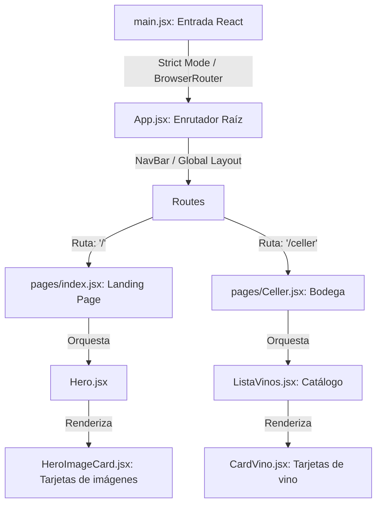

# Arquitectura y Estructura del Frontend (front-end-vinos)

Este documento detalla la estructura técnica, el flujo de enrutamiento y el sistema de diseño del frontend del restaurante **La Canal**, desarrollado bajo el stack de **Vite 8 + React 19 + Tailwind CSS v4**.

---

## 1. Mapa de Estructura del Proyecto

La aplicación se organiza bajo una estructura modular y limpia en el directorio `front-end-vinos/src/`:

```text
front-end-vinos/
├── public/                 # Recursos públicos puros sin procesar (ej. favicon)
├── docs/                   # Documentación local sobre dependencias
├── src/                    # Código fuente principal de la aplicación
│   ├── assets/             # Recursos estáticos locales procesados por Vite (imágenes oficiales)
│   │   ├── crema_catalana.png
│   │   ├── gourmet_catalan_dish.png
│   │   └── grilled_fish.png
│   ├── components/         # Componentes atómicos y modulares de la interfaz
│   │   ├── NavBar.jsx      # Barra de navegación (soporte SPA y scroll suave)
│   │   ├── Hero.jsx        # Banner principal (maquetación dual móvil/escritorio)
│   │   ├── HeroImageCard.jsx # Componente modular para las tarjetas de imágenes
│   │   ├── ListaVinos.jsx  # Catálogo de visualización, filtrado y agrupación de vinos
│   │   └── CardVino.jsx    # Tarjeta editorial individual de vino
│   ├── pages/              # Orquestadores de vistas/páginas de la aplicación
│   │   ├── index.jsx       # Página de inicio (Landing Page) principal
│   │   └── Celler.jsx      # Página de la bodega / catálogo de vinos (ruta: /celler)
│   ├── App.css             # Estilos de componente específicos
│   ├── App.jsx             # Componente raíz. Orquesta el mapa de rutas (<Routes>)
│   ├── index.css           # Punto de entrada de estilos globales, variables y animaciones
│   └── main.jsx            # Punto de entrada de React, inicia el renderizado y BrowserRouter
├── package.json            # Gestión de dependencias y scripts de ejecución
├── vite.config.js          # Configuración del bundler Vite y plugins de desarrollo
└── eslint.config.js        # Reglas de análisis de código estático (Linter)
```

---

## 2. Flujo de Renderizado y Ruteado (Routing Flow)

La aplicación sigue un flujo unidireccional y desacoplado para inicializar el sistema de navegación sin recargas de página (SPA):



### Componentes de Ruteado:
1. **`main.jsx`:** Envuelve el componente raíz `<App />` dentro de `<BrowserRouter>` de `react-router-dom`. Esto asegura que el contexto del enrutador cubra toda la aplicación una sola vez al nivel más alto.
2. **`App.jsx`:** Actúa como la plantilla de maquetación global (`Global Layout`). Renderiza de forma persistente la cabecera `<NavBar />` en todas las páginas y declara la distribución de rutas hijas usando `<Routes>` y `<Route>`.
3. **`pages/index.jsx`:** Actúa como el controlador de la ruta principal (`/`). Es el lienzo donde se montan las vistas modulares como la de bienvenida (`Hero`) y futuros bloques.
4. **`pages/Celler.jsx`:** Controlador de la ruta `/celler`. Consume la API Flask de vinos y orquesta la vista del catálogo pasando los datos a `ListaVinos`.

---

## 3. Sistema de Diseño y Estilos (Design System)

El diseño visual está totalmente alineado con las *Directrices de Identidad de La Canal* y se implementa usando la especificación del nuevo motor **Tailwind CSS v4** configurado en `src/index.css`.

### A. Paleta Orgánica de Colores:
* **Fondo Principal (`--color-canal-bg`):** `#FAF6F0` (Marfil cálido mate, evita el brillo blanco de pantallas).
* **Fondo Alternativo (`--color-canal-alt`):** `#F3EFE9` (Tono piedra caliza).
* **Texto Principal (`--color-canal-text`):** `#1C1B1A` (Gris antracita, reduce la fatiga visual al leer).
* **Texto Secundario (`--color-canal-secondary`):** `#59544B` (Marrón ceniza de contraste medio).
* **Bordes y Delimitadores (`--color-canal-border`):** `#A8A396` (Bronce taupe envejecido).

### B. Tipografías Oficiales:
* **Serif Romana (`--font-serif-romana`):** `Cinzel` / `Cormorant Garamond` (Siempre en mayúsculas para títulos, transmitiendo elegancia y tradición).
* **Sans-Serif Humanista (`--font-sans-humanist`):** `Montserrat` / `Inter` (Ligera y espaciada para textos de manifiesto y lectura fluida).
* **Serif Cursiva (`--font-serif-italic`):** `Cormorant Garamond` (Italic en minúsculas para ingredientes y etiquetas descriptivas).

### C. Utilidades Avanzadas de CSS (Puro CSS de Alto Rendimiento):
* **Textura Caliza (`.marble-subtle-bg`):** Un gradiente de color CSS que emula de forma suave el grano mineral de la piedra travertino de las mesas, optimizando la velocidad de carga al no requerir imágenes.
* **Doble Marco Perimetral (`.double-border-frame`):** Implementa el diseño tradicional de doble línea fina enmarcada (`padding: 6px` entre dos bordes de `1px solid`), utilizado en tarjetas de menú y en el manifiesto.

---

## 4. Estructura de Componentes Clave

### A. `NavBar.jsx` (Barra de Navegación)
* **Maquetación Dual:** Dispone de un menú de navegación horizontal para escritorios y un botón de hamburguesa con panel colapsable y doble borde flotante para dispositivos móviles.
* **Scroll Inteligente de Retorno:** Incorpora un manejador de clic inteligente que detecta si el usuario ya se encuentra en la Home y realiza un desplazamiento suave (`behavior: "smooth"`) hacia el inicio (`top: 0`), mejorando la usabilidad.

### B. `Hero.jsx` (Showcase de Bienvenida)
Es un componente puramente responsivo estructurado en dos columnas de visualización:
1. **Manifiesto (Izquierda):** Tarjeta con diseño de menú impreso físico, texto humanista y botón de reserva interactivo con efecto de relleno en hover.
2. **Galería (Derecha):** Orquesta dos maquetas diferenciadas para pantallas grandes y móviles:
   * **Desktop (`>= xl`):** Colaje asimétrico en tres dimensiones con solapamientos de capas (`z-index` del 10 al 25), coordenadas absolutas fijas y tipografía gigante flotando en la capa de fondo.
   * **Móvil/Tablet (`< xl`):** Distribución simétrica en cuadrícula masonry, optimizando el área táctil y la nitidez de las fotos.

### C. `ListaVinos.jsx` (Catálogo de Vinos)
Componente central de la funcionalidad de vinos. Recibe `vinos`, `isLoading` y `error` como props desde `Celler.jsx`.
* **Buscador Editorial:** Input de texto que filtra por nombre de vino, bodega y D.O. con coincidencia parcial case-insensitive.
* **Filtros Rápidos por Tipo:** Botones generados dinámicamente a partir de los tipos únicos presentes en los datos (`useMemo` + `Set`).
* **Agrupación Visual:** Los vinos filtrados se agrupan por `tipo_nombre` con cabeceras bilingües (catalán/castellano) y contador de vinos por categoría.
* **Estados de UI:** Skeleton loader animado (carga), panel de error con doble borde (fallo de API), y estado vacío con botón de limpieza de filtros.
* **Optimización:** Las tres fases de procesamiento (`filteredVinos`, `uniqueTypes`, `groupedVinos`) están memorizadas con `useMemo`.

> [!NOTE]
> Para la documentación técnica completa del flujo de datos de la Lista de Vinos, consultar `docs/documentacion-lista-vinos.md`.

### D. `CardVino.jsx` (Tarjeta Editorial de Vino)
Componente atómico que renderiza cada vino individual en un diseño editorial premium:
* **Imagen por Tipo:** Mapea `tipo_nombre` a fotos editoriales de Unsplash (tinto, blanco, espumoso, rosado) con fallback por defecto.
* **Jerarquía Tipográfica:** Bodega (Sans Humanista), Nombre del vino (Serif Romana), D.O. (Serif Cursiva itálica).
* **Ficha Técnica:** Muestra añada, formato/capacidad y copa recomendada (condicional) en un bloque con separadores sutiles.
* **Micro-animaciones:** Hover con elevación (`translateY -4px`), sombra expandida y zoom suave de la imagen (scale 1.05 en 1.5s).

### E. `HeroImageCard.jsx` (Tarjetas de Mosaico)
Componente modular atómico que envuelve cada imagen del collage:
* Aplica el doble borde de forma configurable.
* Cuenta con **posicionamiento interno por insets absolutos (`absolute inset-[6px]`)** que anula errores de colapso de altura circular en navegadores móviles bajo propiedades de `aspect-ratio` y anchos de porcentaje.
* Gestiona etiquetas flotantes interactivas en itálica descriptiva que emergen con transiciones de opacidad en hover.
* Configura propiedades de prioridad de red en la carga de imágenes (`fetchpriority="high"` en la imagen de portada LCP para optimizar el SEO y la métrica Core Web Vitals, y `low` en las complementarias).

---

## 5. Rendimiento y Buenas Prácticas

* **Cero Recargas:** Uso de `<Link>` y rutas nativas en SPA para navegación instantánea.
* **Animaciones Aceleradas por Hardware:** Desplazamientos y floats controlados por propiedades de transformación (`transform: translateY()`), reduciendo re-pintados (Repaints/Layout Shifts) en la CPU del navegador.
* **HTML Semántico:** Uso de etiquetas estructurales HTML5 como `<header>`, `<nav>`, `<main>`, `<section>`, `<h1>` y `` con textos alternativos optimizados para accesibilidad y rastreo SEO.
