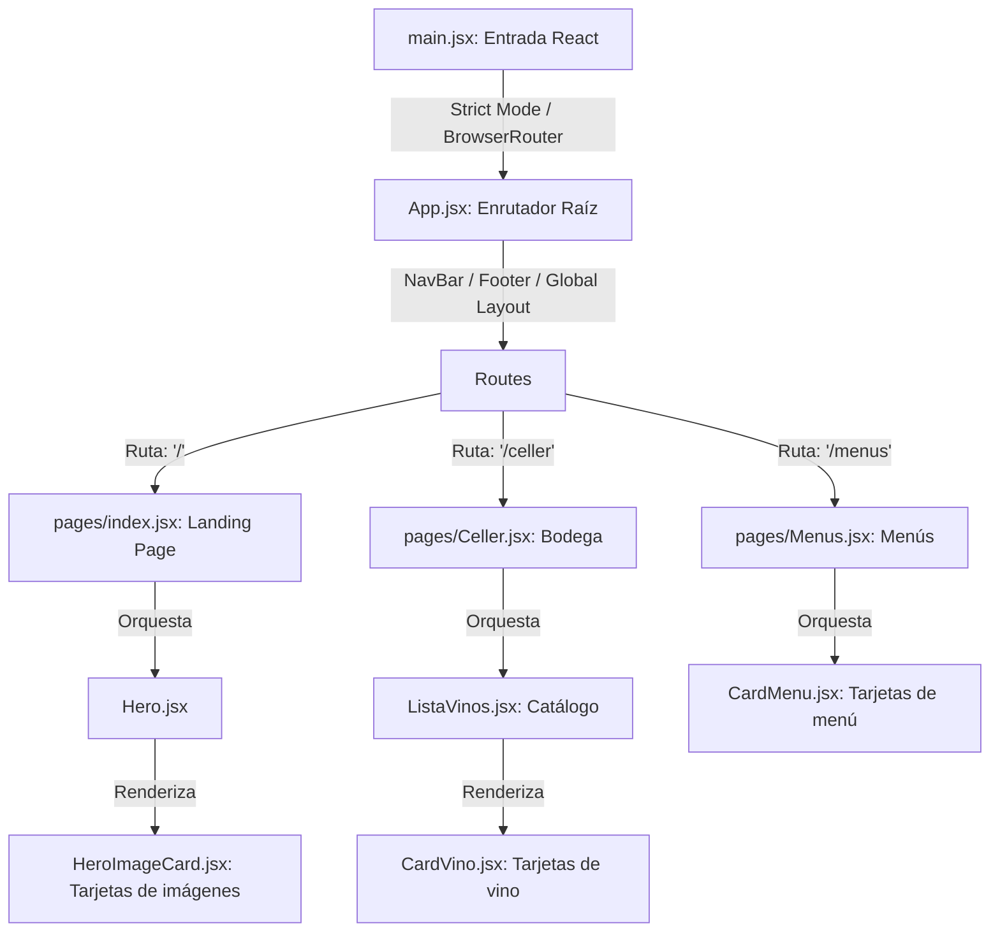

# Arquitectura y Estructura del Frontend (front-end-vinos)

Este documento detalla la estructura técnica, el flujo de enrutamiento y el sistema de diseño del frontend del restaurante **La Canal**, desarrollado bajo el stack de **Vite 8 + React 19 + Tailwind CSS v4**.

---

## 1. Mapa de Estructura del Proyecto

La aplicación se organiza bajo una estructura modular y limpia en el directorio `front-end-vinos/src/`:

```text
front-end-vinos/
├── public/                 # Recursos públicos puros sin procesar (ej. favicon)
├── docs/                   # Documentación local sobre dependencias
├── src/                    # Código fuente principal de la aplicación
│   ├── assets/             # Recursos estáticos locales procesados por Vite (imágenes oficiales)
│   │   ├── crema_catalana.png
│   │   ├── gourmet_catalan_dish.png
│   │   └── grilled_fish.png
│   ├── components/         # Componentes atómicos y modulares de la interfaz
│   │   ├── NavBar.jsx      # Barra de navegación (soporte SPA y scroll suave)
│   │   ├── Hero.jsx        # Banner principal (maquetación dual móvil/escritorio)
│   │   ├── HeroImageCard.jsx # Componente modular para las tarjetas de imágenes
│   │   ├── ListaVinos.jsx  # Catálogo de visualización, filtrado y agrupación de vinos
│   │   ├── CardVino.jsx    # Tarjeta editorial individual de vino
│   │   ├── CardMenu.jsx    # Tarjeta plegable interactiva de menú
│   │   └── Footer.jsx      # Pie de página global con contacto e Instagram
│   ├── pages/              # Orquestadores de vistas/páginas de la aplicación
│   │   ├── index.jsx       # Página de inicio (Landing Page) principal
│   │   ├── Celler.jsx      # Página de la bodega / catálogo de vinos (ruta: /celler)
│   │   └── Menus.jsx       # Página de cartas y menús del restaurante (ruta: /menus)
│   ├── App.css             # Estilos de componente específicos (sin uso actual)
│   ├── App.jsx             # Componente raíz. Orquesta el Layout global y mapa de rutas
│   ├── index.css           # Punto de entrada de estilos globales, variables y animaciones
│   └── main.jsx            # Punto de entrada de React, inicia el renderizado y BrowserRouter
├── package.json            # Gestión de dependencias y scripts de ejecución
├── vite.config.js          # Configuración del bundler Vite y plugins de desarrollo
└── eslint.config.js        # Reglas de análisis de código estático (Linter)
```

---

## 2. Flujo de Renderizado y Ruteado (Routing Flow)

La aplicación sigue un flujo unidireccional y desacoplado para inicializar el sistema de navegación sin recargas de página (SPA):



### Componentes de Ruteado:
1. **`main.jsx`:** Envuelve el componente raíz `<App />` dentro de `<BrowserRouter>` de `react-router-dom`. Esto asegura que el contexto del enrutador cubra toda la aplicación una sola vez al nivel más alto.
2. **`App.jsx`:** Actúa como la plantilla de maquetación global (`Global Layout`). Renderiza de forma persistente la cabecera `<NavBar />` y el pie de página `<Footer />` en todas las vistas, y declara la distribución de rutas hijas usando `<Routes>` y `<Route>`.
3. **`pages/index.jsx`:** Actúa como el controlador de la ruta principal (`/`). Es el lienzo donde se montan las vistas modulares como la de bienvenida (`Hero`) y futuros bloques.
4. **`pages/Celler.jsx`:** Controlador de la ruta `/celler`. Consume la API Flask de vinos y orquesta la vista del catálogo pasando los datos a `ListaVinos`.
5. **`pages/Menus.jsx`:** Controlador de la ruta `/menus`. Expone la oferta gastronómica unificada e interactiva de menús del restaurante pasando los datos estructurados a componentes `<CardMenu />`.

---

## 3. Sistema de Diseño y Estilos (Design System)

El diseño visual está totalmente alineado con las *Directrices de Identidad de La Canal* y se implementa usando la especificación del nuevo motor **Tailwind CSS v4** configurado en `src/index.css`.

### A. Paleta Orgánica de Colores (Optimizada para Accesibilidad):
* **Fondo Principal (`--color-canal-bg`):** `#FAF6F0` (Marfil cálido mate, evita el brillo blanco de pantallas).
* **Fondo Alternativo (`--color-canal-alt`):** `#EBE5DA` (Tono piedra caliza, ajustado para mayor contraste de áreas).
* **Texto Principal (`--color-canal-text`):** `#141312` (Gris antracita profundo, aumentado para mayor legibilidad y nitidez).
* **Texto Secundario (`--color-canal-secondary`):** `#4A453C` (Marrón ceniza oscuro de contraste superior a 7:1).
* **Bordes y Delimitadores (`--color-canal-border`):** `#8F897D` (Bronce taupe, ajustado para garantizar contraste superior a 3:1 en interfaces gráficas).

### B. Tipografías Oficiales:
* **Serif Romana (`--font-serif-romana`):** `Cinzel` / `Cormorant Garamond` (Siempre en mayúsculas para títulos, transmitiendo elegancia y tradición).
* **Sans-Serif Humanista (`--font-sans-humanist`):** `Montserrat` / `Inter` (Ligera y espaciada para textos de manifiesto y lectura fluida).
* **Serif Cursiva (`--font-serif-italic`):** `Cormorant Garamond` (Italic en minúsculas para ingredientes y etiquetas descriptivas).

### C. Utilidades Avanzadas de CSS (Puro CSS de Alto Rendimiento):
* **Textura Caliza (`.marble-subtle-bg`):** Un gradiente de color CSS que emula de forma suave el grano mineral de la piedra travertino de las mesas, optimizando la velocidad de carga al no requerir imágenes.
* **Doble Marco Perimetral (`.double-border-frame`):** Implementa el diseño tradicional de doble línea fina enmarcada (`padding: 6px` entre dos bordes de `1px solid`), utilizado en tarjetas de menú y en el manifiesto.

---

## 4. Estructura de Componentes y Páginas (Documentación Detallada)

### A. Puntos de Entrada y Enrutamiento Raíz

#### 1. `main.jsx`
* **Ubicación:** `front-end-vinos/src/main.jsx`
* **Propósito:** Actúa como el punto de inicio de la ejecución en el cliente. Carga e inicializa el árbol virtual de componentes de React sobre el contenedor del DOM real `#root`.
* **Configuración Clave:**
  - Envuelve la aplicación `<App />` dentro de `<BrowserRouter>` de `react-router-dom` para habilitar el enrutamiento del lado del cliente (SPA) en todo el árbol de componentes.
  - Utiliza `<StrictMode>` para activar advertencias y comprobaciones adicionales de desarrollo.
  - Importa `index.css`, asegurando que el motor global de Tailwind y los tokens de diseño de la marca se apliquen antes de pintar cualquier elemento.

#### 2. `App.jsx`
* **Ubicación:** `front-end-vinos/src/App.jsx`
* **Propósito:** Definir el Layout global y actuar como el enrutador raíz del proyecto.
* **Componentes y Rutas:**
  - Renderiza persistentemente el encabezado `<NavBar />` y el pie de página `<Footer />` en todas las vistas de forma orquestada.
  - Define el contenedor principal con clase `min-h-screen bg-canal-bg` que asegura el fondo caliza mate de pantalla completa.
  - Utiliza `<Routes>` y `<Route>` para renderizar condicionalmente las páginas basadas en la URL del navegador:
    - Ruta `/`: Renderiza el orquestador `<Index />`.
    - Ruta `/celler`: Renderiza el orquestador `<Celler />`.
    - Ruta `/menus`: Renderiza el orquestador `<Menus />`.

---

### B. Componentes Modulares de la Interfaz

#### 3. `NavBar.jsx` (Barra de Navegación)
* **Ubicación:** `front-end-vinos/src/components/NavBar.jsx`
* **Propósito:** Proporcionar la cabecera superior interactiva y global de la aplicación.
* **Características Clave:**
  - **Diseño Simétrico:** Menú de tres columnas en escritorio (enlaces a la izquierda, logotipo "La Canal" centrado en Serif Romana, enlaces y CTA de reserva a la derecha).
  - **Menú Móvil Responsive:** En pantallas pequeñas, colapsa en un botón de hamburguesa animado con un panel desplegable envuelto en un contenedor de doble borde físico (`.double-border-frame`).
  - **Estado Local (`isOpen`):** Booleano que controla la transición de apertura/cierre del panel móvil.
  - **Scroll Inteligente de Retorno:** Al hacer clic en el logotipo central desde la ruta Home (`/`), desplaza de forma fluida el scroll de la ventana al inicio superior (`top: 0`, `behavior: "smooth"`).
  - **Manejador de Reservas (`handleReservationClick`):** Cierra el panel en móvil y lanza el flujo de reservas de mesa (temporalmente implementado con un diálogo de alerta nativo).

#### 4. `Hero.jsx` (Showcase de Bienvenida)
* **Ubicación:** `front-end-vinos/src/components/Hero.jsx`
* **Propósito:** Presentar la sección de bienvenida de la página principal transmitiendo la filosofía de cocina de origen y producto.
* **Características Clave:**
  - **Manifiesto Tipográfico (Izquierda):** Tarjeta con diseño de menú impreso físico (`.double-border-frame`) y botón de reserva interactivo con efecto de relleno en hover.
  - **Tipografía Gigante 3D:** Cadena "La Canal" translúcida en la capa de fondo (`opacity-[0.04]`, `text-[9vw]`), proporcionando profundidad estética tridimensional.
  - **Mosaico Asimétrico Solapado (Derecha):** Orquesta dos disposiciones responsivas:
    - **Escritorio (`>= xl`):** Collage 3D solapado con tres tarjetas de imágenes flotantes con animación sutil de flotación (`animate-soft-float` y `animate-soft-float-delayed`).
    - **Móvil/Tablet (`< xl`):** Cuadrícula simétrica en masonry vertical para optimizar la navegación táctil.

#### 5. `HeroImageCard.jsx` (Tarjetas de Mosaico)
* **Ubicación:** `front-end-vinos/src/components/HeroImageCard.jsx`
* **Propósito:** Componente de enmarcado atómico y optimización de rendimiento para las imágenes de comida del Hero.
* **Propiedades (Props):**
  - `src` (string, obligatoria): Ruta o URL del recurso de la imagen.
  - `alt` (string, obligatoria): Texto alternativo para accesibilidad y SEO.
  - `label` (string, opcional): Texto de la etiqueta interactiva en cursiva Serif que emerge sobre la imagen.
  - `className` (string, opcional): Clases de Tailwind de posicionamiento absoluto.
  - `fetchPriority` (string, opcional): Define la prioridad de carga en red (`high` o `low`).
* **Detalles Técnicos:**
  - Implementa un marco concéntrico de doble línea fina enmarcada (`padding: 6px` entre dos bordes).
  - **Posicionamiento Inset:** Emplea la propiedad `absolute inset-[6px]` sobre la imagen interior para evitar el colapso de altura en navegadores móviles cuando se trabaja con proporciones de `aspect-ratio` y anchos dinámicos por porcentaje.
  - Configura la métrica Core Web Vitals optimizando la imagen principal LCP del Hero (`fetchPriority="high"` en la imagen de carrilleras y `low` en las secundarias).

#### 6. `ListaVinos.jsx` (Motor del Catálogo de Vinos)
* **Ubicación:** `front-end-vinos/src/components/ListaVinos.jsx`
* **Propósito:** Gestionar de forma inteligente y reactiva el catálogo completo de vinos en el cliente.
* **Propiedades (Props):**
  - `vinos` (`Array<Object>`): Array con el catálogo crudo recuperado de la base de datos a través de la API.
  - `isLoading` (`boolean`): Bandera de carga activa.
  - `error` (`Object | null`): Objeto de error en caso de fallo en la llamada HTTP.
* **Estados Locales (`useState`):**
  - `searchQuery` (`string`): Cadena de texto para la barra de búsqueda en tiempo real.
  - `selectedType` (`string`): Categoría de vino seleccionada en el menú rápido (Tinto, Blanco, Espumoso, Rosado, o "all").
* **Procesamiento de Datos en 3 Fases Memorizadas (`useMemo`):**
  1. **Filtrado (`filteredVinos`):** Filtra en paralelo combinando por operador AND la búsqueda de texto libre (case-insensitive sobre `vino_nombre`, `bodega_nombre` y `zona_origen`) y la coincidencia normalizada de categoría.
  2. **Categorías Únicas (`uniqueTypes`):** Extrae de forma dinámica las categorías presentes en la lista original de vinos utilizando un `Set` y las devuelve ordenadas para renderizar los botones de filtrado rápido.
  3. **Agrupación y Ordenación (`groupedVinos`):** Agrupa los vinos filtrados en un mapa de categorías y los ordena alfabéticamente por nombre de vino utilizando `localeCompare`.
* **Estados de la Interfaz:**
  - **Skeleton Loader (Cargando):** Si `isLoading` es true, pinta 3 tarjetas fantasma animadas con la clase `animate-pulse`.
  - **Error Panel:** Si `error` existe, muestra una advertencia de conexión elegante con el diseño `.double-border-frame`.
  - **Empty State:** Si tras el filtrado no quedan vinos, renderiza un mensaje con un botón de limpieza para restablecer los estados de búsqueda.

#### 7. `CardVino.jsx` (Tarjeta Editorial de Vino)
* **Ubicación:** `front-end-vinos/src/components/CardVino.jsx`
* **Propósito:** Mostrar de forma visual e impresa la información técnica de un vino específico.
* **Propiedades (Props):**
  - `vino` (`Object`): Datos individuales de un vino procedente del mapeo en la lista.
* **Características Clave:**
  - **Imagen Editorial Dinámica:** Mapea el tipo de vino (`tipo_nombre` en minúsculas) a imágenes estáticas premium de Unsplash (`tinto`, `blanco`, `espumoso`, `rosado`), con una imagen de bodegón genérica de respaldo.
  - **Jerarquía Visual Clara:** Bodega en Sans Humanista con alta tracking, Nombre del vino en Serif Romana de gran peso visual, Denominación de origen en cursiva Serif itálica.
  - **Ficha de Cosecha y Servicio:** Muestra la añada, capacidad formateada y, si existe en la base de datos, el tipo de copa recomendado para el servicio del sumiller.
  - **Micro-animaciones:** Aplica transiciones suaves en hover (elevación vertical en `translateY(-4px)` y efecto zoom de la imagen interior a `scale(1.05)` en 1.5s).

#### 8. `CardMenu.jsx` (Tarjeta Editorial y Plegable de Menú)
* **Ubicación:** `front-end-vinos/src/components/CardMenu.jsx`
* **Propósito:** Renderizar de forma estructurada e interactiva la carta de cada menú individual del restaurante.
* **Propiedades (Props):**
  - `menu` (`Object`): Datos y secciones del menú procedentes del mapeo de la página Menus.
* **Características Clave:**
  - **Estado Desplegable Local (`isOpen`):** Un estado booleano que mediante clases responsivas y transiciones de CSS puro (`overflow-hidden`, `max-h-0` / `max-h-300`, `transition-all duration-700`) despliega de forma muy fluida el contenido de platos e ingredientes al hacer clic sobre la tarjeta.
  - **Separador Ornamental SVG (`ScrollFlourish`):** Dibuja un adorno vectorial clásico y estilizado con curvas y esferas de tono bronce atenuado para estructurar la composición tipográfica.
  - **Soporte de Suplementos y Notas:** Renderiza condicionalmente el coste extra de platos premium (ej. *supl. 14€* en filet de vedella) e itálicas detalladas para notas al pie (como petit fours o detalles del precio).
  - **Micro-animaciones:** Efecto de elevación en hover, sombreado dinámico e indicador de acción con flecha de retorno rotatoria.

#### 9. `Footer.jsx` (Pie de Página Unificado)
* **Ubicación:** `front-end-vinos/src/components/Footer.jsx`
* **Propósito:** Proporcionar el pie de página global para el contacto, ubicación en mapas y redes oficiales del establecimiento.
* **Características Clave:**
  - **Enrutado de Retorno Inteligente:** Si el usuario clica sobre el logotipo de "La Canal" y se encuentra en la Landing Page (`/`), efectúa un scroll suave automático al pixel 0 superior.
  - **Sección enmarcada clásica:** Presenta la dirección física en Tona (Barcelona), teléfono de reserva y enlace a Instagram en una caja con doble borde `.double-border-frame` y micro-animación en hover.
  - **Social Link Interactiva:** El enlace a Instagram cuenta con transiciones dinámicas que invierten la paleta cromática en hover y animan el logotipo vectorial SVG.

---

### C. Páginas y Controladores de Vistas

#### 10. `index.jsx` (Página de Inicio)
* **Ubicación:** `front-end-vinos/src/pages/index.jsx`
* **Propósito:** Actuar como orquestador y contenedor de la Landing Page principal del restaurante.
* **Funcionamiento:** Renderiza de forma modular la sección `<Hero />` y se encuentra estructurada para incorporar futuras secciones como Carta, Menús o Filosofía de manera secuencial.

#### 11. `Celler.jsx` (Página de la Bodega)
* **Ubicación:** `front-end-vinos/src/pages/Celler.jsx`
* **Propósito:** Orquestar la vista de El Celler, gestionar la llamada HTTP y el control de resiliencia del frontend.
* **Comportamiento y Ciclo de Vida (`useEffect`):**
  - **Scroll Top Inicial:** Asegura que la pantalla comience inmediatamente en el pixel 0 al navegar a esta ruta.
  - **Consumo de la API con Fallback:**
    - Realiza un `fetch` asíncrono hacia el endpoint `http://127.0.0.1:5000/vinos`.
    - **Control de Latencia (AbortController):** Integra un temporizador de 3 segundos (`setTimeout`) que aborta de forma activa la petición de red si el backend excede este tiempo, previniendo pantallas bloqueadas en conexiones lentas.
    - **Capa de Resiliencia (Fallback):** En caso de fallo de red o timeout, captura el error de forma silenciosa (`setError(null)` y registra una advertencia en la consola), manteniendo una experiencia de usuario limpia mediante la omisión de mensajes de error de sistema agresivos.
  - **Navegación:** Integra un enlace de retorno de estilo editorial (`← Tornar a l'inici / Volver al inicio`) hacia la Home (`/`).

#### 12. `Menus.jsx` (Página de Menús Gastronómicos)
* **Ubicación:** `front-end-vinos/src/pages/Menus.jsx`
* **Propósito:** Orquestar la sección de menús interactivos del restaurante.
* **Comportamiento y Ciclo de Vida:**
  - **Scroll Inicial Instante:** Fuerza el scroll al pixel superior `top: 0` al inicializarse la vista.
  - **Datos Estructurados Locales (`MENUS_DATA`):** Transcribe e integra en formato estructurado de arrays de secciones y platos la oferta clásica de *Menú del Dia*, *Cap de Setmana* y *Menú Interludi*, con sus respectivos precios y descripciones de platos.
  - **Grid Responsive:** Mapea el array de datos locales pasándole las propiedades a componentes individuales `<CardMenu />` distribuidos en una cuadrícula fluida de 3 columnas en escritorio y vertical en móviles.

#### 13. `App.css` (Boilerplate de Vite)
* **Ubicación:** `front-end-vinos/src/App.css`
* **Propósito:** Este archivo contiene las clases y estilos por defecto generados al inicializar la aplicación con Vite (como `.counter`, `.hero`, `#center`, etc.).
* **Detalle Técnico:** Actualmente **no está siendo utilizado** por ningún componente del catálogo de vinos, ya que el proyecto utiliza una maquetación e identidad visual propia descrita exclusivamente en `index.css`. Se conserva por motivos de compatibilidad de la plantilla base.

---

## 5. Rendimiento y Buenas Prácticas

* **Cero Recargas:** Uso de `<Link>` y rutas nativas en SPA para navegación instantánea.
* **Animaciones Aceleradas por Hardware:** Desplazamientos y floats controlados por propiedades de transformación (`transform: translateY()`), reduciendo re-pintados (Repaints/Layout Shifts) en la CPU del navegador.
* **HTML Semántico:** Uso de etiquetas estructurales HTML5 como `<header>`, `<nav>`, `<main>`, `<section>`, `<h1>` y `` con textos alternativos optimizados para accesibilidad y rastreo SEO.
