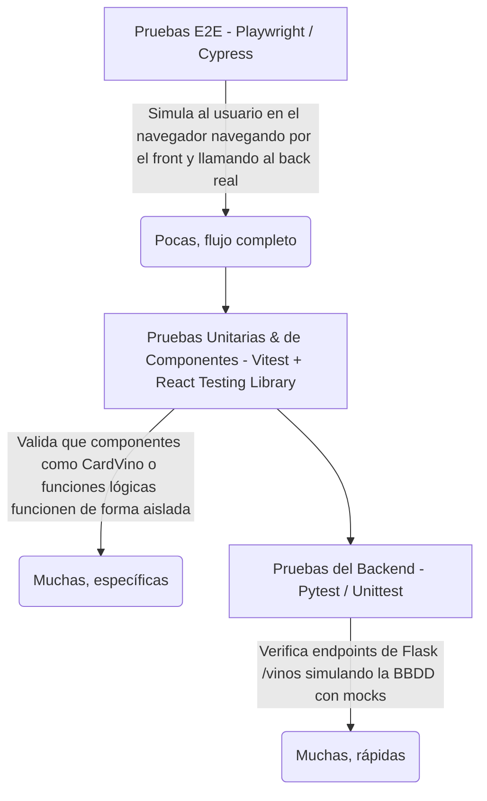

# Guía de Testing Unitario y E2E — Proyecto ABP La Canal (Vinos)

Esta guía técnica está diseñada para ayudarte a ti y a tus compañeros de equipo a comprender, configurar y desarrollar la estrategia de **pruebas de software (Testing)** exigida para la entrega de vuestro proyecto académico.

Dado que vuestra aplicación utiliza una arquitectura moderna desacoplada (**Backend en Flask** y **Frontend en React con Vite**), dividiremos la estrategia de testing en tres niveles clave (la clásica pirámide de testing), adaptando cada ejemplo a los componentes y datos reales de vuestro sistema.

---

## 🗺️ La Estrategia de Testing (La Pirámide)

Para vuestra entrega, es ideal proponer y demostrar que entendéis los siguientes niveles de pruebas:



1. **Tests Unitarios del Backend (Python / Flask):** Verifican que los endpoints del backend devuelvan los códigos HTTP correctos y el JSON esperado, aislando la base de datos real mediante *mocks* (simulaciones).
2. **Tests Unitarios y de Componentes del Frontend (React / Vitest):** Comprueban que los componentes visuales (como `CardVino.jsx`) rendericen la información correctamente y respondan de forma adecuada a las interacciones del usuario.
3. **Tests End-to-End (E2E) (Playwright):** Levantan tanto la base de datos como la API y la aplicación web para simular a un usuario real interactuando con el navegador (haciendo clic, viendo la carta de vinos, etc.).

---

## 🐍 Parte 1: Testing en el Backend (Flask)

En el backend, vuestro archivo principal es `app.py` y las rutas están definidas mediante un *Blueprint* en `controller/controller.py`. Los datos se obtienen de la base de datos a través de `database/queries.py`.

Para testear esto de forma unitaria, **no debemos conectar con la base de datos real** (ya que si la BBDD está caída, los tests fallarían sin ser culpa del código de la API). Usaremos **`pytest`** y su sistema de **mocks**.

### 1. Instalación de dependencias de testing
Para el entorno virtual de Python (`.venv` en `api-vinos`), debéis instalar las herramientas necesarias:
```bash
pip install pytest pytest-mock
```

### 2. Estructura de archivos sugerida
Dentro de la carpeta `api-vinos/`, cread una carpeta llamada `tests/`:
```text
api-vinos/
├── controller/
│   └── controller.py
├── database/
│   ├── connection.py
│   └── queries.py
├── tests/
│   ├── __init__.py
│   └── test_controller.py  <-- Aquí escribiremos el test
├── app.py
└── requirements.txt
```

### 3. Ejemplo práctico: `test_controller.py`
Este test verifica que el endpoint `GET /vinos` funciona correctamente, simulando lo que devolvería la base de datos mediante mock.

> [!NOTE]
> Usar un *mock* significa interceptar la llamada a `get_all_vinos()` y hacer que devuelva una lista de vinos controlada por nosotros para verificar el comportamiento de la API de forma aislada.

Cread el archivo `api-vinos/tests/test_controller.py` con el siguiente código:

```python
import pytest
from app import app

# Creamos una fixture de pytest para configurar el cliente de pruebas de Flask
@pytest.fixture
def client():
    app.config["TESTING"] = True
    with app.test_client() as client:
        yield client

def test_get_vinos_success(client, mocker):
    """
    Caso de Prueba: Verificar que GET /vinos responde con código 200
    y devuelve la lista de vinos simulada (mock) correctamente.
    """
    # 1. ARRANGE (Preparar el escenario)
    # Simulamos lo que devolvería la función get_all_vinos de la BBDD
    vinos_simulados = [
        {
            "vino_nombre": "La Canal Crianza",
            "tipo_nombre": "Tinto",
            "bodega_nombre": "Bodega La Canal",
            "zona_origen": "Osona",
            "anio": 2021,
            "formato_capacidad": "750",
            "copa_nombre": "Copa Burdeos"
        },
        {
            "vino_nombre": "Canal Blanco Premium",
            "tipo_nombre": "Blanco",
            "bodega_nombre": "Bodega La Canal",
            "zona_origen": "Penedès",
            "anio": 2022,
            "formato_capacidad": "750",
            "copa_nombre": "Copa Chardonnay"
        }
    ]
    
    # Reemplazamos temporalmente la función real de base de datos por nuestro mock
    mock_queries = mocker.patch("controller.controller.get_all_vinos", return_value=vinos_simulados)

    # 2. ACT (Ejecutar la acción)
    # Hacemos una petición GET virtual a la API
    response = client.get("/vinos")

    # 3. ASSERT (Comprobar resultados)
    assert response.status_code == 200
    
    # Comprobamos que el JSON recibido coincide con los datos del mock
    json_data = response.get_json()
    assert len(json_data) == 2
    assert json_data[0]["vino_nombre"] == "La Canal Crianza"
    assert json_data[1]["tipo_nombre"] == "Blanco"
    
    # Aseguramos que la función de BBDD fue llamada exactamente 1 vez
    mock_queries.assert_called_once()
```

### 4. Cómo ejecutar los tests del backend
Ejecutad el siguiente comando en la terminal (dentro de la carpeta `api-vinos` con el entorno virtual activo):
```bash
pytest -v
```

---

## ⚛️ Parte 2: Testing en el Frontend (React + Vite)

Dado que vuestro frontend utiliza **Vite**, la herramienta más moderna, ultra rápida y recomendada por la comunidad es **`Vitest`**, combinada con **`React Testing Library`** (para interactuar con los componentes en un navegador virtual).

### 1. Instalación de dependencias en el frontend
En la carpeta `front-end-vinos`, ejecutad el siguiente comando para instalar el kit de testing básico de React:
```bash
npm install -D vitest @testing-library/react @testing-library/jest-dom jsdom
```

### 2. Configurar `vite.config.js` para habilitar el entorno de testing
Debéis actualizar el archivo `vite.config.js` para indicarle a Vite que use el entorno `jsdom` (un navegador emulado en memoria) al ejecutar tests.

Modificad vuestro archivo `front-end-vinos/vite.config.js` para que se vea así:

```javascript
import { defineConfig } from 'vite'
import react from '@vitejs/plugin-react'

// https://vite.dev/config/
export default defineConfig({
  plugins: [react()],
  test: {
    globals: true,
    environment: 'jsdom',
    setupFiles: './src/setupTests.js', // Archivo para configurar extensiones de assertions
  },
})
```

### 3. Crear el archivo de configuración `setupTests.js`
Cread el archivo `front-end-vinos/src/setupTests.js` para inyectar los métodos de comparación y aserción de Testing Library (como `.toBeInTheDocument()`):

```javascript
import '@testing-library/jest-dom';
```

### 4. Ejemplo práctico: Test Unitario del Componente `CardVino.jsx`
Vamos a escribir un test para asegurar que el componente `CardVino` muestra los datos que le llegan a través de las *props*, gestiona bien los valores nulos (como añada vacía) y asigna la imagen correspondiente de forma case-insensitive.

Cread el archivo `front-end-vinos/src/components/CardVino.test.jsx`:

```javascript
import { render, screen } from '@testing-library/react';
import { describe, it, expect } from 'vitest';
import CardVino from './CardVino';

describe('Componente <CardVino />', () => {
  // Datos simulados de un vino (mock) que cumple con la estructura esperada
  const mockVino = {
    vino_nombre: 'Gran Clot del Canal',
    tipo_nombre: 'Tinto',
    bodega_nombre: 'Celler La Canal',
    zona_origen: 'D.O. Penedès',
    anio: 2019,
    formato_capacidad: '750',
    copa_nombre: 'Copa Burdeos'
  };

  it('debe renderizar correctamente la información básica del vino', () => {
    // 1. ARRANGE & ACT: Renderizamos el componente con las props
    render(<CardVino vino={mockVino} />);

    // 2. ASSERT: Buscamos si los textos clave están en el documento
    expect(screen.getByText('Gran Clot del Canal')).toBeInTheDocument();
    expect(screen.getByText('Celler La Canal')).toBeInTheDocument();
    expect(screen.getByText('D.O. Penedès')).toBeInTheDocument();
    expect(screen.getByText('750 ml')).toBeInTheDocument();
    
    // Verificamos que se muestre el texto de la copa recomendada
    expect(screen.getByText('Copa Burdeos')).toBeInTheDocument();
  });

  it('debe resolver la imagen correcta basada en el tipo de vino (case-insensitive)', () => {
    render(<CardVino vino={mockVino} />);

    // El tipo es 'Tinto' (capitalizado), el componente debe resolver la imagen de tipo tinto
    const imagen = screen.getByRole('img');
    
    // Validamos que el alt esté bien formado
    expect(imagen).toHaveAttribute('alt', 'Gran Clot del Canal - Tinto');
    
    // Validamos que apunte a la URL de vino tinto (definida en el mapa de imágenes de CardVino)
    expect(imagen).toHaveAttribute('src', 'https://images.unsplash.com/photo-1584916201218-f4242ceb4809?auto=format&fit=crop&w=600&h=800&q=80');
  });

  it('debe manejar correctamente cuando el año (añada) es nulo o ausente', () => {
    // Escenario con año nulo
    const vinoSinAnio = { ...mockVino, anio: null };
    render(<CardVino vino={vinoSinAnio} />);

    // El componente según su diseño debe mostrar un guion '—' en la añada
    expect(screen.getByText('—')).toBeInTheDocument();
  });
});
```

### 5. Cómo ejecutar los tests del frontend
Agregad un script en vuestro `package.json` del frontend para ejecutar los tests fácilmente:
```json
"scripts": {
  "dev": "vite",
  "build": "vite build",
  "lint": "eslint .",
  "preview": "vite preview",
  "test": "vitest"
}
```

Ahora podéis correr las pruebas ejecutando en vuestro terminal:
```bash
npm run test
```

---

## 🌐 Parte 3: Testing End-to-End (E2E) con Playwright

Las pruebas **End-to-End (E2E)** son el estándar de oro en el desarrollo moderno de software porque garantizan que **todo el sistema funciona en conjunto**. 

**Playwright** (desarrollado por Microsoft) es actualmente la herramienta preferida en la industria por su velocidad y fiabilidad en navegadores modernos (Chromium, Firefox, WebKit).

### 1. Inicializar Playwright en vuestro proyecto
Os aconsejamos instalarlo a nivel de la raíz del proyecto para que testee toda la aplicación web en conjunto.

En la raíz de vuestro proyecto (`test_repository/`), ejecutad:
```bash
npm init playwright@latest
```
*El asistente os preguntará dónde queréis alojar las pruebas E2E (sugerimos dejar la carpeta `tests` por defecto), si queréis instalar los navegadores de prueba (sí) y si queréis añadir un workflow de GitHub Actions (opcional).*

### 2. Configurar el Servidor en `playwright.config.js`
En el archivo de configuración `playwright.config.js` generado en la raíz, podéis indicarle a Playwright que levante vuestra aplicación de React automáticamente antes de iniciar las pruebas:

```javascript
import { defineConfig, devices } from '@playwright/test';

export default defineConfig({
  testDir: './tests-e2e', // Para no confundir con las carpetas de tests unitarios
  fullyParallel: true,
  reporter: 'html',
  use: {
    baseURL: 'http://localhost:5173', // URL donde corre vuestro front en desarrollo
    trace: 'on-first-retry',
  },
  
  // Levanta el servidor de React antes de correr las pruebas
  webServer: {
    command: 'npm --prefix front-end-vinos run dev',
    url: 'http://localhost:5173',
    reuseExistingServer: !process.env.CI,
  },
});
```

### 3. Ejemplo práctico: `vinos_flow.spec.js`
Este test simula a un cliente real que entra en la web del **Restaurante La Canal**, espera a que carguen los vinos desde la base de datos de la API (Flask) y comprueba que se listan y se ve la información visual.

Cread el archivo en `tests-e2e/vinos_flow.spec.js`:

```javascript
import { test, expect } from '@playwright/test';

test.describe('Flujo de la Carta de Vinos — Restaurante La Canal', () => {
  
  test('Debe cargar la página principal y listar las tarjetas de vinos de la API', async ({ page }) => {
    // 1. Navegar a la aplicación web (React)
    await page.goto('/');

    // 2. Comprobar que el título o elemento Hero del Restaurante está visible
    // (Asumimos que tenéis un título con "La Canal" o similar en la página)
    await expect(page.locator('h1')).toContainText(/La Canal/i);

    // 3. Esperar a que la lista de vinos esté visible en el DOM.
    // Esto asegura que la llamada a la API Flask (GET /vinos) se completó con éxito
    const listadoVinos = page.locator('main, section.lista-vinos'); 
    await expect(listadoVinos).toBeVisible();

    // 4. Validar que hay al menos una tarjeta de vino renderizada
    // (Buscamos elementos <article> que representan los componentes CardVino)
    const tarjetasVinos = page.locator('article');
    await expect(tarjetasVinos.first()).toBeVisible();
    
    // Contamos que existan vinos en la interfaz
    const cantidadVinos = await tarjetasVinos.count();
    expect(cantidadVinos).toBeGreaterThan(0);
    
    // 5. Simular interacción: buscar un vino específico y validar su bodega
    const primerVinoTitulo = page.locator('article h3').first();
    await expect(primerVinoTitulo).toBeVisible();
    
    // Imprimimos en consola del test qué vino detectó
    const nombreVino = await primerVinoTitulo.innerText();
    console.log(`[E2E] Primer vino detectado en pantalla: ${nombreVino}`);
  });
});
```

### 4. Cómo ejecutar los tests E2E
Podéis ejecutar las pruebas de dos maneras en la terminal:
* **Modo consola:** `npx playwright test`
* **Modo interactivo (UI espectacular):** `npx playwright test --ui` (este modo abrirá una ventana de Playwright donde podréis ver el navegador ejecutando vuestras acciones línea por línea, inspeccionar el HTML, hacer viajes en el tiempo por el flujo, etc. **¡Esto dejará asombrado a tu profesor en la presentación!**).

---

## 🎓 Consejos para la Entrega y Defensa del Proyecto Académico

Si presentas este esquema de pruebas ante tu tribunal o profesor, demostrarás un rigor profesional excelente. Aquí tienes unos tips valiosos para redactar la memoria de testing:

1. **La importancia de la Cobertura (Coverage):** Menciona en la memoria que vuestra estrategia busca cubrir tanto la **lógica individual de UI** (React), la **integridad de las consultas de API** (Flask) y la **experiencia de extremo a extremo** (Playwright).
2. **Uso de Mocks en el Backend:** Explica que utilizáis *mocks* en las pruebas unitarias de Flask para evitar que el fallo del servidor de base de datos altere el resultado de los tests de código de la API.
3. **Flujo AAA (Arrange, Act, Assert):** Destaca en la explicación del código que todos tus tests están estructurados bajo este patrón industrial:
   * **Arrange (Preparar):** Preparar los datos o simular componentes.
   * **Act (Actuar):** Ejecutar la acción o llamar al endpoint.
   * **Assert (Afirmar):** Validar que el resultado es el esperado.
