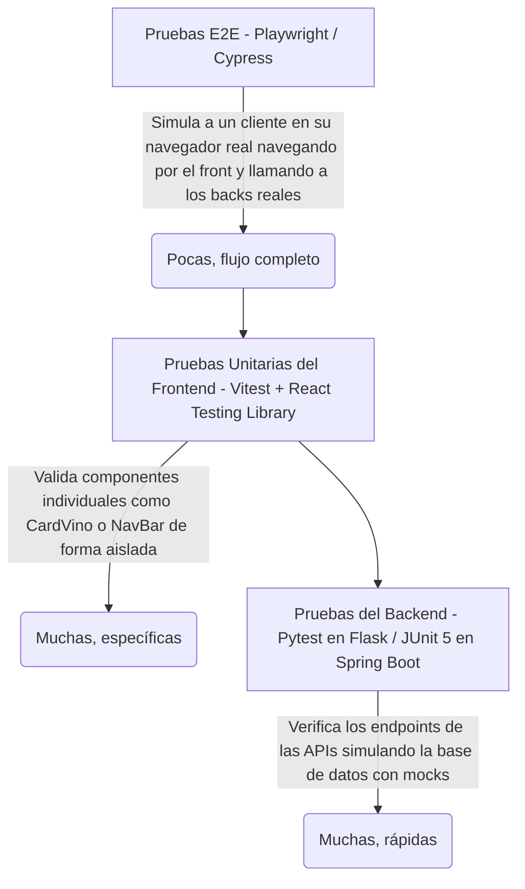

# Guía de Testing Unitario y E2E — Proyecto ABP La Canal (Vinos y Reservas)

Esta guía técnica está diseñada para ayudarte a ti y a tus compañeros de equipo a comprender, configurar y desarrollar la estrategia de **pruebas de software (Testing)** exigida para la entrega de vuestro proyecto académico.

No te preocupes si eres estudiante y aún no dominas el testing. Aquí encontrarás explicaciones paso a paso, analogías sencillas, y ejemplos de código reales y listos para usar en vuestro proyecto. ¡Al final de esta guía te sentirás muy cómodo/a escribiendo pruebas!

---

## 🗺️ La Estrategia de Testing (La Pirámide)

Para vuestra entrega académica, es fundamental proponer y demostrar que entendéis la **pirámide de testing**, adaptada a la arquitectura moderna desacoplada de vuestro proyecto:
- **Backend en Flask** (API de Vinos)
- **Backend en Spring Boot** (API de Reservas)
- **Frontend en React con Vite**
- **Base de Datos MariaDB**



### 🎯 Los Tres Niveles en Vuestro Proyecto:

1. **Tests Unitarios del Backend (Flask y Spring Boot):** Verifican que los endpoints devuelvan los códigos de estado HTTP correctos (como `200 OK`, `201 Created` o `400 Bad Request`) y el JSON esperado. Para que las pruebas sean rápidas e independientes de si la base de datos real está encendida o no, usaremos **Mocks** (simulaciones).
2. **Tests Unitarios del Frontend (React + Vitest):** Comprueban que los componentes de la interfaz (como `CardVino.jsx` o `Hero.jsx`) rendericen la información correcta y respondan bien a las acciones del usuario (por ejemplo, hacer clic en un botón).
3. **Tests End-to-End (E2E) (Playwright):** Levantan toda la aplicación web real y simulan a un comensal haciendo clic en la pantalla, rellenando formularios de reserva y viendo la carta de vinos.

---

## 🐍 Parte 1: Testing en el Backend Python (Flask)

En el backend de vinos, vuestro archivo principal es `app.py`, las rutas están definidas en `controller/controller.py` y las consultas SQL están en `database/queries.py`.

Para testear los endpoints sin conectar con la base de datos MariaDB real, usaremos **`pytest`** y **`pytest-mock`**.

### 1. ¿Qué es un Mock? (Explicación para Estudiantes)
> [!NOTE]
> Imagina que estás rodando una película de acción. No lanzas al actor principal por un precipicio real; usas a un **doble de acción** (stunt double). 
> En testing, un **Mock** es ese doble de acción. Es un objeto simulado que reemplaza a la base de datos real. Le decimos exactamente qué debe responder ("devuelve estos 2 vinos de mentira") para probar si nuestro controlador de Flask procesa esa información correctamente.

### 2. Instalación de dependencias de testing
En el entorno virtual de Python (`.venv` dentro de la carpeta `api-vinos`), instala las herramientas ejecutando:
```bash
pip install pytest pytest-mock
```

### 3. Estructura de archivos sugerida
Dentro de la carpeta `api-vinos/`, cread una carpeta llamada `tests/`:
```text
api-vinos/
├── controller/
│   └── controller.py
├── database/
│   ├── connection.py
│   └── queries.py
├── tests/
│   ├── __init__.py
│   └── test_controller.py  <-- Aquí escribiremos el test
├── app.py
└── requirements.txt
```

### 4. Ejemplo práctico: `test_controller.py`
Este test verifica que el endpoint `GET /vinos` funciona correctamente, simulando la base de datos mediante un mock.

Cread el archivo `api-vinos/tests/test_controller.py` con el siguiente código detalladamente comentado:

```python
import pytest
from app import app

# Una "fixture" es un método que prepara el terreno antes de cada test.
# Aquí configuramos el cliente de pruebas virtual de Flask.
@pytest.fixture
def client():
    app.config["TESTING"] = True  # Activamos el modo de pruebas en Flask
    with app.test_client() as client:
        yield client  # Proporciona el cliente virtual a las funciones de test

def test_get_vinos_success(client, mocker):
    """
    Caso de Prueba: Verificar que GET /vinos responde con código 200
    y devuelve la lista de vinos simulada (mock) correctamente.
    """
    # 1. ARRANGE (Preparar el escenario)
    # Definimos los datos ficticios que queremos que devuelva nuestra base de datos simulada
    vinos_simulados = [
        {
            "vino_nombre": "La Canal Crianza",
            "tipo_nombre": "Tinto",
            "bodega_nombre": "Bodega La Canal",
            "zona_origen": "Osona",
            "anio": 2021,
            "formato_capacidad": "750",
            "copa_nombre": "Copa Burdeos"
        },
        {
            "vino_nombre": "Canal Blanco Premium",
            "tipo_nombre": "Blanco",
            "bodega_nombre": "Bodega La Canal",
            "zona_origen": "Penedès",
            "anio": 2022,
            "formato_capacidad": "750",
            "copa_nombre": "Copa Chardonnay"
        }
    ]
    
    # INTERCEPTAMOS la función real "get_all_vinos" que conecta a la BBDD.
    # En su lugar, hacemos que devuelva inmediatamente nuestra lista 'vinos_simulados'.
    mock_queries = mocker.patch("controller.controller.get_all_vinos", return_value=vinos_simulados)

    # 2. ACT (Ejecutar la acción)
    # Hacemos una petición HTTP GET virtual al endpoint del controlador
    response = client.get("/vinos")

    # 3. ASSERT (Comprobar resultados)
    # Verificamos que la API responda con un código HTTP 200 OK
    assert response.status_code == 200
    
    # Comprobamos que los datos JSON recibidos coinciden exactamente con los de nuestro mock
    json_data = response.get_json()
    assert len(json_data) == 2
    assert json_data[0]["vino_nombre"] == "La Canal Crianza"
    assert json_data[1]["tipo_nombre"] == "Blanco"
    
    # Aseguramos que la función simulada de BBDD fue llamada exactamente 1 vez (muy importante para evitar consultas de más)
    mock_queries.assert_called_once()
```

### 5. Cómo ejecutar los tests de Flask
Ejecutad el siguiente comando en la terminal (dentro de la carpeta `api-vinos` con el entorno virtual activo):
```bash
pytest -v
```
*(El flag `-v` significa "verbose", lo que hará que pytest os muestre de forma muy detallada el nombre de cada test y si ha pasado con éxito en color verde).*

---

## ☕ Parte 1.5: Testing en el Backend Java (Spring Boot)

Dado que vuestro sistema también incluye la API de reservas (**`book_api`**) programada en **Spring Boot**, es crucial verificar la robustez de sus endpoints (como `/reservar` o `/buscar/libres`).

En Java, utilizaremos **JUnit 5**, **Mockito** y **MockMvc** para realizar pruebas unitarias rápidas en la capa del controlador.

### 1. ¿Cómo funciona el Testing en Spring Boot?
Al igual que en Flask, no queremos usar la base de datos MariaDB real. La arquitectura de `book_api` está organizada en tres capas:
1. **Controller (`reserveController`):** Recibe las llamadas HTTP.
2. **DAO (`bookDAO`, `clientDAO`, `tableDAO`):** Ejecuta las sentencias SQL.
3. **Database:** Almacena los registros físicamente.

Utilizaremos la anotación `@WebMvcTest`, que carga **únicamente la capa del controlador**, manteniendo el test extremadamente rápido, y sustituiremos los DAOs reales por **Mocks de Mockito**.

### 2. Estructura de archivos en Java (Maven)
En vuestro proyecto de Spring Boot (`book_api`), las pruebas se alojan en la carpeta `src/test/java`:
```text
book_api/
└── src/
    ├── main/
    │   └── java/com/book_api/
    │       ├── controller/reserveController.java
    │       └── dao/...
    └── test/
        └── java/com/book_api/
            ├── BookApiApplicationTests.java
            └── controller/
                └── reserveControllerTest.java  <-- Aquí escribiremos nuestro test
```

### 3. Ejemplo práctico: `reserveControllerTest.java`
Vamos a escribir un test para asegurar que el endpoint `/buscar/libres` (que busca mesas disponibles) funciona correctamente y devuelve la información esperada. 

Para evitar problemas de carga de base de datos o configuraciones de Spring Boot, usaremos un **Test Unitario Puro con JUnit 5 y Mockito**, el cual es independiente de la base de datos real, compila en milisegundos y es el más recomendado para aprender testing.

Cread el archivo en `book_api/src/test/java/com/book_api/controller/reserveControllerTest.java`:

```java
package com.book_api.controller;

import com.book_api.dao.booksDAO.bookDAO;
import com.book_api.dao.clientsDAO.clientDAO;
import com.book_api.dao.tablesDAO.tableDAO;
import com.book_api.model.classes.tables;
import com.book_api.model.enums.timeShiftStates;
import com.book_api.model.enums.tableStates;

import org.junit.jupiter.api.BeforeEach;
import org.junit.jupiter.api.DisplayName;
import org.junit.jupiter.api.Test;
import org.mockito.InjectMocks;
import org.mockito.Mock;
import org.mockito.Mockito;
import org.mockito.MockitoAnnotations;
import org.springframework.http.HttpStatus;
import org.springframework.http.ResponseEntity;

import java.util.ArrayList;
import java.util.List;

import static org.junit.jupiter.api.Assertions.*;

class reserveControllerTest {

    @InjectMocks
    private reserveController controller; // El controlador real que queremos probar

    // Creamos los mocks (simulaciones) de los DAOs que utiliza el controlador
    @Mock
    private bookDAO bookDAO;

    @Mock
    private clientDAO clientDAO;

    @Mock
    private tableDAO tableDAO;

    @BeforeEach
    void setUp() {
        // Inicializa los mocks anotados con @Mock e inyéctalos automáticamente en 'controller'
        MockitoAnnotations.openMocks(this);
    }

    @Test
    @DisplayName("Debe devolver 200 OK y las mesas libres cuando existen mesas en la BBDD")
    void testBuscarLibresSuccess() {
        // 1. ARRANGE (Preparar el escenario con los campos correctos del modelo tables)
        List<tables> mesasSimuladas = new ArrayList<>();
        tables mesaUno = new tables();
        mesaUno.setId(1);
        mesaUno.setCapacity(4);
        mesaUno.setState(tableStates.FREE);
        mesaUno.setLocation("Interior");
        mesasSimuladas.add(mesaUno);

        // Simulamos que el tableDAO devuelve nuestra mesa ficticia
        Mockito.when(tableDAO.getAvaliableTables(0, timeShiftStates.maniana))
               .thenReturn(mesasSimuladas);

        // 2. ACT (Ejecutar la acción llamando directamente al método del controlador)
        ResponseEntity<?> response = controller.checkReserve();

        // 3. ASSERT (Comprobar resultados)
        assertEquals(HttpStatus.OK, response.getStatusCode());
        assertNotNull(response.getBody());
        
        // Hacemos un cast del cuerpo a la lista de mesas para verificar su contenido
        @SuppressWarnings("unchecked")
        List<tables> result = (List<tables>) response.getBody();
        assertEquals(1, result.size());
        assertEquals(1, result.get(0).getId());
        assertEquals(4, result.get(0).getCapacity());
        assertEquals("Interior", result.get(0).getLocation());
        assertEquals(tableStates.FREE, result.get(0).getState());
    }

    @Test
    @DisplayName("Debe devolver 404 NOT FOUND cuando no hay mesas disponibles")
    void testBuscarLibresEmpty() {
        // 1. ARRANGE
        Mockito.when(tableDAO.getAvaliableTables(0, timeShiftStates.maniana))
               .thenReturn(new ArrayList<>());

        // 2. ACT
        ResponseEntity<?> response = controller.checkReserve();

        // 3. ASSERT
        assertEquals(HttpStatus.NOT_FOUND, response.getStatusCode());
        assertEquals("No available tables found!", response.getBody());
    }
}
```

### 4. Cómo ejecutar los tests en Spring Boot
Podéis ejecutar las pruebas de dos maneras muy sencillas:
- **Desde la Terminal (Maven):** Abre la terminal dentro de la carpeta `book_api` y ejecuta:
  ```bash
  mvn test
  ```
- **Desde IntelliJ IDEA (Recomendado):** Haz clic derecho sobre el archivo `reserveControllerTest.java` o sobre la carpeta `test/java` y selecciona **Run 'Tests in...'** (el botón con el icono de Play verde). Verás un panel en la parte inferior indicando en verde que tu test se ha superado satisfactoriamente.

---

## ⚛️ Parte 2: Testing en el Frontend (React + Vite)

Para vuestra aplicación de React construida sobre **Vite**, utilizaremos **`Vitest`** (el motor de tests superrápido moderno) y **`React Testing Library`** (para interactuar de forma intuitiva con el HTML).

### 1. ¿Cómo funciona el testing de componentes?
> [!NOTE]
> Cuando testeas un componente de React (como `CardVino.jsx`), React Testing Library hace algo asombroso: **renderiza el componente en un navegador virtual en memoria (llamado jsdom)**.
> A partir de ahí, puedes buscar textos en la pantalla, comprobar si las imágenes se muestran bien, o simular que un usuario pulsa botones.

### 2. Instalación de dependencias
En la carpeta de vuestro frontend (`front-end-vinos`), instala el kit de testing básico ejecutando:
```bash
npm install -D vitest @testing-library/react @testing-library/jest-dom jsdom
```

### 3. Configurar `vite.config.js`
Es necesario indicarle a Vite que dé soporte al entorno de pruebas virtuales `jsdom`. Actualizad vuestro archivo `front-end-vinos/vite.config.js` con las opciones de `test`:

```javascript
import { defineConfig } from 'vite'
import react from '@vitejs/plugin-react'

export default defineConfig({
  plugins: [react()],
  test: {
    globals: true,             // Permite usar describe, it, expect sin importarlos en cada archivo
    environment: 'jsdom',      // Usa un DOM virtual en memoria para simular un navegador
    setupFiles: './src/setupTests.js', // Archivo de configuración global de aserciones
  },
})
```

### 4. Crear el archivo `setupTests.js`
Cread el archivo `front-end-vinos/src/setupTests.js` para importar los matcher personalizados de Testing Library (como `.toBeInTheDocument()`):

```javascript
import '@testing-library/jest-dom';
```

### 5. Ejemplo práctico: Test de `CardVino.test.jsx`
Vamos a escribir un test muy completo y didáctico para asegurar que el componente `CardVino` muestra los datos que le llegan a través de las *props*, y maneja correctamente los valores vacíos (como una añada nula).

Cread el archivo en `front-end-vinos/src/components/CardVino.test.jsx`:

```javascript
import { render, screen } from '@testing-library/react';
import { describe, it, expect } from 'vitest';
import CardVino from './CardVino';

describe('Componente <CardVino />', () => {
  // Datos ficticios que cumplen exactamente con el esquema de vinos del backend
  const mockVino = {
    vino_nombre: 'Gran Clot del Canal',
    tipo_nombre: 'Tinto',
    bodega_nombre: 'Celler La Canal',
    zona_origen: 'D.O. Penedès',
    anio: 2019,
    formato_capacidad: '750',
    copa_nombre: 'Copa Burdeos'
  };

  it('debe renderizar correctamente la información básica del vino', () => {
    # 1. ARRANGE & ACT (Renderizamos el componente pasándole las props ficticias)
    render(<CardVino vino={mockVino} />);

    # 2. ASSERT (Verificamos que el HTML en memoria contenga la información esperada)
    # screen.getByText busca de manera exacta un elemento HTML que contenga el texto indicado.
    expect(screen.getByText('Gran Clot del Canal')).toBeInTheDocument();
    expect(screen.getByText('Celler La Canal')).toBeInTheDocument();
    expect(screen.getByText('D.O. Penedès')).toBeInTheDocument();
    
    # Comprobamos que el formato se muestre correctamente con sus unidades
    expect(screen.getByText('750 ml')).toBeInTheDocument();
    
    # Comprobamos que la copa recomendada esté visible
    expect(screen.getByText('Copa Burdeos')).toBeInTheDocument();
  });

  it('debe resolver la imagen correcta basada en el tipo de vino (case-insensitive)', () => {
    render(<CardVino vino={mockVino} />);

    # Buscamos la etiqueta  del componente
    const imagen = screen.getByRole('img');
    
    # Validamos que el atributo "alt" del HTML se forme correctamente
    expect(imagen).toHaveAttribute('alt', 'Gran Clot del Canal - Tinto');
    
    # Validamos que apunte a la URL de imagen de vino tinto configurada en WINE_IMAGES
    expect(imagen).toHaveAttribute('src', 'https://images.unsplash.com/photo-1584916201218-f4242ceb4809?auto=format&fit=crop&w=600&h=800&q=80');
  });

  it('debe mostrar un guion "—" si el año (añada) es nulo o ausente', () => {
    # Creamos un objeto de vino copiando el mock anterior pero con el año nulo
    const vinoSinAnio = { ...mockVino, anio: null };
    
    render(<CardVino vino={vinoSinAnio} />);

    # Comprobamos que se dibuje el guion tal como indica el diseño
    expect(screen.getByText('—')).toBeInTheDocument();
  });
});
```

### 6. Añadir el script en `package.json`
Añadid la línea `"test": "vitest"` dentro del bloque de `scripts` en el `package.json` del frontend:
```json
"scripts": {
  "dev": "vite",
  "build": "vite build",
  "lint": "eslint .",
  "preview": "vite preview",
  "test": "vitest"
}
```

### 7. Cómo ejecutar los tests del frontend
En la terminal (dentro de la carpeta `front-end-vinos`), ejecuta:
```bash
npm run test
```
*(Vitest se quedará en modo "watch", lo que significa que cada vez que modifiques cualquier componente o test, volverá a ejecutar las pruebas automáticamente en menos de un segundo).*

---

## 🌐 Parte 3: Testing End-to-End (E2E) con Playwright

Las pruebas **End-to-End (E2E)** son consideradas el "estándar de oro" porque simulan el flujo completo del sistema como si fueses un usuario real. **Playwright** levantará vuestro frontend de React, hará peticiones al backend real, interactuará con la base de datos y simulará la navegación.

### 1. Inicializar Playwright en la raíz del proyecto
Es altamente recomendable instalarlo a nivel de la **raíz del proyecto** (`test_repository/`) para que pueda orquestar todas las aplicaciones web:
```bash
npm init playwright@latest
```
*(El instalador os hará algunas preguntas sencillas: usad la carpeta por defecto `./tests-e2e` para no mezclar con las pruebas unitarias y seleccionad instalar los navegadores de prueba).*

### 2. Configurar el Servidor en `playwright.config.js`
Configurad el archivo `playwright.config.js` en la raíz para que Playwright encienda automáticamente vuestra aplicación de React antes de empezar los tests:

```javascript
import { defineConfig } from '@playwright/test';

export default defineConfig({
  testDir: './tests-e2e',       // Carpeta dedicada a las pruebas E2E
  fullyParallel: true,          // Ejecuta tests en paralelo para máxima velocidad
  reporter: 'html',             // Genera un informe visual interactivo en HTML
  use: {
    baseURL: 'http://localhost:5173', // URL local donde corre vuestro front (Vite)
    trace: 'on-first-retry',    // Graba trazas y pantallazos en caso de fallo
  },
  
  # LEVANTA el frontend automáticamente antes de ejecutar las pruebas
  webServer: {
    command: 'npm --prefix front-end-vinos run dev',
    url: 'http://localhost:5173',
    reuseExistingServer: true,  // Si ya lo tienes encendido en la terminal, lo aprovecha
  },
});
```

### 3. Ejemplo práctico: `vinos_flow.spec.js`
Este test simula a un cliente que accede a la web del **Restaurante La Canal**, comprueba que la cabecera está visible y verifica que las tarjetas de vinos cargan correctamente desde la API.

Cread el archivo `tests-e2e/vinos_flow.spec.js`:

```javascript
import { test, expect } from '@playwright/test';

test.describe('Flujo de la Carta de Vinos — Restaurante La Canal', () => {
  
  test('Debe cargar la página principal y listar las tarjetas de vinos de la API', async ({ page }) => {
    # 1. Navegar a la página de inicio
    await page.goto('/');

    # 2. Comprobar que el título principal de "La Canal" está visible en pantalla
    await expect(page.locator('h1')).toContainText(/La Canal/i);

    # 3. Esperar a que la sección del listado de vinos esté visible en el DOM.
    # Esto asegura que la petición a la API Flask (GET /vinos) se completó con éxito.
    const listadoVinos = page.locator('main, section.lista-vinos'); 
    await expect(listadoVinos).toBeVisible();

    # 4. Validar que se ha renderizado al menos una tarjeta de vino (etiquetas <article>)
    const tarjetasVinos = page.locator('article');
    await expect(tarjetasVinos.first()).toBeVisible();
    
    # Contamos la cantidad de tarjetas pintadas en pantalla
    const cantidadVinos = await tarjetasVinos.count();
    expect(cantidadVinos).toBeGreaterThan(0);
    
    # Imprimimos información útil en la consola de test
    const primerVinoTitulo = await page.locator('article h3').first().innerText();
    console.log(`[E2E Success] Primer vino cargado: ${primerVinoTitulo}`);
  });
});
```

### 4. Cómo ejecutar los tests E2E (¡Sorprende a tu Profesor!)
Hay dos formas de ejecutar Playwright desde la raíz del proyecto:
1. **Modo Consola:** `npx playwright test`
2. **Modo UI Interactivo (Recomendado para la defensa de proyecto):**
   ```bash
   npx playwright test --ui
   ```
   > [!TIP]
   > El comando `--ui` abrirá una interfaz gráfica espectacular de Playwright en vuestra pantalla. Os permitirá ejecutar los tests paso a paso con un navegador visible, depurar errores en tiempo real, ver la consola y realizar "viajes en el tiempo" (Time Travel) viendo exactamente qué hacía el usuario en cada línea de código. 
   > **¡Esto dejará completamente asombrado a tu tribunal de evaluación!**

---

## 📚 Glosario de Conceptos Clave para Estudiantes

Si te encuentras redactando la memoria de tu proyecto o preparándote para defenderlo ante un profesor, te vendrá genial memorizar estas sencillas definiciones técnicas:

* **AAA (Arrange, Act, Assert):** Es el patrón de diseño estándar para escribir tests legibles.
  * **Arrange (Preparar):** Inicializas las variables, creas datos ficticios o configuras los Mocks.
  * **Act (Actuar):** Ejecutas la función o el endpoint que quieres probar (haces la petición GET o renderizas el componente).
  * **Assert (Verificar):** Confirmas que el resultado obtenido coincide exactamente con lo esperado (`assert response == 200`).
* **Assertion (Aserción):** Es una afirmación lógica. Es el núcleo del test. Si una aserción falla (por ejemplo, esperabas que un vino se llamase "La Canal" pero se llamaba "Vino X"), el test completo se marca como fallido.
* **Mock:** Un objeto simulado que suplanta el comportamiento de un componente real (como una base de datos o un servicio externo). Permite probar vuestro código de forma completamente aislada.
* **Code Coverage (Cobertura de Código):** Un porcentaje que indica cuánto de tu código fuente ha sido ejecutado por tus pruebas. Aunque una cobertura alta (del 80-90%) es genial, no te obsesiones con el 100%; es mucho más importante que tus tests prueben flujos lógicos reales a que cubran líneas de código sin sentido.
* **Fixture:** Una función o bloque de código que prepara un estado limpio y conocido antes de que empiece cada test (por ejemplo, inicializar una base de datos temporal, limpiar variables globales o crear el cliente virtual del servidor).

---

## 🎓 Consejos para la Entrega y Defensa del Proyecto Académico

Si presentas este esquema de pruebas ante tu tribunal o profesor, demostrarás un rigor profesional excelente de nivel industrial. Aquí tienes unos tips de oro para redactar la memoria de testing:

1. **Destaca la Independencia:** Explica en vuestra presentación que las pruebas unitarias del backend (Flask y Spring Boot) utilizan **mocks** para asegurar que el mal funcionamiento de la base de datos MariaDB no invalide las pruebas de lógica de programación.
2. **Justifica los Niveles de Testing:** Argumenta por qué dividisteis los tests en unitarios de Backend (rapidez y validación de APIs), unitarios de Frontend (interacción y UI de React) y E2E (flujo y experiencia de usuario real de extremo a extremo).
3. **Muestra el Modo UI de Playwright:** Durante la demostración en vivo del proyecto, dedica un minuto a ejecutar `npx playwright test --ui`. Ver cómo el navegador virtual hace clics automáticos y navega solo por vuestra web es increíblemente visual y sumará muchos puntos a vuestra calificación final.
