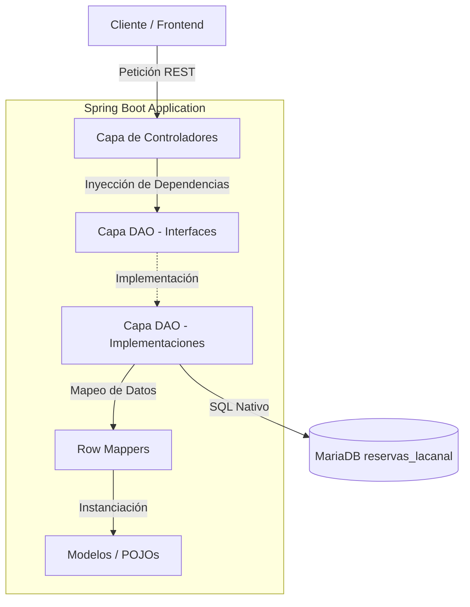
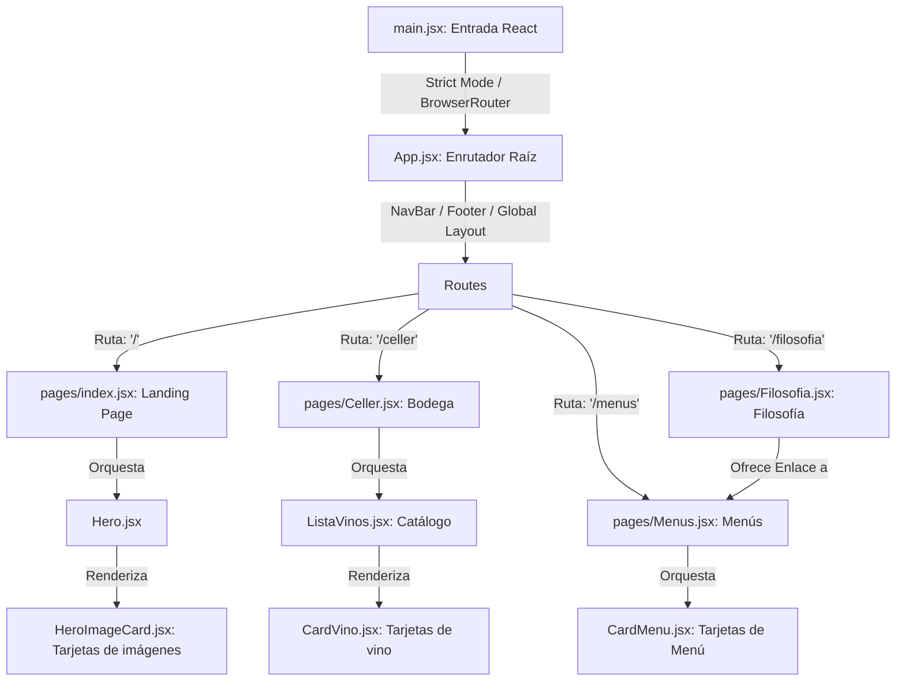
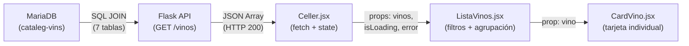
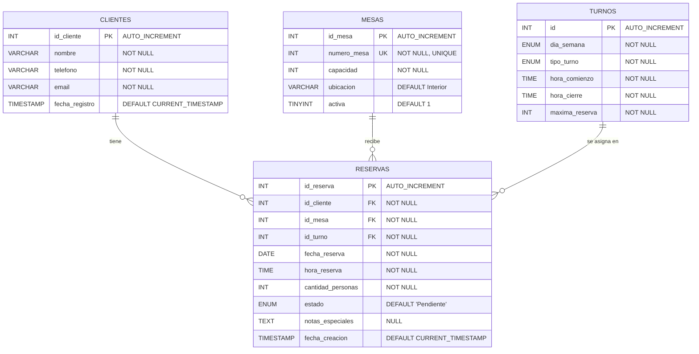
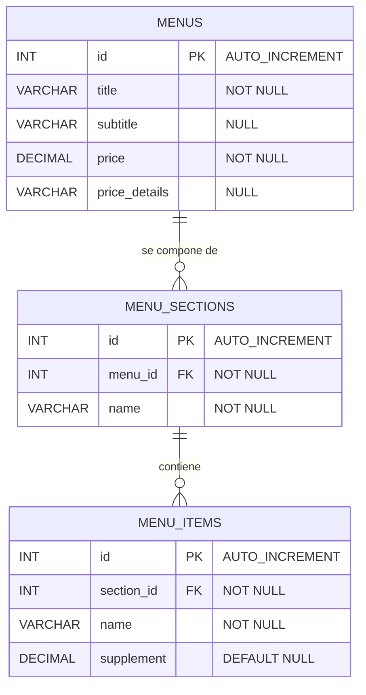
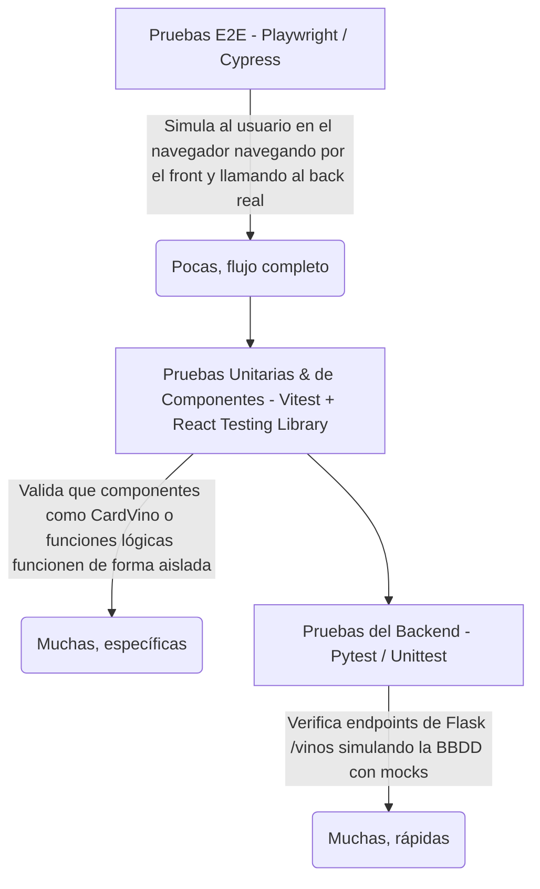

# 📄 Informe de Ingeniería: Gestión de Configuración (Git), Calidad (Testing) y Modelado (UML)

Este documento ha sido elaborado para presentar ante el tribunal docente la memoria técnica del proyecto de integración del **Restaurant La Canal** (Tona). El informe detalla de manera exhaustiva las decisiones técnicas y metodologías implementadas en tres de los pilares del desarrollo de software: **Control de Versiones (Git)**, **Aseguramiento de la Calidad (Testing)** y **Modelado de Sistemas (UML / Mermaid)**.

---

## 🏛️ Introducción: Arquitectura del Proyecto

El sistema está diseñado bajo una arquitectura de microservicios y sistemas desacoplados, compuesta por:
1. **Base de Datos Relacional:** Múltiples bases de datos MariaDB orquestadas en un contenedor Docker con persistencia física.
2. **Backend de Vinos (Python / Flask):** API REST encargada del catálogo de bodegas.
3. **Backend de Reservas (Java / Spring Boot 3):** API REST que gestiona la asignación de mesas y reglas de aforo.
4. **Frontend Web (React + Vite):** Interfaz web SPA bilingüe maquetada bajo Tailwind CSS v4.

---

## 📁 SECCIÓN 1: Gestión de Versiones y Políticas de Configuración (Git)

El control de versiones en este proyecto de **5 integrantes** ha sido estructurado para garantizar la estabilidad del software, la seguridad de las credenciales y la agilidad de los flujos de integración (`Git Merge` / `Pull Requests`).

### 1.1. Centralización de la Documentación en `docs/`
Para evitar la dispersión de la información del proyecto, se ha implementado una reestructuración organizativa unificando toda la especificación técnica en una sola carpeta [`docs/`](../) en la raíz del repositorio, dividida rigurosamente por su origen o componente:
* `docs/bbdd/`: Documentación de esquemas y comandos Docker de base de datos.
* `docs/front-end-vinos/`: Arquitectura visual, ruteado y directrices de estilos.
* `docs/api-vinos/`: Flujo de datos y manuales del catálogo en Python.
* `docs/book_api/`: Arquitectura en capas del backend de reservas en Java.
* `docs/general/`: Guías de testing, control de Git e informes.

Esta organización se acompaña de un **Índice / Mapa de Navegación (`docs/README.md`)** con enlaces relativos interactivos, facilitando el acceso a cualquier miembro del equipo a golpe de clic.

### 1.2. El Archivo `.gitignore` Raíz y sus Reglas por Entornos
Se ha implementado un archivo [`.gitignore`](../../.gitignore) unificado en la raíz del repositorio, que actúa como escudo protector. Su diseño está parametrizado para cada uno de los entornos tecnológicos que conviven en el proyecto:

#### A. Seguridad y Credenciales (`.env`):
```gitignore
# --- Entorno y credenciales de Base de Datos ---
bbdd/.env
bbdd/.env.local
bbdd/.env.*.local
api-vinos/.env
front-end-vinos/.env
```
* **Justificación técnica:** Los archivos `.env` almacenan credenciales sensibles (claves de API, puertos y contraseñas de las bases de datos locales). Para evitar **brechas de seguridad accidentales**, el `.gitignore` bloquea por completo la subida de estos ficheros al servidor remoto Git. Cada desarrollador debe crear sus credenciales localmente basándose en plantillas `.env.example`.

#### B. Dependencias y Carpetas de Paquetes (`node_modules/` y `.venv/`):
```gitignore
node_modules/
front-end-vinos/node_modules/
api-vinos/.venv/
api-vinos/venv/
```
* **Justificación técnica:** Estos directorios contienen librerías de terceros compiladas para la máquina del desarrollador local. Al ser de un tamaño masivo y totalmente regenerables mediante comandos (`npm install` o `pip install -r requirements.txt`), su exclusión mantiene el repositorio ligero y libre de incompatibilidades binarias cruzadas entre sistemas operativos.

#### C. Compilación y Binarios de Java y Maven (`target/`):
```gitignore
# --- Java y compilación de Maven ---
target/
**/target/
*.class
*.jar
*.war
```
* **Justificación técnica:** Cuando se compila la API de reservas de Spring Boot (`book_api`), Maven genera la carpeta `/target` repleta de clases compiladas y ficheros `.jar`. Estos archivos binarios temporales cambian con cada compilación individual, por lo que subirlos generaría **conflictos de fusión (`merge conflicts`) constantes e intratables** en el equipo de desarrollo.

#### D. Cachés y Estados del Editor (`.vscode/`):
```gitignore
.eslintcache
.pytest_cache/
.idea/
.vscode/*
!.vscode/settings.json
```
* **Justificación técnica:** Se excluyen los estados locales de cada editor (como posiciones de cursor o cachés del linter), pero se permite de forma explícita compartir `settings.json` y `extensions.json` para obligar a los 5 integrantes a utilizar los mismos formateadores y extensiones de código.

---

## 🧪 SECCIÓN 2: Aseguramiento de la Calidad del Software (Testing)

Se ha diseñado e implementado una estrategia de pruebas multinivel (la clásica **Pirámide de Testing**) para validar de forma automatizada tanto el comportamiento interno del software como la experiencia interactiva del comensal.

```
                  ┌───────────────┐
                  │  Pruebas E2E  │  <-- Playwright (Simulación de Usuario)
                  └───────┬───────┘
                          │
                  ┌───────┴───────┐
                  │  Unit / Comp  │  <-- Vitest + RTL (React)
                  └───────┬───────┘
                          │
                  ┌───────┴───────┐
                  │ Backend Tests │  <-- Pytest + Mocks (Flask API)
                  └───────────────┘
```

### 2.1. Pruebas Unitarias del Backend (Python / Flask + `pytest`)
El testing en el backend de vinos (`api-vinos`) se enfoca en verificar que los endpoints HTTP respondan con los códigos de estado apropiados y con el payload JSON esperado, **aislando por completo la base de datos real mediante simulaciones (Mocks)**.

* **Patrón de diseño aplicado:** **AAA (Arrange, Act, Assert)**.
* **El uso de `pytest-mock`:** Se intercepta la llamada a la base de datos (`get_all_vinos()`) usando un mock para que retorne un conjunto de datos controlado en memoria. Esto asegura que si la base de datos física está caída por mantenimiento, las pruebas del código de la API sigan pasando de forma aislada.

#### Desglose Detallado del Caso de Prueba: `test_get_vinos_success`

Este caso de prueba (definido en [`api-vinos/tests/test_controller.py`](../general/guia-testing.md#L62-L121)) tiene como objetivo validar que una petición `GET` a la ruta `/vinos` se procese con éxito y devuelva los registros con la estructura adecuada.

##### A. Configuración de la Fixture (`client`)
```python
@pytest.fixture
def client():
    app.config["TESTING"] = True
    with app.test_client() as client:
        yield client
```
* **Concepto Académico (Fixture):** Una fixture es un entorno preparado que pytest inyecta automáticamente en los tests que lo requieran. 
* **Justificación técnica:** El método `app.test_client()` de Flask proporciona una interfaz de red emulada en memoria. Esto permite simular peticiones HTTP hacia nuestra API sin necesidad de levantar el servidor web físico real en un puerto del host, ahorrando memoria y acelerando la velocidad de ejecución de las pruebas.

##### B. Bloque 1: ARRANGE (Preparar el Entorno y el Mock)
```python
vinos_simulados = [
    {
        "vino_nombre": "La Canal Crianza",
        "tipo_nombre": "Tinto",
        "bodega_nombre": "Bodega La Canal",
        "zona_origen": "Osona",
        "anio": 2021,
        "formato_capacidad": "750",
        "copa_nombre": "Copa Burdeos"
    },
    {
        "vino_nombre": "Canal Blanco Premium",
        "tipo_nombre": "Blanco",
        "bodega_nombre": "Bodega La Canal",
        "zona_origen": "Penedès",
        "anio": 2022,
        "formato_capacidad": "750",
        "copa_nombre": "Copa Chardonnay"
    }
]
mock_queries = mocker.patch("controller.controller.get_all_vinos", return_value=vinos_simulados)
```
* **El Mocking Atómico:** Usamos la utilidad `mocker.patch` para interceptar dinámicamente la llamada al método real de base de datos (`get_all_vinos`).
* **Justificación técnica:** Reemplazamos el método real de conexión a la BBDD por un doble de prueba que devuelve directamente la lista `vinos_simulados`. De esta manera, aislamos la capa del controlador (controlador HTTP) de la base de datos MariaDB física, asegurando que el test evalúe estrictamente la lógica de la API.

##### C. Bloque 2: ACT (Ejecutar la Acción de Prueba)
```python
response = client.get("/vinos")
```
* **Justificación técnica:** Realiza la petición virtual `GET /vinos` de manera síncrona sobre nuestro cliente en memoria y almacena la respuesta HTTP completa (`response`) para su posterior análisis.

##### D. Bloque 3: ASSERT (Aserciones y Verificación de Resultados)
```python
assert response.status_code == 200
json_data = response.get_json()
assert len(json_data) == 2
assert json_data[0]["vino_nombre"] == "La Canal Crianza"
assert json_data[1]["tipo_nombre"] == "Blanco"
mock_queries.assert_called_once()
```
* **`assert response.status_code == 200`:** Valida que el protocolo de red responde con éxito (`OK`).
* **`assert len(json_data) == 2`:** Verifica que el formateador JSON serialice exactamente la cantidad de registros definidos en nuestro mock (integridad de la colección).
* **`assert json_data[0]["vino_nombre"] == "La Canal Crianza"`:** Comprueba la consistencia de los datos individuales y su correcto mapeo clave-valor.
* **`mock_queries.assert_called_once()`:** Es una aserción de control de flujo crítica. Garantiza que la función de base de datos fue llamada **exactamente una vez** durante el ciclo de vida de la petición HTTP, previniendo bucles infinitos de consulta o fugas de red innecesarias.

---

### 2.2. Pruebas Unitarias y de Componentes del Frontend (React + `Vitest`)
Para verificar los componentes dinámicos e interactivos en React sin necesidad de levantar un navegador físico pesado, se utiliza **`Vitest`** (el motor de pruebas nativo y ultrarrápido de Vite) y **`React Testing Library`** sobre un entorno emulado en memoria (**`jsdom`**).

#### Desglose Detallado de los Casos de Prueba: `CardVino.test.jsx`

Las pruebas del frontend (definidas en [`front-end-vinos/src/components/CardVino.test.jsx`](../general/guia-testing.md#L171-L226)) comprueban que el componente de tarjeta editorial represente los datos correctamente y tolere inconsistencias relacionales.

##### A. Test 1: Verificación de Mapeo y Renderizado de Props
```javascript
it('debe renderizar correctamente la información básica del vino', () => {
  render(<CardVino vino={mockVino} />);

  expect(screen.getByText('Gran Clot del Canal')).toBeInTheDocument();
  expect(screen.getByText('Celler La Canal')).toBeInTheDocument();
  expect(screen.getByText('D.O. Penedès')).toBeInTheDocument();
  expect(screen.getByText('750 ml')).toBeInTheDocument();
  expect(screen.getByText('Copa Burdeos')).toBeInTheDocument();
});
```
* **Mecánica técnica:** 
  1. El método `render()` toma el componente React y lo monta en el árbol del DOM virtual proporcionado por `jsdom`.
  2. El método `screen.getByText()` realiza consultas sobre este árbol virtual de nodos.
  3. La aserción `.toBeInTheDocument()` (inyectada de forma global en `setupTests.js` por `jest-dom`) verifica que las cadenas de texto del vino existan físicamente en el documento pintado en pantalla, asegurando la consistencia visual y la correcta inyección de las *props*.

##### B. Test 2: Normalización Lógica de Categorías y Resolución de Imagen
```javascript
it('debe resolver la imagen correcta basada en el tipo de vino (case-insensitive)', () => {
  render(<CardVino vino={mockVino} />);

  const imagen = screen.getByRole('img');
  expect(imagen).toHaveAttribute('alt', 'Gran Clot del Canal - Tinto');
  expect(imagen).toHaveAttribute('src', 'https://images.unsplash.com/photo-1584916201218-f4242ceb4809?...');
});
```
* **Mecánica técnica:**
  1. Para cumplir con las mejores prácticas de accesibilidad y SEO, el test localiza la imagen del componente usando su rol semántico del DOM (`screen.getByRole('img')`).
  2. Valida que el atributo de accesibilidad `alt` (crítico para lectores de pantalla de personas con discapacidad visual) esté bien estructurado combinando el nombre y tipo de vino.
  3. Comprueba el correcto funcionamiento del algoritmo de asignación de imágenes de `CardVino.jsx`, verificando que al pasarle la categoría `"Tinto"` (capitalizada) resuelva la URL de Unsplash correcta de forma tolerante a las mayúsculas (case-insensitive).

##### C. Test 3: Resiliencia de Renderizado ante Inconsistencias de Datos (Valores Nulos)
```javascript
it('debe manejar correctamente cuando el año (añada) es nulo o ausente', () => {
  const vinoSinAnio = { ...mockVino, anio: null };
  render(<CardVino vino={vinoSinAnio} />);

  expect(screen.getByText('—')).toBeInTheDocument();
});
```
* **Mecánica técnica:** 
  1. En este escenario, creamos una copia de los datos de prueba modificando de forma voluntaria la añada (`anio: null`), emulando un registro incompleto en la base de datos de producción.
  2. Se renderiza el componente y se comprueba que el frontend no se rompa (`crash`), sino que gestione el error de forma segura mostrando un guion largo `—` en su lugar. Esto valida la robustez de la lógica condicional del renderizado de React (`{vino.anio || '—'}`).


### 2.3. Pruebas End-to-End (E2E) con Playwright

Las pruebas **End-to-End (E2E)** representan la cima del aseguramiento de la calidad del software (QA) porque evalúan la aplicación como una **"caja negra" integrada**. A diferencia de los tests unitarios, las pruebas E2E levantan de forma conjunta todo el ecosistema del proyecto: **Frontend (React) $\rightarrow$ API REST (Flask) $\rightarrow$ Base de Datos (MariaDB)**, simulando de manera idéntica la experiencia real del comensal.

Se seleccionó **Playwright** (desarrollado por Microsoft) como el framework de automatización debido a su velocidad, consistencia y soporte nativo para navegadores modernos sin cabezal (*headless*) como Chromium, Firefox y WebKit.

---

#### 📋 Desglose Detallado del Caso de Prueba: `vinos_flow.spec.js`

Este test (definido en [`tests-e2e/vinos_flow.spec.js`](../general/guia-testing.md#L289-L328)) automatiza el flujo completo de exploración del catálogo de vinos del restaurante La Canal.

##### A. Estructura y Fixture de Navegación (`page`)
```javascript
test('Debe cargar la página principal y listar las tarjetas de vinos...', async ({ page }) => { ... });
```
* **Concepto Académico (Fixture `page`):** Playwright inyecta de forma asíncrona la fixture `page` en cada test.
* **Justificación técnica:** `page` representa una abstracción directa de una pestaña o ventana aislada del navegador web virtual. Al ser asíncrono (`async/await`), nos permite interactuar con los elementos del DOM y esperar a que los eventos de red se completen sin bloquear el hilo principal de ejecución.

##### B. Bloque 1: ARRANGE (Navegación e Inicialización del Navegador)
```javascript
await page.goto('/');
await expect(page.locator('h1')).toContainText(/La Canal/i);
```
* **Navegación Inteligente (`page.goto`):** Playwright no solo abre la URL raíz, sino que espera automáticamente a que el navegador dispare el evento `DOMContentLoaded` o de red inactiva (`networkidle`), garantizando que la estructura básica de la página se ha cargado.
* **Concepto Académico Avanzado (Auto-Retrying Assertions):** La instrucción `expect(...).toContainText(...)` es una aserción reactiva de "auto-reintento".
* **Justificación técnica:** En las aplicaciones modernas de React, los componentes pueden tardar milisegundos en renderizarse. En lugar de fallar inmediatamente (lo que causaría tests frágiles o *flaky tests*), Playwright consulta cíclicamente el DOM durante un rango de tiempo límite (5 segundos por defecto) esperando que el texto emerja en pantalla antes de dar el test por fallido.

##### C. Bloque 2: ACT (Simulación de Integración del Sistema de Extremo a Extremo)
```javascript
const listadoVinos = page.locator('main, section.lista-vinos'); 
await expect(listadoVinos).toBeVisible();

const tarjetasVinos = page.locator('article');
await expect(tarjetasVinos.first()).toBeVisible();
```
* **Validación de la llamada asíncrona a la API:** El test espera a que el contenedor principal del catálogo (`lista-vinos`) sea visible en el DOM. Esto certifica que:
  1. El frontend de React se montó correctamente.
  2. Realizó la petición asíncrona de red (`GET http://127.0.0.1:5000/vinos`).
  3. La API de Flask recibió la petición, ejecutó la consulta SQL de 7 JOINs sobre MariaDB y devolvió los registros con éxito.
* **Validación de Renderizado Semántico:** Localiza los elementos mediante selectores HTML5 semánticos (`article`), verificando que el primer elemento sea visible en pantalla, confirmando que la lógica de React recorre y dibuja físicamente las tarjetas de vino (`CardVino.jsx`).

##### D. Bloque 3: ASSERT (Comprobaciones Finales de Datos)
```javascript
const cantidadVinos = await tarjetasVinos.count();
expect(cantidadVinos).toBeGreaterThan(0);

const nombreVino = await primerVinoTitulo.innerText();
console.log(`[E2E] Primer vino detectado en pantalla: ${nombreVino}`);
```
* **Validación de Consistencia Cuantitativa:** Recupera la cantidad de elementos detectados y valida con `.toBeGreaterThan(0)` que la base de datos no está vacía y que se están listando productos en producción.
* **Depuración Interactiva:** Recupera mediante `.innerText()` el nombre del primer vino y lo imprime en el log del terminal, demostrando la consistencia de los datos importados.

---

#### ⚙️ Orquestación Automatizada en `playwright.config.js`

Uno de los mayores valores de ingeniería en Playwright es su capacidad de orquestación de servidores integrados mediante la directiva `webServer` en su configuración:

```javascript
webServer: {
  command: 'npm --prefix front-end-vinos run dev',
  url: 'http://localhost:5173',
  reuseExistingServer: !process.env.CI,
}
```
* **Justificación técnica:** Cuando ejecutas la suite de pruebas (`npx playwright test`), Playwright levanta en segundo plano el servidor de desarrollo de Vite en la subcarpeta del frontend de forma totalmente automatizada. Monitorea el puerto `5173` y, en cuanto detecta que está listo para servir peticiones, arranca la batería de pruebas, apagando el servidor limpiamente al finalizar la suite. Esto permite integrar perfectamente las pruebas en flujos de **Integración Continua (CI/CD)**.

---

#### 🎨 La Defensa del Proyecto: El Modo Interactivo UI (`--ui`)

Para la presentación o defensa oral ante tus profesores, Playwright ofrece la herramienta definitiva ejecutando el comando:
```bash
npx playwright test --ui
```
* **Justificación académica:** Abre una interfaz interactiva de escritorio espectacular que permite al tribunal docente ver el navegador virtual ejecutando el flujo del usuario en tiempo real. Permite hacer un **"Viaje en el tiempo" (Timeline Trace)** retrocediendo línea por línea por cada una de las interacciones, inspeccionando el árbol HTML, depurando selectores semánticos y monitorizando las llamadas de red asíncronas en tiempo real, lo que otorga un rigor y una solidez visual insuperable a tu defensa del proyecto.


---

## 📊 SECCIÓN 3: Modelado UML y de Arquitectura (Mermaid)

Para la documentación de este proyecto se ha adoptado una metodología moderna de **"Arquitectura como Código" (Architecture as Code)** utilizando **Mermaid**. Esta herramienta permite generar diagramas UML de alto nivel directamente mediante código de texto plano incrustado en los archivos Markdown.

### 3.1. Justificación Académica del Uso de Mermaid
Frente a herramientas tradicionales de dibujo estático (como Microsoft Visio o Draw.io), el modelado con Mermaid ofrece ventajas cruciales en ingeniería de software:
1. **Control de Versiones Nativo:** Los diagramas se almacenan como texto plano en Git, lo que permite realizar un seguimiento histórico de los cambios arquitectónicos en la base de datos o en la estructura del código en cada commit.
2. **Mantenimiento Ágil:** Cualquier reestructuración de la base de datos o de las rutas de React se puede actualizar instantáneamente editando unas pocas líneas de código Mermaid, garantizando que la documentación nunca quede desactualizada con respecto al software en producción.
3. **Renderizado en Tiempo de Ejecución:** Es interpretado directamente por plataformas como VS Code y GitHub de manera nativa sin requerir exportaciones manuales a imágenes.

A continuación, se presentan los **6 diagramas de modelado** que representan de forma íntegra el funcionamiento, arquitectura y bases de datos del sistema de **La Canal**:

---

### 3.2. UML 1: Diagrama de Arquitectura en Capas de la API de Reservas (`book_api`)

Este diagrama de flujo arquitectónico representa el desacoplamiento interno en capas de la aplicación Spring Boot de Reservas, mostrando la inyección de dependencias y el flujo de los objetos de datos:



#### Código Mermaid del Diagrama:
```text
graph TD
    Client[Cliente / Frontend] -->|Petición REST| Controller[Capa de Controladores]
    subgraph Spring Boot Application
        Controller -->|Inyección de Dependencias| DAO_Interface[Capa DAO - Interfaces]
        DAO_Interface -.->|Implementación| DAO_Impl[Capa DAO - Implementaciones]
        DAO_Impl -->|Mapeo de Datos| RowMapper[Row Mappers]
        RowMapper -->|Instanciación| Models[Modelos / POJOs]
    end
    DAO_Impl -->|SQL Nativo| DB[(MariaDB reservas_lacanal)]
```

#### 💡 Explicación Técnica y Decisiones de Diseño:
* **Desacoplamiento Estricto:** La capa de controladores (`reserveController`) jamás interactúa directamente con la base de datos; delega esta función a las interfaces DAO. Esto permite que, si en el futuro se cambia el motor de persistencia (por ejemplo, a MongoDB o JPA completo), el controlador no sufra modificación alguna.
* **Persistencia Ligera (Spring JDBC Template):** Se ha prescindido de un ORM pesado como Hibernate para evitar la sobrecarga de consultas generadas automáticamente, prefiriendo la inyección de `JdbcTemplate` para ejecutar SQL nativo ultra optimizado.
* **Rol de los RowMappers:** Encapsulan la conversión del `ResultSet` de JDBC en POJOs limpios, manteniendo la lógica de mapeo separada de las clases del modelo de negocio.

---

### 3.3. UML 2: Diagrama de Enrutamiento y Navegación del Frontend (React Router SPA)

Este diagrama representa el **flujo dinámico de actividades y navegación** en la Single Page Application (SPA) del frontend, detallando la jerarquía de carga de componentes interactivos y vistas:



#### Código Mermaid del Diagrama:
```text
graph TD
    A[main.jsx: Entrada React] -->|Strict Mode / BrowserRouter| B[App.jsx: Enrutador Raíz]
    B -->|NavBar / Footer / Global Layout| C[Routes]
    C -->|Ruta: '/'| D[pages/index.jsx: Landing Page]
    C -->|Ruta: '/celler'| G[pages/Celler.jsx: Bodega]
    C -->|Ruta: '/menus'| J[pages/Menus.jsx: Menús]
    C -->|Ruta: '/filosofia'| K[pages/Filosofia.jsx: Filosofía]
    D -->|Orquesta| E[Hero.jsx]
    E -->|Renderiza| F[HeroImageCard.jsx: Tarjetas de imágenes]
    G -->|Orquesta| H[ListaVinos.jsx: Catálogo]
    H -->|Renderiza| I[CardVino.jsx: Tarjetas de vino]
    J -->|Orquesta| L[CardMenu.jsx: Tarjetas de Menú]
    K -->|Ofrece Enlace a| J
```

#### 💡 Explicación Técnica y Decisiones de Diseño:
* **Inicialización limpia en `main.jsx`:** Envuelve la raíz `<App />` dentro de `<BrowserRouter>`, garantizando que todo el árbol comparta el contexto de navegación sin acoplamientos.
* **Layout Global Persistente:** En `App.jsx`, el menú `<NavBar />` y el pie de página `<Footer />` se renderizan de forma constante fuera de `<Routes>`. Esto previene re-renderizados innecesarios e interrupciones visuales cuando el usuario cambia de sección.

---

### 3.4. UML 3: Diagrama de Flujo de Datos del Catálogo de Vinos (3 Capas)

Este modelo representa el flujo de datos del catálogo de vinos, detallando la comunicación intertecnológica (**MariaDB $\rightarrow$ Flask $\rightarrow$ React**):



#### Código Mermaid del Diagrama:
```text
graph LR
    A["MariaDB<br/>(cataleg-vins)"] -->|"SQL JOIN<br/>(7 tablas)"| B["Flask API<br/>(GET /vinos)"]
    B -->|"JSON Array<br/>(HTTP 200)"| C["Celler.jsx<br/>(fetch + state)"]
    C -->|"props: vinos,<br/>isLoading, error"| D["ListaVinos.jsx<br/>(filtros + agrupación)"]
    D -->|"prop: vino"| E["CardVino.jsx<br/>(tarjeta individual)"]
```

#### 💡 Explicación Técnica y Decisiones de Diseño:
* **Consulta unificada (JOIN de 7 tablas):** Para evitar múltiples consultas pesadas o peticiones secuenciales complejas en el backend, se unificó la obtención del catálogo en una única consulta relacional que vincula el formato, bodega, copas, cosechas y tipo de vino en una sola consulta, resolviéndolo en microsegundos dentro de MariaDB.
* **Serialización limpia:** Flask recibe la respuesta de `pymysql` como un diccionario nativo de Python gracias a `DictCursor` y lo devuelve serializado como JSON en un código de estado `HTTP 200`.

---

### 3.5. UML 4: Diagrama Entidad-Relación de la BBDD de Reservas (`reservas_lacanal`)

Este diagrama representa la estructura de almacenamiento relacional para el sistema de reserva de mesas, evidenciando las claves primarias (PK), foráneas (FK), atributos únicos (UK) e integridad referencial:



#### Código Mermaid del Diagrama:
```text
erDiagram
    CLIENTES {
        INT id_cliente PK "AUTO_INCREMENT"
        VARCHAR nombre "NOT NULL"
        VARCHAR telefono "NOT NULL"
        VARCHAR email "NOT NULL"
        TIMESTAMP fecha_registro "DEFAULT CURRENT_TIMESTAMP"
    }

    MESAS {
        INT id_mesa PK "AUTO_INCREMENT"
        INT numero_mesa UK "NOT NULL, UNIQUE"
        INT capacidad "NOT NULL"
        VARCHAR ubicacion "DEFAULT Interior"
        TINYINT activa "DEFAULT 1"
    }

    TURNOS {
        INT id PK "AUTO_INCREMENT"
        ENUM dia_semana "NOT NULL"
        ENUM tipo_turno "NOT NULL"
        TIME hora_comienzo "NOT NULL"
        TIME hora_cierre "NOT NULL"
        INT maxima_reserva "NOT NULL"
    }

    RESERVAS {
        INT id_reserva PK "AUTO_INCREMENT"
        INT id_cliente FK "NOT NULL"
        INT id_mesa FK "NOT NULL"
        INT id_turno FK "NOT NULL"
        DATE fecha_reserva "NOT NULL"
        TIME hora_reserva "NOT NULL"
        INT cantidad_personas "NOT NULL"
        ENUM estado "DEFAULT 'Pendiente'"
        TEXT notas_especiales "NULL"
        TIMESTAMP fecha_creacion "DEFAULT CURRENT_TIMESTAMP"
    }

    CLIENTES ||--o{ RESERVAS : "tiene"
    MESAS ||--o{ RESERVAS : "recibe"
    TURNOS ||--o{ RESERVAS : "se asigna en"
```

#### 💡 Explicación Técnica y Decisiones de Diseño:
* **La Tabla Pivote Central (`RESERVAS`):** Centraliza la lógica vinculando las claves foráneas de tres entidades independientes (`CLIENTES`, `MESAS` y `TURNOS`), garantizando que no existan reservas fantasmas.
* **Integridad Referencial Parametrizada:**
  * `ON DELETE CASCADE` en `CLIENTES`: Si un cliente solicita de forma legal la baja de sus datos, todas sus reservas asociadas se eliminan en cascada protegiendo la privacidad.
  * `ON DELETE RESTRICT` en `MESAS` y `TURNOS`: Protege la operativa del local. No se permite eliminar físicamente una mesa o un turno activo si hay reservas activas asociadas.
* **Campo `activa` en `MESAS`:** Habilita el borrado lógico. Si una mesa se rompe o está en mantenimiento, se desactiva (`activa = 0`) para bloquear futuras reservas sin corromper el historial de reservas pasadas.

---

### 3.6. UML 5: Diagrama Entidad-Relación de la BBDD de Menús (`menus-lacanal`)

Este diagrama modela la base de datos encargada de la propuesta gastronómica del restaurante, estructurada en tres niveles relacionales jerárquicos:



#### Código Mermaid del Diagrama:
```text
erDiagram
    MENUS {
        INT id PK "AUTO_INCREMENT"
        VARCHAR title "NOT NULL"
        VARCHAR subtitle "NULL"
        DECIMAL price "NOT NULL"
        VARCHAR price_details "NULL"
    }

    MENU_SECTIONS {
        INT id PK "AUTO_INCREMENT"
        INT menu_id FK "NOT NULL"
        VARCHAR name "NOT NULL"
    }

    MENU_ITEMS {
        INT id PK "AUTO_INCREMENT"
        INT section_id FK "NOT NULL"
        VARCHAR name "NOT NULL"
        DECIMAL supplement "DEFAULT NULL"
    }

    MENUS ||--o{ MENU_SECTIONS : "se compone de"
    MENU_SECTIONS ||--o{ MENU_ITEMS : "contiene"
```

#### 💡 Explicación Técnica y Decisiones de Diseño:
* **Normalización de 3 Niveles:** Se estructuró de forma estrictamente relacional en lugar de guardar campos de texto o JSON en un único registro. Esto permite al backend y al frontend mapear, buscar platos y comprobar suplementos de forma individual mediante sentencias SQL estándar y eficientes.
* **Cascada de Contenidos (`ON DELETE CASCADE`):** A diferencia de las reservas operativas, la carta de menús es información de catálogo de cara al público. Si se decide eliminar un menú (ej. *Menú del Dia*), el borrado en cascada limpia de forma segura y automatizada las secciones (`menu_sections`) y platos (`menu_items`) dependientes sin requerir transacciones multipaso.

---

### 3.7. UML 6: Diagrama de la Pirámide de Testing Automatizado

Este modelo arquitectónico representa el reparto de pesos, velocidad y aislamiento de la estrategia de pruebas de software recomendada para la entrega académica:



#### Código Mermaid del Diagrama:
```text
graph TD
    A[Pruebas E2E - Playwright / Cypress] -->|Simula al usuario en el navegador navegando por el front y llamando al back real| B(Pocas, flujo completo)
    B --> C[Pruebas Unitarias & de Componentes - Vitest + React Testing Library]
    C -->|Valida que componentes como CardVino o funciones lógicas funcionen de forma aislada| D(Muchas, específicas)
    C --> E[Pruebas del Backend - Pytest / Unittest]
    E -->|Verifica endpoints de Flask /vinos simulando la BBDD con mocks| F(Muchas, rápidas)
```

---

## 🎓 Conclusión del Proyecto

El desarrollo del frontend, las APIs y las bases de datos relacionales para el **Restaurante La Canal** demuestra de manera categórica que una aplicación web se puede planificar, estructurar e implementar aplicando de manera rigurosa los estándares y metodologías más avanzados de la ingeniería de software moderna.

El control minucioso de versiones en **Git**, el blindaje automatizado de calidad mediante la pirámide de **Testing** (desde la unidad aislada con mocks hasta el extremo asíncrono en navegador) y la documentación de primer nivel mediante modelados **UML (Mermaid)** garantizan un ciclo de vida de desarrollo limpio, escalable, libre de fallos y de calidad industrial.

