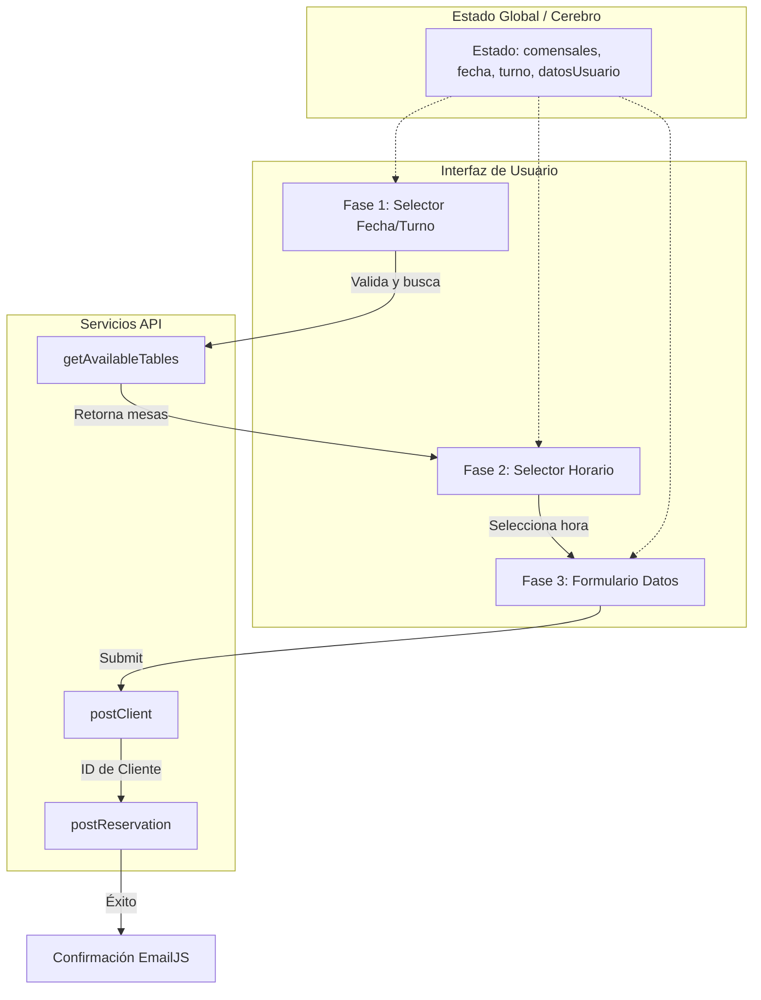

# Documentación Técnica: Frontend Reservas-Mesas

Este documento detalla el funcionamiento interno, la arquitectura y los retos técnicos del frontend del sistema de reservas, desarrollado con **React (Vite)**.

---

## 1. Conceptos de Programación Aplicados

La aplicación se basa en una arquitectura de **Componentes Funcionales** y una gestión de estado centralizada para garantizar la fluidez del proceso de reserva.

### A. Levantamiento de Estado (Lifting State Up)
El "cerebro" de la aplicación es `App.jsx`. En lugar de que cada fase gestione sus propios datos, todo el estado (fecha, comensales, turno, datos del usuario) reside en `App.jsx`.
*   **Beneficio:** Permite que la información persista mientras el usuario navega hacia adelante y hacia atrás entre las fases.

### B. Hooks de React
*   **`useState`:** Gestiona la reactividad de los datos de la reserva y el control de navegación entre fases.
*   **`useEffect`:** Utilizado para la validación en tiempo real (ej: deshabilitar turnos de cena en días específicos) y para inicializar librerías externas.
*   **`useRef`:** Crucial para la integración con **Flatpickr**, permitiendo manipular el DOM del calendario de forma imperativa sin interferir con el ciclo de vida de React.

### C. Renderizado Condicional
La interfaz utiliza un patrón de "máquina de estados" simple para mostrar los componentes `Fase1`, `Fase2` o `Fase3` basándose en la variable `fase`. Esto evita cargar toda la lógica de golpe y mejora la claridad del flujo.

---

## 2. Conexión con la API (Capa de Servicio)

La comunicación se centraliza en `src/services/fetching.js`, actuando como una **Capa de Abstracción de Datos**.

*   **Peticiones Asíncronas:** Se utiliza `async/await` para gestionar la naturaleza no bloqueante de las llamadas a la red.
*   **Estandarización de Datos:** El frontend se encarga de transformar los datos del usuario (como añadir `:00` a la hora) para cumplir con el formato `TIME` y `DATE` que espera el backend en Java/MySQL.
*   **Variables de Entorno:** El uso de `import.meta.env.VITE_API_BASE_URL` permite que el código sea agnóstico al entorno, facilitando el despliegue en Docker o Raspberry Pi sin modificar el código fuente.

---

## 3. Retos de Desarrollo y Soluciones

### Sincronización de IDs de Base de Datos
**El Reto:** El backend requiere IDs específicos para los turnos (ej: Miércoles-Comida = 1) que no son evidentes en el frontend.
**Solución:** Se implementó el helper `getShiftId` en `App.jsx`, que traduce la lógica de negocio (día y turno) en IDs compatibles con la base de datos antes de enviar la reserva.

### Encadenamiento de Promesas (Sequential POSTs)
**El Reto:** Para crear una reserva, primero se debe registrar al cliente y obtener su ID.
**Solución:** El `handleSubmit` implementa un flujo secuencial:
1. Espera a `postClient`.
2. Extrae el `clientId`.
3. Ejecuta `postReservation` usando ese ID.
Esto asegura que nunca se intente crear una reserva para un cliente que aún no existe en el sistema.

### Gestión de CORS
**El Reto:** Los navegadores bloquean peticiones entre diferentes puertos (Vite 5173 -> Spring 8081).
**Solución:** Se coordinó con el backend para incluir una configuración de CORS que permita explícitamente el origen del frontend, permitiendo el intercambio de cabeceras JSON.

---

## 4. Visualización del Funcionamiento (Lógica Frontend)

---

## 5. Resumen de Flujo Técnico
1.  **Fase 1:** Recolección de parámetros de búsqueda y llamada a `/buscar/libres` (POST).
2.  **Fase 2:** Selección de hora dentro de las franjas permitidas por el turno.
3.  **Fase 3:** Recolección de datos personales.
4.  **Finalización:** Orquestación de dos llamadas POST consecutivas y disparo de evento de notificación.
